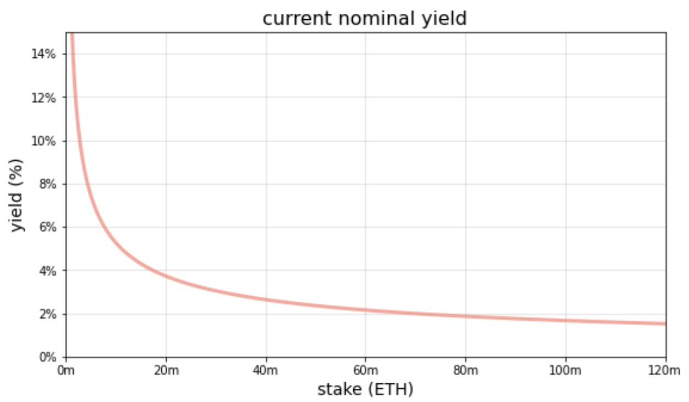
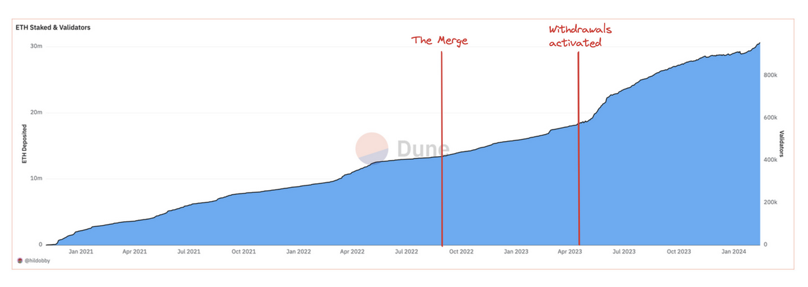
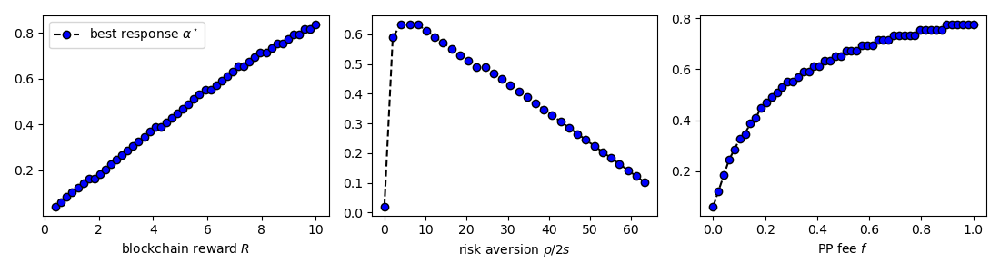
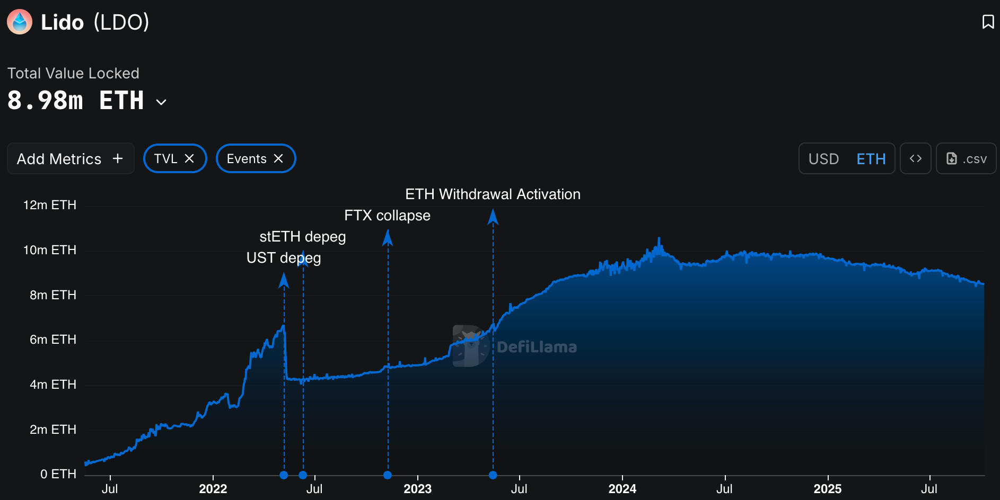
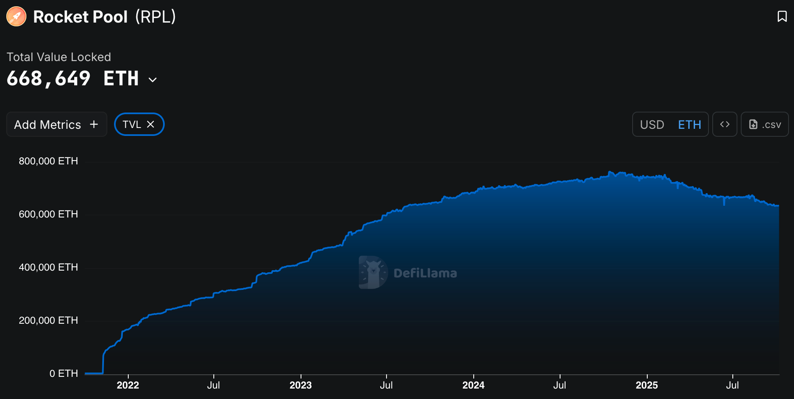
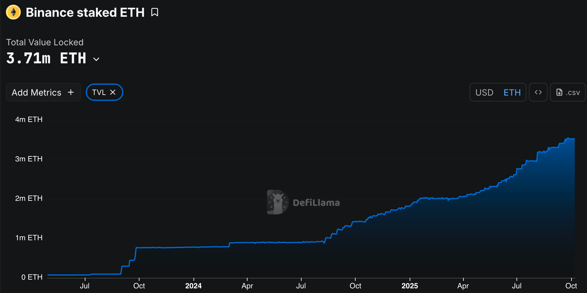

## Staking in Proof-of-Stake blockchains

Fayçal Drissi, Zachary Feinstein, Basil Williams

*University of Oxford, Stevens Institute of Technology, Imperial Business School*
 

<!--These slides: [https://www.faycaldrissi.com/siam2025](https://www.faycaldrissi.com/siam2025)
[my scholar](https://scholar.google.com/citations?user=njvyriQAAAAJ&hl=fr), 
[my website](https://www.faycaldrissi.com/), [my github](https://github.com/FDR0903)-->

---
section: Introduction
---

# Overview

- Staking market
- Centralized / Decentralized Staking
- Is staking worth anything ?

---

      

<h1>
Issuance, staking, and DeFi </h1>

---

# Issuance, staking, and DeFi

<v-clicks>

* **Blockchains** are distributed digital ledgers that **securely** store and execute transactions 
* **Staking**: locking Eth in the blockchain to participate in the protocol: secure block production and validation
* **Issuance**: rewards distributed by the protocol to incentivize staking
* These rewards are minted as new tokens and given to network participants who conduct consensus duties
* **Burn**: gas fees are burned to use the blockchain
$$\text{total supply of ETH} = \text{issuance} - \text{the burn (EIP-1559)}$$
* Last 30 days  
$$78,277.28 \text{ ETH issued} \qquad  8,041.75 \text{ ETH burned}$$

</v-clicks>

*Source: ultrasound.money*

---

# Issuance, staking, and DeFi
### Timeline of issuance

* **Jul 2015** Genesis: block reward set to 5 ETH (PoW miners were rewarded for producing blocks)
* **Oct 2017** Byzantium (EIP-649): block reward reduced to 3 ETH
* **Feb 2019** Constantinople (EIP-1234): block reward reduced to 2 ETH
* **Sep 2022** The Merge: Ethereum issuance is now only from PoS rewards (not withdrawable)
* **Apr 2023** Shanghai/Capella (EIP-4895): Withdrawals to the execution layer

---

# Issuance, staking, and DeFi
### Today

* Since the beacon chain: issuance is determined by an **issuance curve**
*  parameterized curve that calculates the *yield* as a function of the amount of ETH staked
$$
\text{yield} = \frac{2.6 \cdot 64}{\sqrt{\text{staked ETH}}}
$$

{style="transform: translate(40%, 0%); width: 450px"}

---

# Issuance, staking, and DeFi
### Rationale
- Aim for 3.3% yield with 30 million ETH staked
- highly incentivizing at least 10 million staked ETH

{style="transform: translate(60%, 0%); width: 400px"}

* **Issuance** in a blockchain is similar to **traditional monetary policy**

---

# Issuance, staking, and DeFi
### Today: staking high

- June 2025: 35 out 120 million ETH staked (88.6 bn $); stake rate of $28.24\%$
{style="transform: translate(5%, 0%); width: 800px"}

---

# Issuance, staking, and DeFi
### Today: staking high

- June 2025: 35 out 120 million ETH staked (88.6 bn $); stake rate of $28.24\%$
{style="transform: translate(5%, 0%); width: 800px"}

---

#  Research questions
- What are the equilibrium levels of staking and blockchain adoption ?
- Can equilibrium outcomes be controlled by the blockchain ? 
-  Can the Ethereum Foundation (EF) target objectives such as the volatility of the native token, economic security, and blockchain adoption ?
 

---
section: Centralized / Decentralized staking
---

      

<h1>
Centralized / Decentralized staking
</h1>

---

# Setup

$N$ identical investors
- Initial ETH wealth $s$

The market
- Staking in the blockchain: $R$
- outside risk-free option: $r_{\$}\, s$

---

# Setup: two pools
**PP** (protocol pool)
- liquidity cost $c_P$
- per‑staker fixed validator overhead $f$

**LP** (liquid staking): 
- liquidity cost $c_L$
- extra mean‑zero risk with variance $\sigma$
- LIDO proportional fee ($\alpha\in[0,1)$)

---

# Timeline 

**Stage 1**: blockchain posts reward $R$ to maximize a security objective.

**Stage 2**: given $R$, LIDO posts fee $\alpha$.

**Stage 3**: given $R$ and $\alpha$, $N$ stakers decide to enter versus outside option ($r_{\$} s$).

**Stage 4**: Given $N$, stakers split across PP and LP.

---

# Stage 4 - LP versus PP

Let $s_P=s\,N_P$, $\quad s_L=s\,N_L$, $\quad S=s_P+s_L=s(N_P+N_L)=sN$.

* Pool selection indicator

$$b\sim \text{Bernoulli}\big(\tfrac{s_P}{S}=\tfrac{N_P}{N}\big)$$

**PP per‑staker payoff**
$$R_{PP}= b\,\frac{s}{s_P} R - c_P - f = b\,\frac{R}{N_P} - c_P - f.$$

**LP per‑staker payoff**
$$R_{LP} = (1-b)(1-\alpha)\,\frac{s}{s_L} R - c_L - \tilde\sigma$$
$$\mathbb E[\tilde\sigma]=0,\ \mathrm{Var}(\tilde\sigma)=\sigma.$$

---

# Stage 4 - expected utility

The utility of a staker

$$
\begin{split}
J_{L}\left(s_{L},s_{P}\right)= & \frac{s_{L}}{S}\mathbb{E}_{\tilde{\sigma}}\left[u\left(s+\left(1-\alpha\right)R\frac{s}{s_{L}}-c_{L}-\sigma\right)\right]+\frac{s_{P}}{S}\mathbb{E}_{\tilde{\sigma}}\left[u\left(s-c_{L}-\sigma\right)\right]\\
J_{P}\left(s_{L},s_{P}\right)= & \frac{s_{P}}{S}u\left(s+R\frac{s}{s_{P}}-c_{P}-f\right)+\frac{s_{L}}{S}u\left(s-c_{P}-f\right)
\end{split}
$$

---

# Stage 4 - expected utility

The utility of a staker

$$
\begin{split}
J_{L}\left(s_{L},s_{P}\right)= & \frac{s_{L}}{S}\mathbb{E}_{\tilde{\sigma}}\left[u\left(s+\left(1-\alpha\right)R\frac{s}{s_{L}}-c_{L}-\sigma\right)\right]+\frac{s_{P}}{S}\mathbb{E}_{\tilde{\sigma}}\left[u\left(s-c_{L}-\sigma\right)\right]\\
J_{P}\left(s_{L},s_{P}\right)= & \frac{s_{P}}{S}u\left(s+R\frac{s}{s_{P}}-c_{P}-f\right)+\frac{s_{L}}{S}u\left(s-c_{P}-f\right)
\end{split}
$$

---

# Stage 4 - Strategic complementarity

For any concave $u$
$$
\begin{split}
J_{P}\left(s_{L},s_{P}\right)=&\frac{s_{P}}{s_{L}+s_{P}}u\left(s-c_{P}-f+\frac{s}{s_{P}}R\right)+\frac{s_{L}}{s_{L}+s_{P}}u(\underbrace{s-c_{P}-f}_{=\xi})\\=&\frac{s_{P}}{S}u\left(\xi+\frac{s}{s_{P}}R\right)+\left(1-\frac{s_{P}}{S}\right)u\left(\xi\right)
\end{split}
$$

Using concavity (tangent line inequality)

$$
\partial_{s_{P}}\mathbb{E}\left[u\left(s+R_{i}^{PP}\right)\right]=\frac{1}{S}\left[u\left(\xi+\frac{s}{s_{P}}R\right)-u\left(\xi\right)-\frac{s}{s_{P}}R\,u'\left(\xi+\frac{s}{s_{P}}R\right)\right] \ge 0
$$

> Payoff rises as the pool grows ⇒ **all‑PP or all‑LP**.

---

# Stage 4 - expected utility

Assume $\rho$ is the relative risk aversion of stakers.

Pratt's approximation:

$$
\begin{split}
J_{L}\left(s_{L},s_{P}\right)=&s+\left(1-\alpha\right)\frac{R}{N}-C_L-\gamma\,\left(1-\alpha\right)^{2}\frac{R^{2}}{N^{2}}\frac{s_{P}}{s_{L}}\\J_{P}\left(s_{L},s_{P}\right)=&s+\frac{R}{N}-C_P-\gamma\,\frac{R^{2}}{N^{2}}\frac{s_{L}}{s_{P}}
\end{split}
$$
where 
$$C_P = c_P + f, \qquad C_L := c_L + \gamma\,\sigma, \qquad \gamma=\rho/2s$$

<!--

# Stage 4 — Dominant‑Corner Comparison

If all‑LP: $s_L=S, s_P=0$
$$\mathbb E[u(s+R_{LP})]= \mathbb E_{\tilde\sigma}\,\left[u\,\left(s+(1-\alpha)\tfrac{R}{N}-c_L-\tilde\sigma\right)\right].$$

If all‑PP: $s_P=S, s_L=0$
$$\mathbb E[u(s+R_{PP})]= u\,\left(s+\tfrac{R}{N}-c_P-f\right).$$

With Pratt CE: **LP dominates PP** iff
$$\boxed{\ \alpha R;\le; N\big[c_P+f-(c_L+\gamma\sigma)\big]\ }.$$
-->

---

# Stage 4 - dominant outcome

If all‑LP: $s_L=S, s_P=0$
$$J_{L}\left(S,0\right)= s+\left(1-\alpha\right)\frac{R}{N}-C_{L}.$$

If all‑PP: $s_P=S, s_L=0$
$$J_{P}\left(0,S\right)= s+\frac{R}{N}-C_{P}.$$

**LP dominates PP** iff
$$\boxed{C_{P}-\alpha\frac{R}{N}\ge C_{L} }$$

---

# Stage 4 - pure‑Nash (one‑deviator) conditions

**All‑LP is Nash** iff
$$
J_{P}\left(S-s,s\right)-J_{L}\left(S,0\right) \le 0
$$
or equivalently
$$\boxed{\ \alpha\tfrac{R}{N}+C_L-C_P-\gamma\tfrac{N-1}{N^2}R^2\ \le 0\ }.$$

**All‑PP is Nash** iff
$$J_{L}\left(s,S-s\right)-J_{P}\left(0,S\right)$$
or equivalently
$$\boxed{\ -\alpha\tfrac{R}{N}-C_L+C_P-\gamma(1-\alpha)^2\tfrac{N-1}{N^2}R^2\ \le 0\ }.$$

As $N\to\infty$: conditions collapse to 
$$C_L-C_P\le \ge 0$$ 

---

# Stage 4 - comparative statics

* Higher **$\alpha$** → tilts toward **PP**.
* Higher **$\sigma$** (LP idiosyncratic risk) → toward **PP**.
* Higher **$N$** → smaller proposer‑luck variance → both corners easier to sustain.
* Higher **$R$** → larger mean gaps ($\propto \alpha R/N$) **and** larger risk penalties $(\propto R^2$).

---

# Stage 3 - entry to staking

- If the **all‑LP equilibrium** condition holds, entry is pinned by

$$(1-\alpha)\tfrac{R}{N}-C_L = r_{\$} s 
\quad\Rightarrow\quad
\boxed{N_L=\dfrac{(1-\alpha)R}{r_{\$} s + C_L } }.$$

- Then the **all‑LP equilibrium** condition becomes

$$\boxed{\ \frac{\alpha-\gamma R}{1-\alpha}r_{\$} s+\frac{1-\gamma R}{1-\alpha}C_L-c_P-f+\gamma\frac{(r_{\$} s+C_L)^2}{(1-\alpha)^2}\ \le 0\ }$$

---

# Stage 3 - entry to staking

- If the **all‑PP equilibrium** condition holds, entry is pinned by

$$C_P+ \tfrac{R}{N}= r_{\$} s
  \quad\Rightarrow\quad
  \boxed{\ N_P=\dfrac{R}{r_{\$} s + C_P} }.$$
  
- Then the **all‑PP equilibrium** condition becomes
  
$$\boxed{-\left(\gamma\,\left(1-\alpha\right)^{2}R+\alpha\right)\,r_{\$}\,s+\left(1-\alpha-\gamma\,\left(1-\alpha\right)^{2}R\right)\left(c_{P}+f\right)-C_{L}+\gamma\,\left(1-\alpha\right)^{2}\left(r_{\$}\,s+C_{P}\right)^{2}\le0 }$$
  

---

# Stage 2 — LIDO best response $\alpha^{\star}(R)$

- Let $A:=1/(1-\alpha)$
- The **all‑LP equilibrium** condition is equivalent to the quadratic in $A$:
$$\gamma\,A^{2}\,\left(r_{\$}\,s+C_{L}\right)^{2}+A\left(1-\gamma R\right)\left(r_{\$}\,s+C_{L}\right)-r_{\$}\,s-C_{P}\le0$$

- Feasible $A$ lie between the two roots. 
- Since $A$ increases in $\alpha$, LIDO sets **largest feasible** $A$ (hence largest $\alpha$):

$$\boxed{\alpha^{\star}=\min\left\{ \max\left\{ 0,1-\frac{r_{\$}\,s+C_{L}}{2\left(r_{\$}\,s+C_{P}\right)}\left(\left(1-\gamma R\right)+\sqrt{\left(1-\gamma R\right)^{2}+4\gamma\,\left(r_{\$}\,s+C_{P}\right)}\right)\right\} ,1-\epsilon\right\} \in[0,1)}.$$

---

# Stage 2 — LIDO best response $\alpha^{\star}(R)$

**Comparative statistics:** $\alpha^{\star}$ rises in $R$ and $C_P$; falls in $C_L$; non‑monotone in $\gamma$

{style="transform: translate(0%, 0%); width: 850px"}

---

# Stage 1 — blockchain chooses $R$ to favor **PP**
- Best response $\alpha$ is increasing in $R$ $\implies$  **rule out LP** even if $\alpha=0$: require the **all-LP equilibrium** condition to fail at $\alpha=0$
$$
\boxed{R\le r_{\$}\,s+C_{L}-\frac{C_{P}-C_{L}}{\gamma\left(r_{\$}\,s+C_{L}\right)} = R_{\text{kill LP}}}
$$

- Blockchain **ensures PP** is a Nash: harder at small $R$ and low $\alpha$ $\implies$ must enforce the **all-PP equilibrium** condition at **$\alpha=0$**:
$$
\boxed{R\ge\frac{C_{P}-C_{L}}{\gamma\,\left(r_{\$}\,s+C_{P}\right)}+\left(r_{\$}\,s+C_{P}\right)= R_{\text{save PP}}}
$$

---

# Stage 1 — blockchain chooses $R$ to favor **PP**
- Feasible interval exists iff 
$$R_{\text{save PP}} \le R_{\text{kill LP}}$$

- Possible only if 
$$
C_{L}>C_{P}
$$

- In this case, blockchain sets $R$ at the **upper end** (maximize PP entrants):
$$
R^\star = R=r_{\$}\,s+C_{L}+\frac{C_{L}-C_{P}}{\gamma\left(r_{\$}\,s+C_{L}\right)}
$$
$$
N_{P}^\star=\frac{r_{\$}\,s+C_{L}}{r_{\$}\,s+C_{P}}+\frac{C_{L}-C_{P}}{\gamma\left(r_{\$}\,s+C_{L}\right)\left(r_{\$}\,s+C_{P}\right)}
$$

---

# Takeaways

* Strategic complementarity → corner outcomes (all‑LP or all‑PP).
* LIDO’s best response $\alpha^{\star}(R)$ increases with $R$; larger $R$ lets LIDO charge more.
* To secure **PP only**, the chain must pick $R$ in a band which exists iff LP is sufficiently costly/risky relative to PP.

---
section: Macroeconomics of Liquid Staking
---

      

<h1>
Macroeconomics of Liquid Staking</h1>

---

# Liquid staking dominates solo staking

- Let pool LS$_1$ have stake $s_1$, LS$_2$ have stake $s_2$, total $S=s_1+s_2$.
- A staker with individual stake $s_0$ who joins LS$_1$ receives

$$R_{LS_1}=\begin{cases}
(1-\alpha)\,\dfrac{s_0}{s_1}\,R - c, & \text{with prob. } \dfrac{s_1}{S}\\[4pt]
-\,c, & \text{with prob. } \dfrac{s_2}{S}
\end{cases}$$

- Let $u$ be strictly concave.  Expected utility of joining LS$_1$:
$$
J_1(s_1;s_2)=\frac{s_1}{S}\,u\!\left(\xi+\frac{a}{s_1}\right)
+\frac{s_2}{S}\,u\!\left(\xi\right),
\qquad
\xi:=s_0-c_L,\quad a:=(1-\alpha)R\,s_0.
$$

- Strategic complementarity (monotonicity in own pool size), by  concavity

$$\partial_{s_1}J_1(s_1;s_2)=\frac{1}{S}\,
u\!\left(\xi+\frac{a}{s_1}\right)-u(\xi)
-\frac{a}{s_1}\,u'\!\left(\xi+\frac{a}{s_1}\right)\;\ge\;0,$$

- solo staking ($s_1=s_0$) is strictly dominated by joining any larger LS pool

---

# LSTs enable DeFi access (examples)

{style="transform: translate(5%, 0%); width: 750px"}

---

# LSTs enable DeFi access (examples)

{style="transform: translate(5%, 0%); width: 750px"}

---

# LSTs enable DeFi access (examples)

{style="transform: translate(5%, 0%); width: 750px"}

---

   

<h3>
 What are the outcomes of liquid staking on security, prices, and issuance ?</h3>

---

      

<h1>
Productivity versus staking</h1>

---

# **Blockchain economy**

* Small open economy with continuum of homogeneous users (mass one).
* Time is continuous; initial wealth $x_0 = Q_0\,P_0$ in USD.
* Consumption good normalized to $1$ USD.
* Representative agent maximizes
$$
\mathbb E_0\int_0^{\infty} e^{-\beta\,t}\,\log(c_t)\,dt
$$

---

# **Users face a portfolio choice**

Agents allocate wealth across:

* Consumption (USD)
* DeFi using native ETH
* Staking (via LSTs)

---

# Global variables and notation

* $P_t$: price of ETH (USD per ETH)
* $Q_t$: supply of ETH
* $S_t$: aggregate USD value of staked ETH
* $D_t$: aggregate USD value of productive ETH (DeFi)
* Issuance in ETH: $dI_t^e/I_t^e$
* Issuance in USD: $dI_t^{\$}/I_t^{\$}$  (public)

---

# Staking USD returns

The returns to staking include
1. USD reward for staking (from productivity)
2. USD losses due to slashing
3. Eth price/holdings adjustment (issuance, slashing)

$$
\frac{d\nu_{S,t}}{\nu_{S,t}}=\underbrace{\frac{dI_{t}^{\$}}{I_{t}^{\$}}}_{\text{issuance}}-\underbrace{\gamma\,dN_{t}}_{\text{slashing}}+\underbrace{dA_{S,t}}_{\text{adjustment}}
$$

---

# DeFi USD returns

The returns to DeFi include
1. productivity / adoption
2. financial / technological / demand risk
3. liquidity costs
4. Eth price/holdings adjustment (issuance, slashing)

$$
\frac{d\nu_{D,t}}{\nu_{D,t}}=\underbrace{\mu^{\$}\,dt}_{\text{productivity}}+\underbrace{\sigma^{\$}\,dZ_{t}}_{\text{risk}}-\underbrace{c_{D}dt}_{\text{liquidity cost}}+\underbrace{dA_{D,t}}_{\text{adjustment}}
$$

---

# Issuance adjustment

* Example: initially $P=1$, stakers hold $1$ ETH, DeFi users hold $1$ ETH (total USD wealth = $2$)
* Protocol issues $1$ ETH to stakers: total ETH = $3$ 
* Price adjusts to $2/3$

  $\implies$ stakers hold 2 ETH worth $4/3$

  $\implies$ DeFi users 1 ETH worth $2/3$

  $\implies$ Total USD wealth = $2$ (unchanged)

- >**Issuance redistributes USD wealth from ETH holders to stakers, it does not create new USD**

(remark: it could create dollars by attacting users : to discuss)

---

# Slashing adjustment

* Slashing burns ETH from stakers and redistributes value to non‑stakers via price adjustment
* Combined effect of issuance and price response is a wealth transfer, not net creation.

---

# Accounting identities

* New dollars only come from DeFi productivity:
$$
\frac{dx_t}{x_t} = D_t\left(\mu^{\$}\,dt + \sigma^{\$}\,dZ_t\right)
$$

* ETH supply of stakers changes
$$
\frac{dI_t^e}{I_t^e} - \gamma\,dN_t
$$

* ETH supply of DeFi users does not change

---

# Dollar returns to staking / DeFi

DeFi:
$$
\begin{split}
\frac{d\nu_{D,t}}{\nu_{D,t}}=\underbrace{\mu^{\$}\,dt}_{\text{productivity}}+\underbrace{\sigma^{\$}\,dZ_{t}}_{\text{risk}}-\underbrace{c_{D}dt}_{\text{liq cost}} \\
-\underbrace{\frac{S_{t}}{D_{t}}\frac{dI_{t}^{\$}}{I_{t}^{\$}}}_{\text{issuance tax}}+\underbrace{\gamma\frac{S_{t}}{P_{t}\,Q_{t}}dN_{t}}_{\text{deflation}}
\end{split}
$$

Staking:
$$
\frac{d\nu_{S,t}}{\nu_{S,t}}=\underbrace{\frac{dI_{t}^{\$}}{I_{t}^{\$}}}_{\text{issuance}}-\underbrace{\gamma\frac{D_{t}}{P_{t}\,Q_{t}}dN_{t}}_{\text{- slashing + deflation}}
$$

---

# Portfolio problem

* Homogeneous users imply identical choices
* Optimal consumption:
$$
c_t = \beta\,x_t
$$
* Optimal weights
$$\small
\theta=\min\left\{ \max\left\{ 0,\frac{1}{2\,\Delta\gamma\,\Delta\sigma^{2}}\left(\tilde{\delta}+\sqrt{\tilde{\delta}^{2}+4\,\Delta\gamma\,\Delta\sigma^{2}\left(\Delta\mu\left(1+\gamma_{2}\right)+\lambda\,\Delta\gamma+\sigma_{2}\Delta\sigma\left(1+\gamma_{2}\right)\right)}\right)\right\} ,1\right\} 
$$

where 
$$\small
\Delta\gamma=\gamma-\frac{P_{t}Q_{t}}{D_{t}}\gamma_{\iota}^{\$}\qquad\quad \Delta\mu=\mu^{\$}-c_{D}-\frac{P_{t}Q_{t}}{D_{t}}\mu_{\iota}^{\$}\qquad\quad \Delta\sigma=\sigma^{\$}-\frac{P_{t}Q_{t}}{D_{t}}\sigma_{\iota}^{\$}
$$

and
$$\small
\tilde{\delta}=\Delta \gamma\,\Delta\mu-\Delta\sigma^{2}\left(1-\gamma_{2}\right)+\sigma_{2}\,\Delta\gamma\,\Delta\sigma
$$

---

# Clearing and equilibrium

* Equilibrium shares satisfy:
$$
x_t = P_t\,Q_t \quad\qquad D_t = \theta_D\,x_t \quad\qquad  S_t = (1-\theta_D)\,x_t
$$

- The optimal shares solve a fixed point (contraction mapping)
$$
\begin{cases}
\theta & =\min\left\{ \max\left\{ 0,F\left(\theta\right)\right\} ,1\right\} \\
F\left(\theta\right) & =\frac{1}{2\,\Delta\gamma\,\Delta\sigma{}^{2}}\left(\tilde{\delta}+\sqrt{\tilde{\delta}^{2}+4\,\Delta\gamma\,\Delta\sigma{}^{2}\left(\Delta\mu\left(1+\gamma_{2}\right)+\lambda\,\Delta\gamma+\sigma_{2}\Delta\sigma\left(1+\gamma_{2}\right)\right)}\right)\\
\tilde{\delta}\left(\theta\right) & =\Delta\gamma\left(\theta\right)\,\Delta\mu\left(\theta\right)-\Delta\sigma\left(\theta\right)^{2}\left(1-\gamma_{2}\right)+\sigma_{2}\,\Delta\gamma\left(\theta\right)\,\Delta\sigma\left(\theta\right)\\
\Delta\gamma\left(\theta\right) & =\gamma-\frac{\gamma_{\iota}^{\$}}{\theta}\\
\Delta\mu\left(\theta\right) & =\mu^{\$}-c_{D}-\frac{\mu_{\iota}^{\$}}{\theta}\\
\Delta\sigma\left(\theta\right) & =\sigma^{\$}-\frac{\sigma_{\iota}^{\$}}{\theta}\\
\\\end{cases}
$$

---

# Clearing and equilibrium

- Clearing condition
$$
D_{t}+S_{t}=x_{t}=P_{t}\,Q_{t} \qquad\qquad \frac{dQ_{t}}{Q_{t}} = \left(1-\theta_D\right)\left(\frac{dI_{t}^{e}}{I_{t}^{e}}-\gamma\,dN_{t}\right)
$$

- ETH price loadings
$$
\begin{cases}
\mu_{P} & =\underbrace{\theta_{D}\left(\mu^{\$}-c_{D}\right)}_{\text{productivity}}-\underbrace{\left(1-\theta_{D}\right)\mu_{\iota}^{e}}_{\text{inflation}}+\underbrace{\left(1-\theta_{D}\right)\sigma_{\iota}^{e}\left(\left(1-\theta_{D}\right)\sigma_{\iota}^{e}-\theta_{D}\,\sigma^{\$}\right)}_{\text{covariance issuance/defi}}\\
\\\sigma_{P} & =\underbrace{\theta_{D}\,\sigma^{\$}}_{\text{DeFi risk}}-\underbrace{\left(1-\theta_{D}\right)\sigma_{\iota}^{e}}_{\text{issuance volatility: (inflation/deflation)}}\\
\\\gamma_{P} & =-\underbrace{\frac{\left(1-\theta_{D}\right)\left(\gamma_{\iota}^{e}-\gamma\right)}{1+\left(1-\theta_{D}\right)\left(\gamma_{\iota}^{e}-\gamma\right)}}_{\text{\text{slashing: (inflation/deflation)}}}
\end{cases}
$$

---

# Limiting case

When $\sigma_\iota^e = \gamma_\iota^e = 0$
$$
\begin{cases}
\mu_{P} & =\underbrace{\theta_{D}\left(\mu^{\$}-c_{D}\right)}_{\text{productivity}}-\underbrace{\left(1-\theta_{D}\right)\mu_{\iota}^{e}}_{\text{inflation}}\\
\\\sigma_{P} & =\underbrace{\theta_{D}\,\sigma^{\$}}_{\text{DeFi risk}}\\
\\\gamma_{P} & =\underbrace{\frac{\left(1-\theta_{D}\right)\gamma}{1-\left(1-\theta_{D}\right)\gamma}}_{\text{\text{\text{deflation}}}}
\end{cases}
$$

---

# Policy levers

* Policy tools
  - Slashing $\gamma$
  - ETH issuance schedule $dI^e/I^e$

* Mapping from dollar issuance shocks to ETH issuance (identity):
$$
\begin{cases}
\mu_{\iota}^{e}= & \mu_{\iota}^{\$}-\mu_{P}-\left(\sigma_{\iota}^{\$}-\sigma_{P}\right)\sigma_{P}\\~\\
\sigma_{\iota}^{e}= & \sigma_{\iota}^{\$}-\sigma_{P}\\~\\
\gamma_{\iota}^{e}= & \frac{\gamma_{\iota}^{\$}-\gamma_{P}}{1+\gamma_{P}}
\end{cases}
$$

---

# Policy objectives

- Minimize ETH volatility
$$
\sigma_{\iota}^{e} = \frac{\theta_D}{1-\theta_D}\sigma^\$, \qquad \qquad \gamma_\iota^e = \gamma
$$

> ETH issuance absorbs shocks

- Target share of staking (etc ..)
$$
...
$$

---

# Equilibrium aggregate wealth (closed system)

* Aggregate wealth growth
$$\frac{dx_{t}}{x_{t}}=\theta_{D}\left(\mu^{\$}-c_{D}\right)\,dt+\theta_{D}\,\sigma^{\$}\,dZ_{t}$$

> Equilibrum depends on issuance through the share allocated to DeFi

---

      

<h1>
DeFi and Liquid staking tokens
</h1>

---
# DeFi and Liquid staking tokens

---

# Liquid staking

* Agents can access DeFi (be productive) via LSTs
* Agents allocate wealth across:
  * Consumption (USD)
  * DeFi (via LSTs)
  * Staking (via LSTs)

---

# Wealth of users

- DeFi users (via LSTs)
$$
\frac{d\nu_{LST,t}}{\nu_{LST,t}}=\underbrace{\mu^{\$}\,dt}_{\text{productivity}}+\underbrace{\sigma^{\$}\,dZ_{t}}_{\text{global risk}}-\underbrace{c_{LST}dt}_{\text{liq cost ETH}}+\underbrace{\frac{dI_{t}^{\$}}{I_{t}^{\$}}}_{\text{issuance}}-\underbrace{\gamma\,dN_{t}}_{\text{slashing}}+\underbrace{dA_{LST,t}}_{\text{adjustment}}
$$

- Stakers (via LSTs)
$$
\frac{d\nu_{S,t}}{\nu_{S,t}}=\underbrace{\frac{dI_{t}^{\$}}{I_{t}^{\$}}}_{\text{issuance}}-\underbrace{\gamma\,dN_{t}}_{\text{slashing}}+\underbrace{dA_{S,t}}_{\text{adjustment: ETH prices and ETH holdings}}
$$

---

# Accounting identities and equilbrium

- Dollar returns to LS DeFi
$$
\frac{d\nu_{LST,t}}{\nu_{LST,t}}=\underbrace{\mu^{\$}\,dt}_{\text{adoption \& productivity}}+\underbrace{\sigma^{\$}\,dZ_{t}}_{\text{global risk}}-\underbrace{c_{LST}dt}_{\text{liq cost ETH}}
$$
- Dollar returns to staking
$$
\frac{d\nu_{S,t}}{\nu_{S,t}}=0
$$
- Share of wealth invested in the blockchain
$$
\theta_{LST} = \max\{\min\{\frac{\mu^{\$}-c_{LST}}{(\sigma^\$)^2},1\},0\}
$$

---

# Accounting identities and equilbrium

- ETH prices
$$
\begin{cases}
\mu_{P} & =\theta_{LST}\left(\mu^{\$}-c_{LST}\right)-\left(1-\theta_{LST}\right)\mu_{\iota}^{e}-\left(1-\theta_{LST}\right)\sigma_{\iota}^{e}\sigma_{P}\\~\\
\sigma_{P} & =\theta_{LST}\,\sigma^{\$}-\left(1-\theta_{LST}\right)\sigma_{\iota}^{e}\\~\\
\gamma_{P} & =\gamma\frac{1-\theta_{LST}}{1-\gamma\,\left(1-\theta_{LST}\right)}
\end{cases}
$$

>Issuance can be effective to control ETH prices, not productivity or security

- Equilibrium aggregate wealth
$$
\frac{dx_{t}}{x_{t}}=\theta_{LST}\left(\mu^{\$}-c_{LST}\right)\,dt+\theta_{LST}\sigma^{\$}\,dZ_{t}
$$

---

      

<h1>
DeFi with ETH and LSTs</h1>

---

# Portfolio problem

* Agents can access DeFi (be productive) via LSTs and ETH
* Agents allocate wealth across:
  * Consumption (USD)
  * DeFi (via LSTs)
  * DeFi (via ETH)

---

# Investment options

- DeFi with LSTs
$$
\frac{d\nu_{LST,t}}{\nu_{LST,t}}=\underbrace{\mu^{\$}\,dt}_{\text{adoption \& productivity}}+\underbrace{\sigma^{\$}\,dZ_{t}}_{\text{global risk}}-\underbrace{c_{LST}dt}_{\text{liq cost ETH}}+\underbrace{\frac{dI_{t}^{\$}}{I_{t}^{\$}}}_{\text{issuance}}-\underbrace{\gamma\frac{D_{t}}{P_{t}\,Q_{t}}dN_{t}}_{\text{slashing + deflation}}
$$

- DeFi with native tokens
$$
\frac{d\nu_{D,t}}{\nu_{D,t}}=\underbrace{\mu^{\$}\,dt}_{\text{adoption \& productivity}}+\underbrace{\sigma^{\$}\,dZ_{t}}_{\text{global risk}}-\underbrace{c_{D}dt}_{\text{liq cost ETH}}-\underbrace{\frac{S_{t}}{D_{t}}\frac{dI_{t}^{\$}}{I_{t}^{\$}}}_{\text{issuance tax}}+\underbrace{\gamma\frac{S_{t}}{P_{t}\,Q_{t}}dN_{t}}_{\text{deflation}}
$$

- Equilibrium aggregate wealth 
$$
\frac{dx_{t}}{x_{t}}=\left(\theta_{LST}\left(\mu^{\$}-c_{LST}\right)+\left(1-\theta_{LST}\right)\left(\mu^{\$}-c_{D}\right)\right)\,dt+\sigma^{\$}\,dZ_{t}
$$

---

      

<h1>
The general problem </h1>

---

# Blockchains
* Agents can access DeFi (be productive) via LSTs and ETH
* Agents allocate wealth across:
  * Consumption (USD)
  * DeFi (via LSTs)
  * DeFi (via ETH)
  * Staking (via LSTs)

---

# The portfolio problem

- Assumption: **risk-reward tradeoffs are strictly ordered**
- Three investments, two risk factors (productivity and staking)
- Any exposure can be achieved with two assets (Carathéodory)
- Because the assets’ risk–reward tradeoffs are strictly ordered, the minimal-sum representation is achieved by the two best assets and is unique
- **Users select the equilibrium  that maximises log-growth of wealth (Kelly criterion)**

---

# Three options (equilibrium wealth)

- Staking / DeFi with ETH
$$
\frac{dx_{t}}{x_{t}}=\theta_{D}\left(\mu^{\$}-c_{D}\right)\,dt+\theta_{D}\,\sigma^{\$}\,dZ_{t}
$$

- Staking / DeFi with LSTs
$$
\frac{dx_{t}}{x_{t}}=\theta_{LST}\left(\mu^{\$}-c_{LST}\right)\,dt+\theta_{LST}\,\sigma^{\$}\,dZ_{t}
$$

- DeFi with ETH / DeFi with LSTs
$$
\frac{dx_{t}}{x_{t}}=\left(\theta_{LST}\left(\mu^{\$}-c_{LST}\right)+\left(1-\theta_{LST}\right)\left(\mu^{\$}-c_{D}\right)\right)\,dt+\sigma^{\$}\,dZ_{t}
$$

- If $c_{LST}<c_D$, they choose **Staking / DeFi with LSTs** wins $\implies$ passively holding the LST is worthless

---

      

<h1>
Conclusion </h1>

---

# Conclusion: takeaways
* Full staking (all ETH staked) increases economic security but may concentrate control if LST providers are centralised.
* Policy should target decentralised LST designs and incentives to avoid a single point of failure.

1. In a closed accounting model, issuance redistributes USD wealth; productivity drives net USD creation.
2. ETH price loadings are endogenous — their interpretation depends on whether you allow exogenous price shocks.
3. Liquid staking expands DeFi access and is often preferred when it lowers effective liquidity/transaction costs.
4. Policy matters: issuance schedule and decentralisation of LSTs both influence equilibrium concentration and security

---

# Modeling caveats (accounting choice)

- demand for ETH to pay gas fees

---

# What we don't have 

- productivity of the blockchain does not grow with how much is staked 
- today this is not the case, because LST tokens don't give you access to all what ETH gives you access to: but once it happens, the model will be true
  
  $\implies$ diversification effects between ETH / stETH

--- 

# Consequences
- In POW we had concentration because of sophistication / capital
- Now we have concentration because of liquid staking
- is it bad ? 
  - staking is a way to avoid the security tax
  - not necessarily if liquid staking leads to security (more nodes, solo stakers)
- This can be achieved with protocol / decentralised liquid staking

--- 

# TO SAY:

- assuption: defi sharpe is positive otherwise no productivity: staking is worth zero
- slashing share can be used as policy tool
- DVT: distributed validator technology
- Solo staking: an impossibility, any pool is strictly preferable
https://vitalik.eth.limo/general/2023/09/30/enshrinement.html
https://notes.ethereum.org/bW2PeHdwRWmeYjCgCJJdVA

---
layout: end
---

Thank you !

[faycaldrissi.com](https://www.faycaldrissi.com/)
