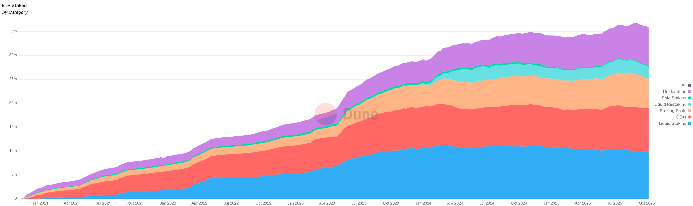
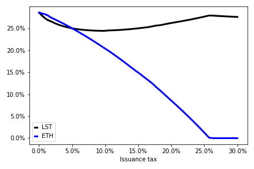
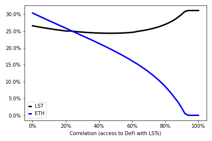
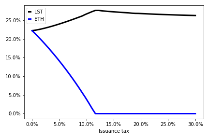
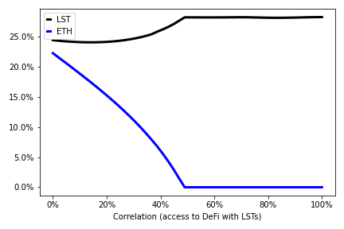

## These slides:  [faycaldrissi.com/staking_talk/](https://www.faycaldrissi.com/staking_talk/)

 

# Macroeconomics of liquid staking

## Fayçal Drissi, Zachary Feinstein, Basil Williams

### *University of Oxford, Stevens Institute of Technology, Imperial Business School*
 

<!--These slides: [https://www.faycaldrissi.com/siam2025](https://www.faycaldrissi.com/siam2025)
[my scholar](https://scholar.google.com/citations?user=njvyriQAAAAJ&hl=fr), 
[my website](https://www.faycaldrissi.com/), [my github](https://github.com/FDR0903)-->

---
section: Motivation
---

# Introduction

### How liquid staking works

- <u>**Deposit assets**</u>: users lock tokens in a liquid staking protocol (ETH, SOL)
- <u>**Receive the derivative token**</u>: protocol issues a token (stETH) that represents the staked assets
- <u>**Earn rewards**</u>: staking reward increases the value of the derivative token
- <u>**Examples**</u>: Lido, Rocket pool, Ankr, Marinade Finance (Solana)

 

<!--<v-click>

### Benefits: 
  - No opportunity costs: assets remain accessible for DeFi use
  - Better economic security

</v-click>-->

---

# Fact #1: LSTs enable DeFi access
Users utilise LSTs in DeFi applications: AMM pools (stETH), Aave Interest Bearing STETH  (stETH as collateral to borrow  assets)
 
 

{style="transform: translate(-8%, 0%); width: 480px"}
{style="transform: translate(94%, -100%); width: 480px"}
---

# Fact #2: liquid staking represents the majoritary of staking

- Liquid staking is easy
<v-click>

- Liquid staking reduces reward risk
$\implies$ strategic complementarity

<v-click>

- Liquid staking represents the majoritary of staking

{style="transform: translate(0%, 0%); width: 900px"}

</v-click>
</v-click>

---

# Motivation
 

<h3> <u>Question</u>  

What are the effects of liquid staking on the macroeconomics of blockchains ?
</h3>

<v-click>

 
 
 

<h3> <u>Some answers</u>  

The tension between staking and DeFi productivity is necessary for 

 

LSTs eliminate the tension between staking and DeFi
 

Natural forces will migrate DeFi from native ETH to LSTs
 

Issuing (or slashing) ETH would no longer affect user incentives

</h3>

</v-click>

---
section: Without LSTs
---

# Blockchain economy without liquid staking tokens

* Small open economy with continuum of homogeneous users (mass one).
* Consumption good normalized to $1$ USD.

<v-click>

* Blockchain issuance is exogenous 
$$dI_t^e/I_t^e$$

<v-click>

* Blockchain users  maximise expected log utility of consumption 
$$E_0\int_0^{\infty} e^{-\beta\,t}\,\log(c_t)\,dt$$

<v-click>

- Users allocate wealth across:
  1. Consumption (USD)
  2. DeFi  (with native ETH)
  3. Staking

</v-click>
</v-click>
</v-click>

---

# Issuance / slashing in USD

* Price of ETH $P=\$1$. 
* Supply of ETH $Q=2\, \footnotesize\text{ETH}$ 
* Stakers hold $1$ ETH, DeFi users hold $1$ ETH

$\implies$ market cap of ETH = $Q\times P = \$\,2.$
<v-click>

* Protocol issues $1$ ETH to stakers $\implies$ new supply $Q = 3 \, \footnotesize\text{ETH}$ 
<v-click>

* Market Cap in USD does not change $\implies$ price adjusts to $P = \$\,2/3$
<v-click>

$\implies$  stakers hold 2 ETH worth $\$\,4/3$,  DeFi users 1 ETH worth $\$\,2/3$

<v-click>

**$\implies$ Issuance redistributes USD wealth from ETH holders to stakers, it does not create/destroys USD**
$$
\boxed{\text{ETH Issuance policy } dI^e_t/I^e_t \equiv \text{USD tax policy } dI^\$_t/I^\$_t \text{ on DeFi users}}
$$

 

<v-click>

### Slashing
* Slashing burns ETH of stakers and transfers value to non‑stakers via price adjustment

</v-click>
</v-click>
</v-click>
</v-click>
</v-click>

---

# Blockchain economy without liquid staking tokens

### Blockchain USD and ETH supply dynamics
- Only DeFi creates/destroys USD wealth
- Staked ETH changes due to issuance/slashing, DeFi ETH does not

<v-click>
 

### Dollar return to DeFi: $\small \qquad \qquad \qquad \qquad \qquad \underbrace{\mu^{\$}\,dt+\sigma^{\$}\,dZ_{t}}_{\text{productivity rate}}-\underbrace{\frac{S_{t}}{D_t}\frac{dI_{t}^{\$}}{I_{t}^{\$}}}_{\text{issuance tax}}+\underbrace{\gamma\frac{S_{t}}{D_t+S_t}dN_{t}}_{\text{deflation}}$

<v-click>

### $\footnotesize \qquad\qquad\qquad\qquad\qquad\qquad\qquad\qquad\qquad\qquad\qquad\quad\swarrow\qquad\qquad\qquad \nearrow$

### Dollar return to staking: $\small \qquad \qquad \qquad \qquad \qquad \qquad  \underbrace{\frac{dI_{t}^{\$}}{I_{t}^{\$}}}_{\text{issuance}}-\underbrace{\gamma\frac{D_{t}}{D_t+S_t}dN_{t}}_{\text{slashing}}$

</v-click>

 

</v-click>

- $S_t\,$:  USD value of aggregate staked ETH
- $D_t$:  USD value of aggregate productive ETH

---

# Blockchain social planning

* <u>**Policy tools**</u> (slashing, ETH issuance) affect USD wealth of users $\implies$ influence incentives

<v-click>
 
$\implies$ <u>**Policy objectives**</u> can be attained (Kose, Rivera and Saleh (2021), Jermann (2023), Cong, He and Tang (2022), and others)

<v-click>

- In our model
$$
\text{issuance tax policy} =\mu_{\iota}^{\$}\,dt+\sigma_{\iota}^{\$}\,dZ_{t}+\gamma_{\iota}^{\$}\,dN_{t}
$$
 
 

$$\footnotesize
\text{allocation } = \theta_D(\gamma, \mu_{\iota}^{\$}, \sigma_{\iota}^{\$}, \gamma_{\iota}^{\$}) \qquad \qquad \qquad \text{ETH prices: } \begin{cases}
\text{drift}  & = \mu_P(\gamma, \mu_{\iota}^{\$}, \sigma_{\iota}^{\$}, \gamma_{\iota}^{\$})\\
\\\text{productivity shocks}  & = \sigma_P(\gamma, \mu_{\iota}^{\$}, \sigma_{\iota}^{\$}, \gamma_{\iota}^{\$}) \\
\\\text{slashing shocks} & =\gamma_P(\gamma, \mu_{\iota}^{\$}, \sigma_{\iota}^{\$}, \gamma_{\iota}^{\$})
\end{cases}
$$

<!--<v-click>
- <u>**Policy objective**</u>: ETH prices
$$\footnotesize
\begin{cases}
\text{Drift} & =\underbrace{\theta_{D}\,\mu^{\$}}_{\text{productivity}}-\underbrace{\left(1-\theta_{D}\right)\mu_{\iota}^{e}}_{\text{inflation}}-\underbrace{\beta}_\text{consumption}+\underbrace{\left(1-\theta_{D}\right)\sigma_{\iota}^{e}\left(\left(1-\theta_{D}\right)\sigma_{\iota}^{e}-\theta_{D}\,\sigma^{\$}\right)}_{\text{covariance issuance/defi}}\\
\\\text{Productivity shocks}  & =\underbrace{\theta_{D}\,\sigma^{\$}}_{\text{DeFi risk}}-\underbrace{\left(1-\theta_{D}\right)\sigma_{\iota}^{e}}_{\text{issuance}}\\
\\\text{slashing shocks} & =\underbrace{\gamma\,\frac{1-\theta_{D}}{1+\left(1-\theta_{D}\right)\left(\gamma_{\iota}^{e}-\gamma\right)}}_{\text{\text{slashing/deflation}}}-\underbrace{\gamma_{\iota}^{e}\,\frac{1-\theta_{D}}{1+\left(1-\theta_{D}\right)\left(\gamma_{\iota}^{e}-\gamma\right)}}_{\text{\text{issuance}}}
\end{cases}
$$

</v-click> -->
</v-click>
</v-click>

---
section: With only LSTs
layout: two-cols-header
---

# Blockchain economy with only liquid staking tokens

::left::

 
 
 
 

### Users allocate wealth across:
  * Consumption (USD)
  * DeFi <u>**with LSTs**</u>
  * Staking with LSTs

 

::right::

<v-click>

## Dollar returns:

### - With <u>only ETH</u> in DeFi

- DeFi: $\qquad \text{productivity rate}-\text{issuance tax}+\text{deflation}$

$$\footnotesize 
\qquad\qquad\qquad\qquad\qquad\swarrow\qquad\qquad\qquad \nearrow 
$$

- Staking: $\qquad\qquad\qquad\quad  \text{issuance}\quad- \quad\text{slashing}$

 
 
 
 

<v-click>

### - With <u>only LSTs</u> in DeFi
- Staking: $\qquad\qquad\quad\qquad\qquad\quad$ <u>**zero**</u>
 
 

- DeFi: $\qquad\qquad\quad\qquad\qquad\underbrace{\mu^{\$}\,dt+\sigma^{\$}\,dZ_{t}}_{\text{productivity rate}}$

</v-click>
</v-click>

---

# Consequences
- **ETH issuance** as reward to staking no longer affects the incentives to staking/DeFi.

 

- **Slashing** no longer affects USD wealth $\implies$ no longer affects staker incentives.

 

<v-click>

- **Centralisation**: total stake at the hand of liquid staking protocols

 

<v-click>

- **Centralisation**:
  * Issuance is a temporary transfer of wealh from stakers in the pool that wins the block, to other stakers
  * Aggregating in one liquid staking pool minimizes wealth variance $\implies$ one surviving pool is the dominant strategy when (symmetric) liquid staking pools compete.

</v-click>
</v-click>

---
section: With ETH and LSTs
---

# Ethereum today

* Users can be productive with both LSTs and ETH
 
 

<v-click>

* Users allocate wealth across:
  * Consumption (USD)
  * DeFi (with LSTs)
  * DeFi (with ETH)
  * Staking (with LSTs)

<v-click>
 

* <u>**Productivity rates**</u> of both tokens are positively correlated

<v-click>

 

- For simplicity: <u>**no slashing**</u>

</v-click>

</v-click>

</v-click>

---

# Dollar returns

- DeFi with LSTs $\qquad\qquad\qquad\qquad\qquad\qquad\qquad\qquad \underbrace{\mu^{\$}\,dt+{\color{red}\sigma^{\$}\,dZ_{t}}}_{\text{LST productivity rate}}+\text{issuance}$

$$
\qquad\qquad\qquad\qquad\qquad\qquad\qquad\quad\uparrow
$$
- DeFi with native tokens $\qquad\qquad\qquad\qquad\qquad\qquad \underbrace{\mu^{\$}\,dt+{\color{blue}\sigma^{\$}\,dW_{t}}}_{\text{ETH productivity rate}}-\text{issuance tax}$
$$
\qquad\qquad\qquad\qquad\qquad\swarrow
$$
- Staking with LSTs $\qquad\qquad\qquad\qquad\qquad\qquad\qquad\qquad\qquad\quad \text{issuance}$

- Correlation: accessibility to DeFi with LSTs
$$
\langle {\color{blue}W},{\color{red}Z}\rangle = \rho > 0
$$

---
layout: two-cols-header
---

# Issuance/correlation favour LSTs

::left::

###  $\qquad$ Issuance
{style="transform: translate(0%, 0%); width: 450px"}

::right::

<v-click>

###  $\qquad$ Correlation
{style="transform: translate(0%, 0%); width: 450px"}

</v-click>

---

# Strategic complementarity

- DeFi with LSTs $\qquad\qquad\qquad\qquad\qquad\quad \underbrace{\mu^{\$}\,dt+{\color{red}\sigma^{\$}\,dZ_{t}}}_{\text{LST productivity rate}}-\underbrace{c\left(\text{LST}_t\right) dt}_{\text{endog liq cost stETH}}+\text{issuance}$

$$
\qquad\qquad\qquad\qquad\qquad\qquad\qquad\qquad\qquad\quad\uparrow
$$
- DeFi with native tokens $\qquad\qquad\qquad\qquad \underbrace{\mu^{\$}\,dt+{\color{blue}\sigma^{\$}\,dW_{t}}}_{\text{LST productivity rate}}-\underbrace{c\left(D_t\right)dt}_{\text{endog liq cost ETH}}-\text{issuance tax}$
$$
\qquad\qquad\qquad\qquad\qquad\qquad\qquad\swarrow
$$
- Staking with LSTs $\qquad\qquad\qquad\qquad\qquad\qquad\qquad\qquad\qquad \text{issuance}$

---
layout: two-cols-header
---

# Liquidity costs  $c\left(x\right) = a - b\,x$

::left::

###  $\qquad$ Without strategic complementarity
{style="transform: translate(0%, 0%); width: 450px"}

::right::

###  $\qquad$ With strategic complementarity
{style="transform: translate(0%, 0%); width: 450px"}

---
layout: two-cols-header
---

# Liquidity costs  $c\left(x\right) = a - b\,x$

::left::

###  $\qquad$ Without strategic complementarity
{style="transform: translate(0%, 0%); width: 450px"}

::right::

###  $\qquad$ With strategic complementarity
{style="transform: translate(0%, 0%); width: 450px"}

---
section: Conclusion
---

# Conclusion

- Natural forces will lead to $100\%$ liquid staking $\implies$ issuance is not effective

<v-clicks>

- Is it good or bad ? 
  - <u>**bad**</u>: slashing has no effect, no social planning, centralisation
  - <u>**good**</u>: economic security, productivity

- Demand for native ETH can be controlled with gas fees   $\implies$ decreases productivity / adoption

- <u>**Future work**</u>: decentralised staking / distributed validator technology (DVT)   $\implies$ competition between blockchain and liquid staking protocols
</v-clicks>

---
layout: end
---

Thank you !

These slides:  [faycaldrissi.com/staking_talk/](https://www.faycaldrissi.com/staking_talk/)
