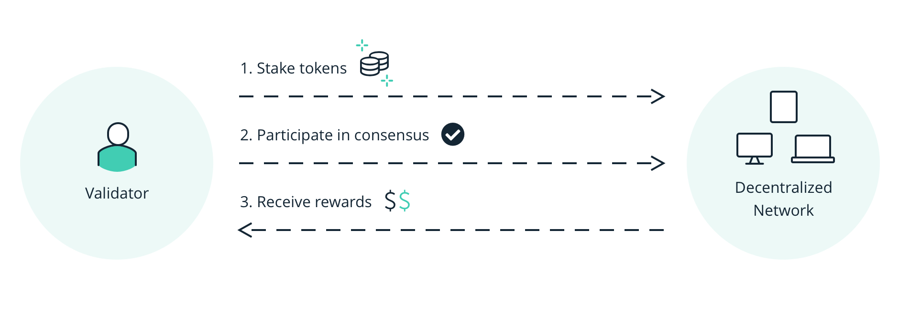
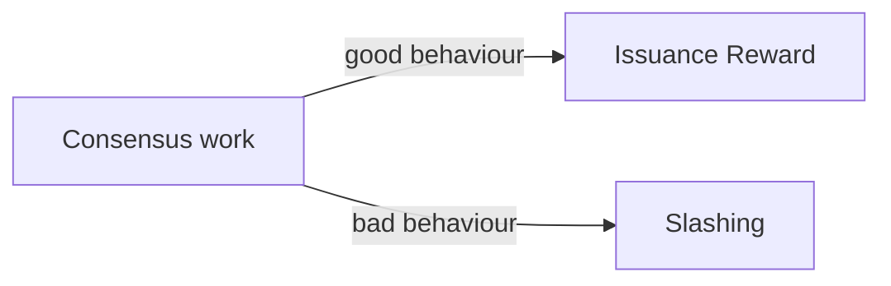
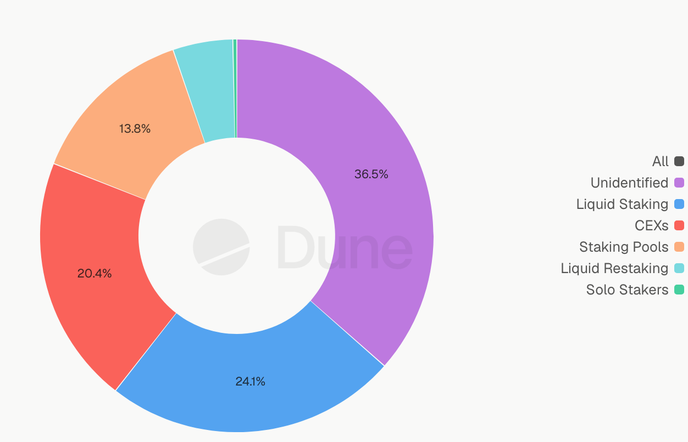
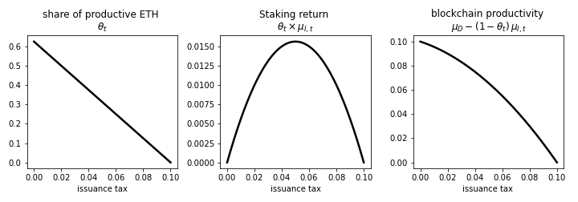
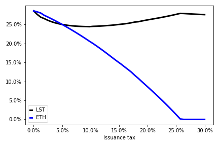
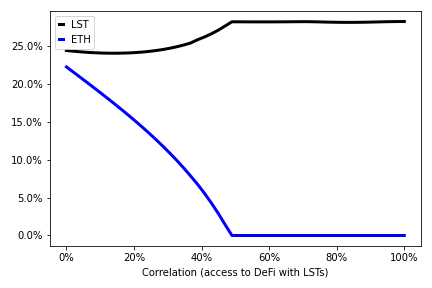

## [faycaldrissi.com/staking_talk/](https://www.faycaldrissi.com/staking_talk/)

 

# Liquid Staking   and   the Limits of Policy

## Fayçal Drissi $\quad$ $\quad$ Zachary Feinstein$\quad$$\quad$ Basil Williams

### *University of Oxford$\quad\quad\quad$ Stevens Institute $\quad\quad$ Imperial Business School*
 

<!--These slides: [https://www.faycaldrissi.com/siam2025](https://www.faycaldrissi.com/siam2025)
[my scholar](https://scholar.google.com/citations?user=njvyriQAAAAJ&hl=fr), 
[my website](https://www.faycaldrissi.com/), [my github](https://github.com/FDR0903)-->

---
section: Motivation
---

# Blockchains

### Modern economies rely on trusted intermediaries (banks, clearing houses, platforms, governments)
- intermediaries reduce transaction costs and enforce contracts
- they also introduce frictions: opacity, market power, monopolies, exclusion, censorship
<v-click>

- can economic activity be coordinated at scale without intermediaries?
  
<v-click>

### Blockchains are a technological response
- **ledger**: shared, tamper-resistant 
- **algorithmic trust**: a consensus protocol + economic incentives

</v-click>
 
<v-click>

### Decentralisation today
- stablecoins market cap: $\$320$bn, crypto market cap: $\$2.63$trn
- decentralised trading: $\$8.2$bn/day
- lending/borrowing: $\$3$bn/day

</v-click>
</v-click>

---
 
# Proof of stake (PoS) blockchains

{style="transform: translate(5%, 10%); width: 800px"}

---

# Proof of stake (PoS) blockchains

## Three foundations of trust
- **Economic security:** high dollar value of stake makes attacks expensive $\implies$ blockchain pays for security with <u>issuance</u> 
<v-click>

- **Discipline:** bad behaviour is punished through <u>slashing</u>

```mermaid {scale: 0.55}
flowchart LR
  V["Consensus work"]
  R["Issuance Reward"]
  S["Slashing"]
  V -->|good behaviour| R
  V -->|bad behaviour| S
```

<v-click>

- **Decentralisation:** diversity in the staking pool reduces the risk of coordination/concentration 

<v-click>

   

### **This paper:** liquid staking can weaken all three: issuance, slashing, and decentralisation

</v-click>
</v-click>
</v-click>

---

# What is liquid staking?

### Consensus (validation) has frictions
- Hardware, IT/software expertise, a $32$ ETH minimum
- **opportunity cost:** staked ETH cannot be used

$\implies$ frictions shrink the staking base

<v-click>

 

### Liquid staking addresses these frictions

Liquid staking

↓

↓

(delegated) Staking
<ul class="list-disc pl-5 space-y-1"><li>Validation is delegated: users lock native tokens in a pool</li><li>Earn staking rewards</li><li>Examples: Lido, Rocket pool, Ankr, Marinade Finance (Solana)</li></ul>

Liquid
<ul class="list-disc pl-5 space-y-1"><li>Receive a derivative token that represents the staked assets</li><li>The token is tradable in DeFi</li></ul>

</v-click>

<!--<v-click>

### Benefits: 
  - No opportunity costs: assets remain accessible for DeFi use
  - Better economic security

</v-click>-->

---

# Liquid staking today

### Liquid staking has reshaped how ETH is held and used
- Easier than solo staking, and reduces reward risk

<v-click>

- Total staked ETH (June 2026): $\approx \$40$ million (32 $\%$ of total ETH)
- Total ETH in liquid staking $\approx 40\%$

{style="transform: translate(75%, 0%); width: 350px"}

<v-click>

- Derivative tokens (stETH, rETH) are productive in DeFi — collateral on Aave, traded on Uniswap

</v-click>
</v-click>

---

# Motivation

<h3> <u>Question</u>  

What are the effects of liquid staking on the macroeconomics of blockchains?

</h3>

<v-click>

### <u>Answers</u>

Tension between productive ETH and staked ETH is what secures the blockchain: issuance and slashing are effective

</v-click>

<v-click>

LSTs eliminate this tension $\implies$ issuance and slashing lose their effects

</v-click>

<v-click>

Natural forces drive the system toward LSTs

</v-click>

---
section: Blockchain economy model
---

# Blockchain economy without liquid staking tokens

* Small open economy with continuum of homogeneous users (mass one).
* Consumption good normalized to $1$ USD.

<v-click>

* Blockchain issuance is exogenous 
$$dI_t^e/I_t^e$$

<v-click>

* Blockchain users maximise expected log utility of consumption 
$$E_0\int_0^{\infty} e^{-\beta\,t}\,\log(c_t)\,dt$$

<v-click>

- Infinitesimal users allocate wealth across:
  1. Consumption (USD)
  2. DeFi  (with native tokens ETH)
  3. Staking

</v-click>
</v-click>
</v-click>

---

# Issuance / slashing in USD

* Price of ETH $P=\$1$. 
* Supply of ETH $Q=2\, \footnotesize\text{ETH}$ 
* Stakers hold $1$ ETH, DeFi users hold $1$ ETH

$\implies$ market cap of ETH = $Q\times P = \$\,2.$
<v-click>

* Protocol issues $1$ ETH to stakers $\implies$ new supply $Q = 3 \, \footnotesize\text{ETH}$ 
<v-click>

* Market Cap in USD does not change $\implies$ price adjusts to $P = \$\,2/3$
<v-click>

$\implies$  stakers hold 2 ETH worth $\$\,4/3$,  DeFi users 1 ETH worth $\$\,2/3$

<v-click>

**$\implies$ Issuance redistributes USD wealth from ETH holders to stakers, it does not create or destroy USD**
$$
\boxed{\text{ETH Issuance policy } dI^e_t/I^e_t \equiv \text{USD tax policy } dI^\$_t/I^\$_t \text{ on DeFi users}}
$$

 

<v-click>

### Slashing
* Slashing burns ETH of stakers and transfers value to non‑stakers via price adjustment

</v-click>
</v-click>
</v-click>
</v-click>
</v-click>

---

# Dollar returns to investment

### Infinitesimal users take aggregates as given

- $S_t\,$:  USD value of aggregate staked ETH
- $D_t$:  USD value of aggregate productive ETH

<v-click>
 

  

### Dollar return to DeFi: $\small \qquad \qquad \qquad \qquad \qquad \underbrace{\mu^{\$}\,dt+\sigma^{\$}\,dW_{t}}_{\text{productivity rate}}-\underbrace{\frac{S_{t}}{D_t}\frac{dI_{t}^{\$}}{I_{t}^{\$}}}_{\text{issuance tax}}+\underbrace{\gamma\frac{S_{t}}{D_t+S_t}dN_{t}}_{\text{deflation}}$

<v-click>

### $\footnotesize \qquad\qquad\qquad\qquad\qquad\qquad\qquad\qquad\qquad\qquad\qquad\quad\swarrow\qquad\qquad\qquad \nearrow$

### Dollar return to staking: $\small \qquad \qquad \qquad \qquad \qquad \qquad  \underbrace{\frac{dI_{t}^{\$}}{I_{t}^{\$}}}_{\text{issuance}}-\underbrace{\gamma\frac{D_{t}}{D_t+S_t}dN_{t}}_{\text{slashing}}$

</v-click>
</v-click>

---

#  Equilibrium 

### Equilibrium definition
- Only DeFi creates or destroys USD wealth 
<v-click>

- Staker holdings change due to issuance
- DeFi holdings do not change due to issuance
<v-click>

- Aggregate demand for ETH = market cap of ETH
<v-click>

- Optimal investor behaviour consistent with aggregates

<v-click>

  

### Equilibrium  (no staking)

$$\small
\begin{array}{rcll}
\textbf{issuance policy} & : & {dI_{t}^{\$}}/{I_{t}^{\$}} & =\;\mu_{I,t}\,dt\\[8pt]
\textbf{allocation to productive DeFi} & : & \theta_{t}^{\star} & =\;\dfrac{\mu_{D}}{2\,\sigma_{D}^{2}}+\dfrac{1}{\sigma_{D}}\sqrt{\overline{\mu}_{I}-\mu_{I,t}}\qquad\quad\left(\overline{\mu}_{I}=\dfrac{\mu_{D}^{2}}{4\,\sigma_{D}^{2}}\right)\\[8pt]
\textbf{ETH prices} & : & \mu_{P,t} & =\;\theta_{t}^{\star}\mu_{D}-\beta-(1-\theta_{t}^{\star})\mu_{I,t}\\[4pt]
 & & \sigma_{P,t} & =\;\theta_{t}^{\star}\sigma_{D}
\end{array}
$$

</v-click>
</v-click>
</v-click>
</v-click>

---

# More generally

$$\footnotesize
\text{issuance tax policy}: \quad \mu_{\iota}\,dt+\sigma_{\iota}\,dW_{t}+\gamma_{\iota}\,dN_{t} \qquad\qquad\qquad {\text{slashing rate}: \gamma}
$$

$$\footnotesize
\text{allocation}: \theta_D(\gamma, \mu_{\iota}, \sigma_{\iota}, \gamma_{\iota}) \qquad\qquad \text{ETH prices}: \begin{cases}
\text{drift}  & = \mu_P(\gamma, \mu_{\iota}, \sigma_{\iota}, \gamma_{\iota})\\
\\\text{productivity shocks}  & = \sigma_P(\gamma, \mu_{\iota}, \sigma_{\iota}, \gamma_{\iota}) \\
\\\text{slashing shocks} & =\gamma_P(\gamma, \mu_{\iota}, \sigma_{\iota}, \gamma_{\iota})
\end{cases}
$$

  

## $\implies$ Policy tools work
Slashing and issuance policy affect USD wealth of users $\implies$ influence incentives $\implies$ **policy objectives** can be attained

---

# Laffer curve

$$\large
\boxed{\ \text{staking return}\ =\ \text{productive base}\ \times\ \text{issuance tax rate}\ }
$$

{style="transform: translate(25%, 0%); width: 600px"}

- issuance raises the tax on productive output 

$\implies$ reduces productive ETH 

$\implies$ beyond a point, contraction of tax base dominates.

<!--<v-click>
- <u>**Policy objective**</u>: ETH prices
$$\footnotesize
\begin{cases}
\text{Drift} & =\underbrace{\theta_{D}\,\mu^{\$}}_{\text{productivity}}-\underbrace{\left(1-\theta_{D}\right)\mu_{\iota}^{e}}_{\text{inflation}}-\underbrace{\beta}_\text{consumption}+\underbrace{\left(1-\theta_{D}\right)\sigma_{\iota}^{e}\left(\left(1-\theta_{D}\right)\sigma_{\iota}^{e}-\theta_{D}\,\sigma^{\$}\right)}_{\text{covariance issuance/defi}}\\
\\\text{Productivity shocks}  & =\underbrace{\theta_{D}\,\sigma^{\$}}_{\text{DeFi risk}}-\underbrace{\left(1-\theta_{D}\right)\sigma_{\iota}^{e}}_{\text{issuance}}\\
\\\text{slashing shocks} & =\underbrace{\gamma\,\frac{1-\theta_{D}}{1+\left(1-\theta_{D}\right)\left(\gamma_{\iota}^{e}-\gamma\right)}}_{\text{\text{slashing/deflation}}}-\underbrace{\gamma_{\iota}^{e}\,\frac{1-\theta_{D}}{1+\left(1-\theta_{D}\right)\left(\gamma_{\iota}^{e}-\gamma\right)}}_{\text{\text{issuance}}}
\end{cases}
$$
</v-click> -->

---
section: With only LSTs
layout: two-cols-header
---

# Blockchain economy with only liquid staking tokens

::left::

 
 
 
 

### Users allocate wealth across:
  * Consumption (USD)
  * DeFi <u>**with LSTs**</u>
  * Staking

 

::right::

<v-click>

## Dollar returns:
- Staking: $\qquad\qquad\quad\qquad\qquad\quad$ <u>**zero**</u>
 

- DeFi: $\qquad\qquad\quad\qquad\qquad\underbrace{\mu^{\$}\,dt+\sigma^{\$}\,dZ_{t}}_{\text{productivity rate}}$

<v-click>

### Why ? 

* Price of ETH $P=\$1$. $\quad$ Supply of ETH $Q=2\, \footnotesize\text{ETH}$.
* Stakers hold $1$ ETH, DeFi users (with LSTs) hold $1$ ETH.

* Protocol issues $1$ ETH. DeFi users holding LSTs are also stakers $\implies$ issuance spreads across all staked ETH

* Stakers hold 1.5 ETH worth $\$\,1$, DeFi users (through LSTs) hold 1.5 ETH worth $\$\,1$

**$\implies$ Issuance has no dollar effect, there is no tax**

</v-click>
</v-click>

---

# Consequences
- **ETH issuance** no longer pays for security and does not affect incentives

 

- **Slashing** no longer affects USD wealth

 

- **Solo staking** or **passive LST** is not viable

 

<v-click>

- **Centralisation**: total stake in the hands of liquid staking protocols

 

<v-click>

- **Centralisation**:
  * Issuance is a temporary transfer of wealth from stakers in the pool that wins the block, to other stakers
  * Aggregating in one liquid staking pool minimizes wealth variance $\implies$ one surviving pool is the dominant strategy when (symmetric) liquid staking pools compete.

</v-click>
</v-click>

---
section: With ETH and LSTs
---

# PoS blockchains today

* Users can be productive with both LSTs and ETH
 
 

<v-click>

* Users allocate wealth across:
  * Consumption (USD)
  * DeFi (with LSTs)
  * DeFi (with ETH)
  * Staking (with LSTs)

<v-click>
 

* <u>**Productivity rates**</u> of both tokens are positively correlated

</v-click>

</v-click>

---

# Dollar returns

- DeFi with LSTs $\qquad\qquad\qquad\qquad\qquad\qquad\qquad\qquad \underbrace{\mu^{\$}\,dt+{\color{red}\sigma^{\$}\,dZ_{t}}}_{\text{LST productivity rate}}+\text{issuance}$

$$
\qquad\qquad\qquad\qquad\qquad\qquad\qquad\quad\uparrow
$$
- DeFi with native tokens $\qquad\qquad\qquad\qquad\qquad\qquad \underbrace{\mu^{\$}\,dt+{\color{blue}\sigma^{\$}\,dW_{t}}}_{\text{ETH productivity rate}}-\text{issuance tax}$
$$
\qquad\qquad\qquad\qquad\qquad\swarrow
$$
- Staking with LSTs $\qquad\qquad\qquad\qquad\qquad\qquad\qquad\qquad\qquad\quad \text{issuance}$

<v-click>

- Correlation: accessibility to DeFi with LSTs
$$
\qquad\qquad\qquad\qquad\langle {\color{blue}W},{\color{red}Z}\rangle = \rho > 0
$$

</v-click>

---
layout: two-cols-header
---

# Issuance/correlation favour LSTs

::left::

###  $\qquad$ Issuance
{style="transform: translate(0%, 0%); width: 450px"}

::right::

<v-click>

###  $\qquad$ Correlation
{style="transform: translate(0%, 0%); width: 450px"}

</v-click>

---

# Strategic complementarity

- DeFi with LSTs $\qquad\qquad\qquad\qquad\qquad\quad \underbrace{\mu^{\$}\,dt+{\color{red}\sigma^{\$}\,dZ_{t}}}_{\text{LST productivity rate}}-\underbrace{c\left(\text{LST}_t\right) dt}_{\text{endog liq cost stETH}}+\text{issuance}$

$$
\qquad\qquad\qquad\qquad\qquad\qquad\qquad\qquad\qquad\quad\uparrow
$$
- DeFi with native tokens $\qquad\qquad\qquad\qquad \underbrace{\mu^{\$}\,dt+{\color{blue}\sigma^{\$}\,dW_{t}}}_{\text{ETH productivity rate}}-\underbrace{c\left(D_t\right)dt}_{\text{endog liq cost ETH}}-\text{issuance tax}$
$$
\qquad\qquad\qquad\qquad\qquad\qquad\qquad\swarrow
$$
- Staking with LSTs $\qquad\qquad\qquad\qquad\qquad\qquad\qquad\qquad\qquad \text{issuance}$

---
layout: two-cols-header
---

# Liquidity costs  $c\left(x\right) = a - b\,x$

::left::

###  $\qquad$ Without strategic complementarity
{style="transform: translate(0%, 0%); width: 450px"}

::right::

###  $\qquad$ With strategic complementarity
{style="transform: translate(0%, 0%); width: 450px"}

---
layout: two-cols-header
---

# Liquidity costs  $c\left(x\right) = a - b\,x$

::left::

###  $\qquad$ Without strategic complementarity
{style="transform: translate(0%, 0%); width: 450px"}

::right::

###  $\qquad$ With strategic complementarity
{style="transform: translate(0%, 0%); width: 450px"}

---
section: Conclusion
---

# Conclusion

- Natural forces push blockchains toward (near) full liquid staking

<v-click>

- Once there, **issuance and slashing no longer affect incentives** — the core policy levers lose their bite

<v-click>

- Is this good or bad?
  - <u>**Bad**</u>: slashing ineffective, no social planning, centralisation (one surviving pool)
  - <u>**Good**</u>: economic security and productivity (capital stays productive)

<v-click>

- Demand for native ETH can still be steered through **gas fees** $\implies$ but at the cost of productivity / adoption

</v-click>
</v-click>
</v-click>

---
layout: end
---

Thank you !

These slides:  [faycaldrissi.com/staking_talk/](https://www.faycaldrissi.com/staking_talk/)
