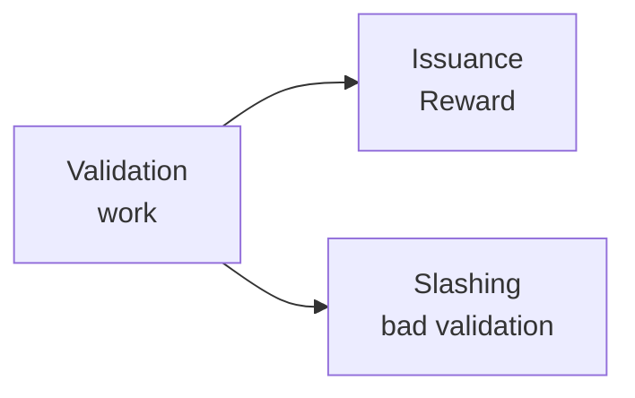
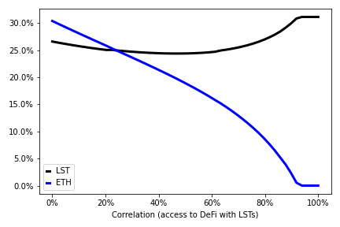
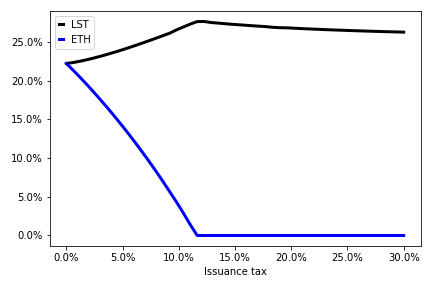

## These slides:  [faycaldrissi.com/staking_talk/](https://www.faycaldrissi.com/staking_talk/)

 

# Macroeconomics of liquid staking

## Fayçal Drissi, Zachary Feinstein, Basil Williams

### *University of Oxford, Stevens Institute of Technology, Imperial Business School*
 

<!--These slides: [https://www.faycaldrissi.com/siam2025](https://www.faycaldrissi.com/siam2025)
[my scholar](https://scholar.google.com/citations?user=njvyriQAAAAJ&hl=fr), 
[my website](https://www.faycaldrissi.com/), [my github](https://github.com/FDR0903)-->

---
section: Motivation
---

# Blockchains

### Modern economies rely on trusted intermediaries (banks, clearing houses, platforms, governments)
<v-click>

- Intermediaries reduce transaction costs and enforce contracts, but introduce frictions
  - opacity, market power, monopoly, exclusion, censorship
  
<v-click>

### Can we coordinate economic activity at scale with less centralized trust?
- Blockchains are the **technological response** to centralisation **frictions**
- Blockchains are the **technological** equivalent of **regulation**:
  - algorithmic and publicly verifiable rules (consensus) to conduct transactions and enforce contracts
  
<v-click>

### Blockchains replace institutional trust with 
  1. a shared, tamper-resistant ledger
  2. a consensus protocol
  3. economic incentives: participants rewarded to follow rules

</v-click>
</v-click>
</v-click>

---
 
# Proof of stake (POS) blockchains

- Lock assets on the blockchain to participate in the consensus protocol
- Blockchain pays for security with **issuance** (staking rewards)

{style="transform: translate(0%, 0%); width: 900px"}

---

# Proof of stake (POS) blockchains

### Slashing
- Blockchain incentivises good behaviour with **slashing**

```mermaid
flowchart LR
  V["Validation<br/>work"]

  R["Issuance<br/> Reward"]
  S["Slashing<br/> bad validation"]

  V --> R
  V --> S
```

<v-click>

### Economic security

- High dollar value of total stake incentivised by issuance: expensive $51\%$ attack
- Diversity of staking pool: decentralised staking prevents coordination attacks

</v-click>

---

# Liquid staking

### Solo staking
- Validation work involves costs, hardware, knowledge IT/software, minimal stake $32$ETH
  

### Liquid staking
1. **Staking is delegated**
  - *Deposit assets*: users lock tokens (ETH, SOL) in a liquid staking protocol
  - *Earn rewards*: staking reward increases the value of the derivative token

2. **Liquid ?** 
  - *Receive a derivative token*: protocol issues a token (stETH) that represents the staked assets
  - The staked token can be traded and used on the blockchain
  

### Examples: Lido, Rocket pool, Ankr, Marinade Finance (Solana)

<!--<v-click>

### Benefits: 
  - No opportunity costs: assets remain accessible for DeFi use
  - Better economic security

</v-click>-->

---

# Fact #1: LSTs enable DeFi
### Users can uses LSTs in DeFi
- Uniswap pools (stETH)
- Aave Interest Bearing STETH  (stETH as collateral to borrow  assets)
  

<v-click>

### Market cap of LSTs in increasing

- **January 2026**: total market capitalization of all staked ETH is approximately $\$ 109$ billion
{style="transform: translate(-8%, 0%); width: 480px"}
{style="transform: translate(94%, -100%); width: 480px"}

</v-click>

---

# Fact #2: liquid staking dominates solo staking

- Liquid staking is easier
<v-click>

- Liquid staking reduces reward risk
$\implies$ strategic complementarity

<v-click>

- Liquid staking represents the majoritary of staking

{style="transform: translate(0%, 0%); width: 900px"}

</v-click>
</v-click>

---

# Motivation
 

<h3> <u>Question</u>  

What are the effects of liquid staking on the macroeconomics of blockchains ?
</h3>

<v-click>

 
 
 

<h3> <u>Some answers</u>  

The tension between staking and DeFi (productivity) is necessary for issuance & slashing to influence user incentives

LSTs eliminate the tension between staking and DeFi
 

Natural forces will migrate DeFi from native ETH to LSTs
 

Issuing (or slashing) ETH would no longer affect user incentives

</h3>

</v-click>

---
section: Without LSTs
---

# Blockchain economy without liquid staking tokens

* Small open economy with continuum of homogeneous users (mass one).
* Consumption good normalized to $1$ USD.

<v-click>

* Blockchain issuance is exogenous 
$$dI_t^e/I_t^e$$

<v-click>

* Blockchain users  maximise expected log utility of consumption 
$$E_0\int_0^{\infty} e^{-\beta\,t}\,\log(c_t)\,dt$$

<v-click>

- Users allocate wealth across:
  1. Consumption (USD)
  2. DeFi  (with native ETH)
  3. Staking

</v-click>
</v-click>
</v-click>

---

# Issuance / slashing in USD

* Price of ETH $P=\$1$. 
* Supply of ETH $Q=2\, \footnotesize\text{ETH}$ 
* Stakers hold $1$ ETH, DeFi users hold $1$ ETH

$\implies$ market cap of ETH = $Q\times P = \$\,2.$
<v-click>

* Protocol issues $1$ ETH to stakers $\implies$ new supply $Q = 3 \, \footnotesize\text{ETH}$ 
<v-click>

* Market Cap in USD does not change $\implies$ price adjusts to $P = \$\,2/3$
<v-click>

$\implies$  stakers hold 2 ETH worth $\$\,4/3$,  DeFi users 1 ETH worth $\$\,2/3$

<v-click>

**$\implies$ Issuance redistributes USD wealth from ETH holders to stakers, it does not create/destroys USD**
$$
\boxed{\text{ETH Issuance policy } dI^e_t/I^e_t \equiv \text{USD tax policy } dI^\$_t/I^\$_t \text{ on DeFi users}}
$$

 

<v-click>

### Slashing
* Slashing burns ETH of stakers and transfers value to non‑stakers via price adjustment

</v-click>
</v-click>
</v-click>
</v-click>
</v-click>

---

# Blockchain economy without liquid staking tokens

- $S_t\,$:  USD value of aggregate staked ETH
- $D_t$:  USD value of aggregate productive ETH

 

### Dollar return to DeFi: $\small \qquad \qquad \qquad \qquad \qquad \underbrace{\mu^{\$}\,dt+\sigma^{\$}\,dZ_{t}}_{\text{productivity rate}}-\underbrace{\frac{S_{t}}{D_t}\frac{dI_{t}^{\$}}{I_{t}^{\$}}}_{\text{issuance tax}}+\underbrace{\gamma\frac{S_{t}}{D_t+S_t}dN_{t}}_{\text{deflation}}$

<v-click>

### $\footnotesize \qquad\qquad\qquad\qquad\qquad\qquad\qquad\qquad\qquad\qquad\qquad\quad\swarrow\qquad\qquad\qquad \nearrow$

### Dollar return to staking: $\small \qquad \qquad \qquad \qquad \qquad \qquad  \underbrace{\frac{dI_{t}^{\$}}{I_{t}^{\$}}}_{\text{issuance}}-\underbrace{\gamma\frac{D_{t}}{D_t+S_t}dN_{t}}_{\text{slashing}}$

<v-click>

- Users determine their allocation $\theta_D$
$$
dx_t = \theta_{D,t} \times \text{DeFi} + (1-\theta_{D,t}) \times \text{staking } - \text{consumption} 
$$ 

</v-click>
</v-click>

 

---

# Blockchain macroeconomics

### Equilibrium and clearing conditions
- Prices clear when ETH demand from users matches ETH supply
$
\qquad \qquad \qquad P_t \, Q_t = S_t + D_t = x_t
$
<v-click>

- Only DeFi (productivity) and consumption create/destroy USD in the economy
$
\quad d(P_t\,Q_t) = D_t (\mu^{\$}\,dt+\sigma^{\$}\,dZ_{t} ) - \beta\, P_t\,Q_t\,dt
$
<v-click>

- ETH supply changes due to issuance/slashing
$
\qquad\qquad\qquad \qquad \qquad\qquad\ \ \ \text{tax policy} ={\color{red} \mu_{\iota}^{\$}}\,dt+{\color{red} \sigma_{\iota}^{\$}}\,dZ_{t}+{\color{red}\gamma_{\iota}^{\$}}\,dN_{t}
$
<v-click>

- Staked / productive ETH determined by user decisions $\qquad\qquad\qquad\qquad\quad\ \ D_t = \theta_D\,P_t\,Q_t \qquad S_t = (1-\theta_D)\,P_t\,Q_t$
<v-click>

 

### Solution

$$\footnotesize
\text{allocation } = \theta_D(\gamma,{\color{red} \mu_{\iota}^{\$}}, {\color{red} \sigma_{\iota}^{\$}}, {\color{red}\gamma_{\iota}^{\$}}) \qquad \qquad \qquad \text{ETH prices: } \begin{cases}
\text{drift}  & = \mu_P(\gamma,{\color{red} \mu_{\iota}^{\$}},{\color{red} \sigma_{\iota}^{\$}}, {\color{red}\gamma_{\iota}^{\$}})\\
\\\text{productivity shocks}  & = \sigma_P(\gamma, {\color{red} \mu_{\iota}^{\$}},{\color{red} \sigma_{\iota}^{\$}}, {\color{red}\gamma_{\iota}^{\$}}) \\
\\\text{slashing shocks} & =\gamma_P(\gamma, {\color{red} \mu_{\iota}^{\$}}, {\color{red} \sigma_{\iota}^{\$}}, {\color{red}\gamma_{\iota}^{\$}})
\end{cases}
$$

<!--<v-click>
- <u>**Policy objective**</u>: ETH prices
$$\footnotesize
\begin{cases}
\text{Drift} & =\underbrace{\theta_{D}\,\mu^{\$}}_{\text{productivity}}-\underbrace{\left(1-\theta_{D}\right)\mu_{\iota}^{e}}_{\text{inflation}}-\underbrace{\beta}_\text{consumption}+\underbrace{\left(1-\theta_{D}\right)\sigma_{\iota}^{e}\left(\left(1-\theta_{D}\right)\sigma_{\iota}^{e}-\theta_{D}\,\sigma^{\$}\right)}_{\text{covariance issuance/defi}}\\
\\\text{Productivity shocks}  & =\underbrace{\theta_{D}\,\sigma^{\$}}_{\text{DeFi risk}}-\underbrace{\left(1-\theta_{D}\right)\sigma_{\iota}^{e}}_{\text{issuance}}\\
\\\text{slashing shocks} & =\underbrace{\gamma\,\frac{1-\theta_{D}}{1+\left(1-\theta_{D}\right)\left(\gamma_{\iota}^{e}-\gamma\right)}}_{\text{\text{slashing/deflation}}}-\underbrace{\gamma_{\iota}^{e}\,\frac{1-\theta_{D}}{1+\left(1-\theta_{D}\right)\left(\gamma_{\iota}^{e}-\gamma\right)}}_{\text{\text{issuance}}}
\end{cases}
$$

</v-click> -->

<v-click>

### Policy

* <u>**Policy tools**</u> (slashing, ETH issuance) affect USD wealth of users $\implies$ influence incentives 
* <u>**Policy objectives**</u> can be attained (Kose, Rivera and Saleh (2021), Jermann (2023), Cong, He and Tang (2022), and others)

</v-click>
</v-click>
</v-click>
</v-click>
</v-click>

---
section: With only LSTs
layout: two-cols-header
---

# Blockchain economy with only liquid staking tokens

::left::

 
 
 
 

### Users allocate wealth across:
  * Consumption (USD)
  * DeFi <u>**with LSTs**</u>
  * Staking with LSTs

 

::right::

<v-click>

### Dollar returns -- <u>only ETH</u> in DeFi

- DeFi: $\qquad \text{productivity rate}-\text{issuance tax}+\text{deflation}$

$$\footnotesize 
\qquad\qquad\qquad\qquad\qquad\swarrow\qquad\qquad\qquad \nearrow 
$$

- Staking: $\qquad\qquad\qquad\quad  \text{issuance}\quad- \quad\text{slashing}$

 
 
 
 

<v-click>

### Dollar returns -- <u>only LSTs</u> in DeFi
- Staking: $\qquad\qquad\quad\qquad\qquad\quad$ <u>**zero**</u>
 
 

- DeFi: $\qquad\qquad\quad\qquad\qquad\underbrace{\mu^{\$}\,dt+\sigma^{\$}\,dZ_{t}}_{\text{productivity rate}}$

</v-click>
</v-click>

---

# Consequences
- **ETH issuance** as reward to staking no longer affects the incentives to staking/DeFi.

 

- **Slashing** no longer affects USD wealth $\implies$ no longer affects staker incentives.

 

<v-click>

- **Centralisation**: total stake at the hand of liquid staking protocols

 

<v-click>

- **Centralisation**:
  * Issuance is a temporary transfer of wealh from stakers in the pool that wins the block, to other stakers
  * Aggregating in one liquid staking pool minimizes wealth variance $\implies$ one surviving pool is the dominant strategy when (symmetric) liquid staking pools compete.

</v-click>
</v-click>

---
section: With ETH and LSTs
---

# Ethereum today

* Users can be productive with both LSTs and ETH
 
 

<v-click>

* Users allocate wealth across:
  * Consumption (USD)
  * DeFi (with LSTs)
  * DeFi (with ETH)
  * Staking (with LSTs)

<v-click>
 

* <u>**Productivity rates**</u> of both tokens are positively correlated

<v-click>

 

- For simplicity: <u>**no slashing**</u>

</v-click>

</v-click>

</v-click>

---

# Dollar returns

- DeFi with LSTs $\qquad\qquad\qquad\qquad\qquad\qquad\qquad\qquad \underbrace{\mu^{\$}\,dt+{\color{red}\sigma^{\$}\,dZ_{t}}}_{\text{LST productivity rate}}+\text{issuance}$

$$
\qquad\qquad\qquad\qquad\qquad\qquad\qquad\quad\uparrow
$$
- DeFi with native tokens $\qquad\qquad\qquad\qquad\qquad\qquad \underbrace{\mu^{\$}\,dt+{\color{blue}\sigma^{\$}\,dW_{t}}}_{\text{ETH productivity rate}}-\text{issuance tax}$
$$
\qquad\qquad\qquad\qquad\qquad\swarrow
$$
- Staking with LSTs $\qquad\qquad\qquad\qquad\qquad\qquad\qquad\qquad\qquad\quad \text{issuance}$

- Correlation: accessibility to DeFi with LSTs
$$
\langle {\color{blue}W},{\color{red}Z}\rangle = \rho > 0
$$

---
layout: two-cols-header
---

# Issuance/correlation favour LSTs

::left::

###  $\qquad$ Issuance
{style="transform: translate(0%, 0%); width: 450px"}

::right::

<v-click>

###  $\qquad$ Correlation
{style="transform: translate(0%, 0%); width: 450px"}

</v-click>

---

# Strategic complementarity

- DeFi with LSTs $\qquad\qquad\qquad\qquad\qquad\quad \underbrace{\mu^{\$}\,dt+{\color{red}\sigma^{\$}\,dZ_{t}}}_{\text{LST productivity rate}}-\underbrace{c\left(\text{LST}_t\right) dt}_{\text{endog liq cost stETH}}+\text{issuance}$

$$
\qquad\qquad\qquad\qquad\qquad\qquad\qquad\qquad\qquad\quad\uparrow
$$
- DeFi with native tokens $\qquad\qquad\qquad\qquad \underbrace{\mu^{\$}\,dt+{\color{blue}\sigma^{\$}\,dW_{t}}}_{\text{LST productivity rate}}-\underbrace{c\left(D_t\right)dt}_{\text{endog liq cost ETH}}-\text{issuance tax}$
$$
\qquad\qquad\qquad\qquad\qquad\qquad\qquad\swarrow
$$
- Staking with LSTs $\qquad\qquad\qquad\qquad\qquad\qquad\qquad\qquad\qquad \text{issuance}$

---
layout: two-cols-header
---

# Liquidity costs  $c\left(x\right) = a - b\,x$

::left::

###  $\qquad$ Without strategic complementarity
{style="transform: translate(0%, 0%); width: 450px"}

::right::

###  $\qquad$ With strategic complementarity
{style="transform: translate(0%, 0%); width: 450px"}

---
layout: two-cols-header
---

# Liquidity costs  $c\left(x\right) = a - b\,x$

::left::

###  $\qquad$ Without strategic complementarity
{style="transform: translate(0%, 0%); width: 450px"}

::right::

###  $\qquad$ With strategic complementarity
{style="transform: translate(0%, 0%); width: 450px"}

---
section: Conclusion
---

# Conclusion

- Natural forces will lead to $100\%$ liquid staking $\implies$ issuance is not effective

<v-clicks>

- Is it good or bad ? 
  - <u>**bad**</u>: slashing has no effect, no social planning, centralisation
  - <u>**good**</u>: economic security, productivity

- Demand for native ETH can be controlled with gas fees   $\implies$ decreases productivity / adoption

- <u>**Future work**</u>: decentralised staking / distributed validator technology (DVT)   $\implies$ competition between blockchain and liquid staking protocols
</v-clicks>

---
layout: end
---

Thank you !

These slides:  [faycaldrissi.com/staking_talk/](https://www.faycaldrissi.com/staking_talk/)
