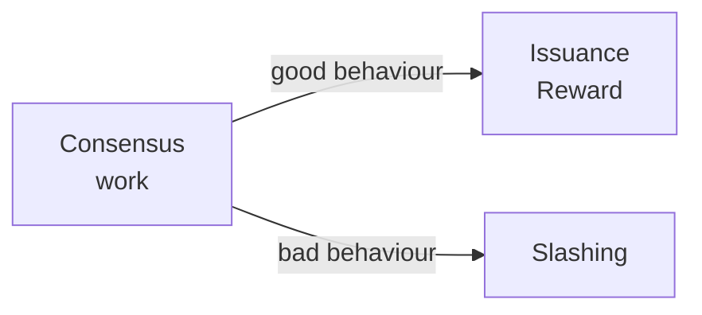
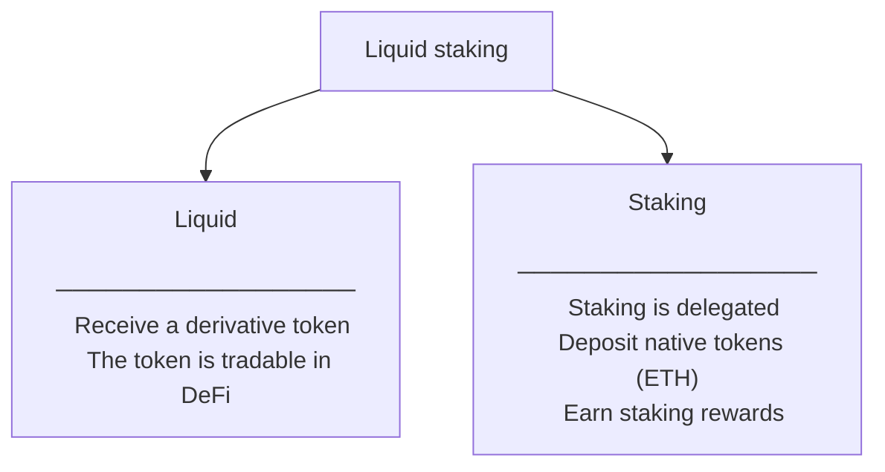
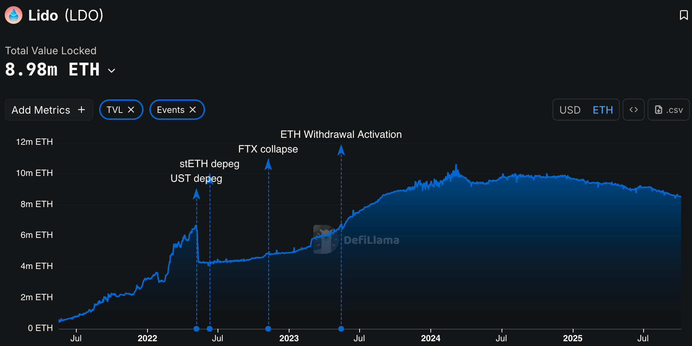
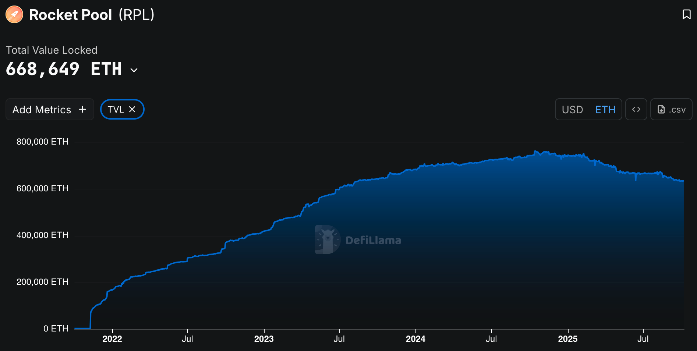
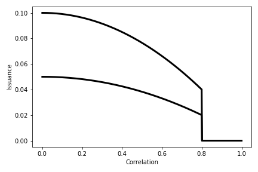

## These slides:  [faycaldrissi.com/staking_talk/](https://www.faycaldrissi.com/staking_talk/)

 

# Macroeconomics of liquid staking

## Fayçal Drissi, Zachary Feinstein, Basil Williams

### *University of Oxford, Stevens Institute of Technology, Imperial Business School*
 

<!--These slides: [https://www.faycaldrissi.com/siam2025](https://www.faycaldrissi.com/siam2025)
[my scholar](https://scholar.google.com/citations?user=njvyriQAAAAJ&hl=fr), 
[my website](https://www.faycaldrissi.com/), [my github](https://github.com/FDR0903)-->

---
section: Motivation
---

# Blockchains

### Modern economies rely on trusted intermediaries (banks, clearing houses, platforms, governments)
- intermediaries reduce transaction costs and enforce contracts  
- they also introduce frictions: opacity, market power, monopolies, exclusion, censorship
  
<v-click>

### Can economic activity be coordinated at scale with less centralized trust?
- blockchains are a **technological response** to the **frictions** of centralization  
- **regulation** through algorithmic and publicly verifiable rules (consensus) to conduct transactions and enforce contracts
  
<v-click>

### Blockchains replace institutional trust with 
  1. a consensus protocol  
  2. economic incentives: participants are rewarded for following the rules

$\implies$ a shared, tamper-resistant ledger

</v-click>
</v-click>

---
 
# Proof of stake (POS) blockchains

- Lock assets on the blockchain to participate in the consensus protocol
- The blockchain pays for security through **issuance**
  - newly created native tokens are distributed to stakers

{style="transform: translate(0%, 0%); width: 900px"}

---

# Proof of stake (POS) blockchains

### Slashing
- The blockchain incentivises correct consensus behaviour through **slashing**

```mermaid
flowchart LR
  V["Consensus<br/>work"]
  
  R["Issuance<br/>Reward"]
  S["Slashing"]

  V -->|good behaviour| R
  V -->|bad behaviour| S
```

 <v-click>

### Economic security
- A high dollar value of total stake, incentivised by issuance, makes a $51%$ attack expensive
- Diversity in the staking pool: decentralised staking reduces the risk of coordination attacks

</v-click>

---

# Liquid staking

### Solo staking
- Validation work involves costs: hardware, IT/software knowledge, and a minimum stake of $32$ ETH
  
<v-click>

### Liquid staking
- Examples: Lido, Rocket Pool, Ankr, Marinade Finance (Solana)

```mermaid
flowchart TD
  L["Liquid staking"]

  S["Liquid
  ──────────────────
  Receive a derivative token
  The token is tradable in DeFi"]

  Q["Staking
  ──────────────────
  Staking is delegated
  Deposit native tokens (ETH)
  Earn staking rewards"]

  L --> S
  L --> Q
```

 
</v-click>

<!--### Liquid staking
1. **Staking is delegated**
  - *Deposit assets*: users lock tokens (ETH, SOL) in a liquid staking protocol
  - *Earn rewards*: staking reward increases the value of the derivative token
  

2. **Liquid ?** 
  - *Receive a derivative token*: protocol issues a token (stETH) that represents the staked assets
  - The staked token can be traded and used on the blockchain
  

### Examples: Lido, Rocket pool, Ankr, Marinade Finance (Solana)

<!--<v-click>

### Benefits: 
  - No opportunity costs: assets remain accessible for DeFi use
  - Better economic security

</v-click>-->

---

# Fact #1: LSTs are productive
### Users can use LSTs in DeFi
- Uniswap pools (stETH)
- Aave interest-bearing stETH (stETH used as collateral to borrow assets)
  

<v-click>

### Market cap of LSTs
- **January 2026**: total market capitalization of liquid staking tokens is $\approx \$70$ billion (about $20\%$ of the total ETH market cap)
{style="transform: translate(-3%, 0%); width: 450px"}
{style="transform: translate(100%, -100%); width: 450px"}

</v-click>

---

# Fact #2: liquid staking dominates solo staking

- Liquid staking is easier
<v-click>

- Liquid staking reduces reward risk

<v-click>

- Liquid staking represents the majority of staking

{style="transform: translate(0%, 0%); width: 900px"}

</v-click>
</v-click>

---

# Motivation
 

<h3> <u>Question</u>  

What are the effects of liquid staking on the macroeconomics of blockchains?
</h3>

<v-click> 

 
 
 

<h3> <u>Some answers</u>  

The tension between staking and DeFi (productivity) is necessary for issuance and slashing to influence user incentives

LSTs eliminate the tension between staking and DeFi
 

Natural forces will shift DeFi from native ETH to LSTs
 

Issuing or slashing ETH would no longer affect user incentives

</h3>

</v-click>

---
section: Without LSTs
---

# Blockchain economy and users

* Small open economy with continuum of homogeneous users (mass one).
* Consumption good normalized to $1$ USD.

<v-click>

* Blockchain users choose a consumption stream $\{c_t\}_{t=0}^\infty$ that maximises expected log utility
$$E_0\int_0^{\infty} e^{-\beta\,t}\,\log(c_t)\,dt$$

<v-click>

- Users allocate wealth across:
  1. Consumption (USD)
  2. DeFi  (with native ETH)
  3. Staking

</v-click>
</v-click>

---

# Some notation

- Each user $i\in[0,1]$ takes as given
  - $P_t$: price of ETH
  - $S_t$: dollar value of staked ETH
  - $D_t$: dollar value of ETH locked in DeFi protocols
  - $Q_t$: supply of ETH in the blockchain
 

<v-click>

  $\implies$

  - $S_t / P_t$: staked ETH
  - $D_t / P_t$: ETH units in DeFi, productive ETH

</v-click>

---

# Issuance in USD

* Price of ETH $P=\$1$. 
* Supply of ETH $Q=2\, \footnotesize\text{ETH}$ 
* Stakers hold $1$ ETH, DeFi users hold $1$ ETH

$\implies$ market cap of ETH = $Q\times P = \$\,2.$
<v-click>

* Protocol issues $1$ ETH to stakers $\implies$ new supply $Q = 3 \, \footnotesize\text{ETH}$ 
<v-click>

* Market Cap in USD does not change $\implies$ price adjusts to $P = \$\,2/3$
<v-click>

$\implies$  stakers hold 2 ETH worth $\$\,4/3$,  DeFi users 1 ETH worth $\$\,2/3$

<v-click>

**$\implies$ Issuance redistributes USD wealth from ETH holders to stakers, it does not create/destroys USD**
$$
\boxed{\text{ETH Issuance policy }  \equiv \text{USD tax policy }  \text{ on DeFi users}}
$$

</v-click>
</v-click>
</v-click>
</v-click>

---

# Slashing in USD

* Price of ETH $P=\$1$. 
* Supply of ETH $Q=2\, \footnotesize\text{ETH}$ 
* Stakers hold $1$ ETH, DeFi users hold $1$ ETH

$\implies$ market cap of ETH = $Q\times P = \$\,2.$
<v-click>

* Protocol burns $0.5$ ETH of stakers $\implies$ new supply $Q = 1.5 \, \footnotesize\text{ETH}$ 
<v-click>

* Market Cap in USD does not change $\implies$ price adjusts to $P = \$\,2/1.5 = \$\,1.33$
<v-click>

$\implies$  stakers hold 0.5 ETH worth $\$\,0.66$,  DeFi users 1 ETH worth $\$\,1.33$

<v-click>

**$\implies$ Slashing burns ETH of stakers and transfers value to non‑stakers via price adjustment**

</v-click>
</v-click>
</v-click>
</v-click>

---

# Returns to staking (no slashing)

* Issuance is a proportional rate $dI_t/I_t$, applied to staked ETH, as currently implemented in Ethereum.   The number of ETH issued at time $t$ is
$$
\underbrace{\frac{S_t}{P_t}}_{\text{staked ETH}}
\times
\underbrace{\frac{dI_t}{I_t}}_{\text{issuance policy}}\,
$$
<v-click>

- The dollar value of wealth distributed to stakers at time $t$ is
$$
\underbrace{\frac{S_t}{P_t}\,\frac{dI_t}{I_t}}_{\text{ETH issued}}\times\underbrace{P_t}_{\text{ETH price}}\,
$$
<v-click>

- The return to staking, per dollar locked in staking, is therefore
$$
\frac{d\nu_{S,t}}{\nu_{S,t}} = \underbrace{\frac{S_t}{P_t}\,\frac{dI_t}{I_t}}_{\text{ETH issued}}
\times
\underbrace{P_t}_{\text{ETH price}}
\times
\underbrace{\frac{1}{S_t}}_{\text{normalized by total stake}}
=
\frac{dI_t}{I_t}\,
$$

</v-click>
</v-click>

---

# Returns to DeFi

### Returns to DeFi have two components
1. productivity 
2. issuance tax

 

<v-click>

### Productivity
* The return from DeFi due to **productivity** is stochastic:
  $$
  \mu_{D}\,dt+\sigma_{D}\,dW_{D,t}\,
  $$
  - $\mu_{D}$: growth of the blockchain economy driven by wealth locked in DeFi protocols and adoption
  - $W_{D,t}$: productivity shocks (exogenous demand shocks, hacks, theft, and political risk)
  - $\sigma_{D}$: scales the magnitude of these shocks

</v-click>

---

# Returns to DeFi

### Issuance tax
- Issuance does not create or destroy dollar wealth in the blockchain economy $\implies$ issuance enters as a negative component of returns to productive ETH
$$
- \underbrace{S_t\,\frac{dI_t}{I_t}}_{\text{dollars distributed to stakers}}
\times
\underbrace{\frac{1}{D_t}}_{\scriptsize \begin{array}{c}\text{normalized by dollar}\\\text{value of productive ETH}\end{array}}
$$

<v-click>

### Returns to DeFi
- Combining this issuance tax with stochastic productivity yields the return to DeFi:
$$
\frac{d\nu_{D,t}}{\nu_{D,t}}
= \underbrace{\mu_{D}\,dt+\sigma_{D}\,dW_{D,t}}_{\text{productivity}}
-
\underbrace{\frac{S_t}{D_t}\,\frac{dI_t}{I_t}}_{\text{tax on productive capital}}
$$
</v-click>

---

# Blockchain user problem

- Let $x_t^i$ denote the dollar net worth of user $i\in[0,1]$
- Each user allocates a fraction $\theta_t^i$ of wealth to DeFi, with the remaining share $1-\theta_t^i$ in staking
$$
\frac{dx_t^i}{x_t^i}
=\theta_t^i\,\frac{d\nu_{D,t}}{\nu_{D,t}}
+\left(1-\theta_t^i\right)\frac{d\nu_{S,t}}{\nu_{S,t}}
-\frac{c_t^i}{x_t^i}\,dt,
$$

  

<v-click>

### In the more general model:

#### Dollar return to DeFi: $\small \ \qquad \qquad \qquad \qquad \underbrace{\mu_D\,dt+\sigma_D\,dW_{L,t}}_{\text{productivity rate}}-\underbrace{\frac{S_{t}}{D_t}\frac{dI_{t}}{I_{t}}}_{\text{issuance tax}}+\underbrace{\gamma\frac{S_{t}}{D_t+S_t}dN_{t}}_{\text{deflation}}$

#### $\footnotesize \qquad\qquad\qquad\qquad\qquad\qquad\qquad\qquad\qquad\qquad\qquad\quad\swarrow\qquad\qquad\qquad \nearrow$

### Dollar return to staking: $\small  \qquad \qquad \qquad \qquad  \underbrace{\frac{dI_{t}}{I_{t}}}_{\text{issuance}}-\underbrace{\gamma\frac{D_{t}}{D_t+S_t}dN_{t}}_{\text{slashing}}$

</v-click>

---

# Blockchain user problem

- We consider a class of issuance policies that respond to shocks (yielding a unique equilibrium)
$$
\frac{dI_t}{I_t}
=
\frac{D_t}{P_t Q_t}\,\left(\mu_{I,t}\,dt+\sigma_{I,t}\,dW_{D,t}\right)
$$

<v-click>

- Optimal allocation
$$
\theta_{t}^{i\,\star}
=
\frac{\mu_{D}-\mu_{I,t}}{\left(\sigma_{D}-\sigma_{I,t}\right)^{2}}
-
\frac{D_t}{S_t+D_t}\,\frac{\sigma_{I,t}}{\sigma_{D}-\sigma_{I,t}}
$$

$\implies$ Higher issuance reduces the allocation to productive DeFi

<v-click>

- Zero allocation to DeFi if $\qquad\qquad\qquad\qquad\qquad\quad\mu_{I,t}\ge \mu_{D}-\frac{D_t}{S_t+D_t}\,\sigma_{I,t}\left(\sigma_{D}-\sigma_{I,t}\right)$

- No staking if  $\qquad\qquad\qquad\qquad\qquad\qquad\qquad\quad\mu_{I,t}\le \mu_{D}-\left(\sigma_{D}-\frac{S_t}{S_t+D_t}\,\sigma_{I,t}\right)\left(\sigma_{D}-\sigma_{I,t}\right)$

</v-click>
</v-click>

---

# Clearing and equilibrium 

### Clearing

- Aggregate user wealth equals the market capitalization of ETH:
$$
x_t \equiv \int_0^1 x_t^i\,di = P_t Q_t,
$$

- Portfolio choices clear the DeFi and staking markets:
$$
D_t = \theta_t\,x_t
\qquad\text{and}\qquad
S_t = (1-\theta_t)\,x_t
\qquad \implies \qquad
P_t\,Q_t = S_t+D_t
$$

<v-click>

### Symmetric equilibrium

- All users choose the same portfolio share:
  - $\theta_t^{\star}=0$ if $\mu_{I,t}\ge \mu_D$
  - $\theta_t^{\star}=1$ if $\mu_{I,t}\le \mu_D-\sigma_D\left(\sigma_D-\sigma_{I,t}\right)$
  - Otherwise,
  $$
  \theta_t^{\star}
  =
  \frac{\mu_D-\mu_{I,t}}{\sigma_D\left(\sigma_D-\sigma_{I,t}\right)}
  $$
- The market capitalization of ETH evolves according to
$$
\frac{d(P_t Q_t)}{P_t Q_t}
=
\theta_t^\star\big(\mu_D\,dt+\sigma_D\,dW_{D,t}\big)
-\beta\,dt.
$$

</v-click>

---

# Equilibrium properties

### Economic security 
- Only if
$$
\mu_D-\sigma_D\left(\sigma_D-\sigma_{I,t}\right)\le\mu_{I,t}\le \mu_D
$$
  
- The range is larger when productivity risk is higher: staking provides a diversification effect

<v-click>

  

### Market cap evolves only due to productivity and consumption
$$
\frac{d(P_t Q_t)}{P_t Q_t}
=
\theta_t^\star\big(\mu_D\,dt+\sigma_D\,dW_{D,t}\big)
-\beta\,dt.
$$

- Issuance influences market cap dynamics through $\theta_t$

</v-click>

---

# Laffer curve: dangers of too much issuance

$$\scriptsize
\text{equilibrium staking return:} \quad \frac{\mu_D-\mu_{I,t}}{\sigma_D\left(\sigma_D-\sigma_{I,t}\right)}\,\mu_I
\qquad\qquad
\text{equilibrium productivity:} \quad \mu_D\,\left(1-\frac{\mu_D-\mu_{I,t}}{\sigma_D\left(\sigma_D-\sigma_{I,t}\right)}\right)\,\mu_I
$$

{style="transform: translate(20%, 0%); width: 620px"}

- Higher issuance raises the tax applied to productive output
<v-click>

- It simultaneously reduces the equilibrium amount of productive ETH
<v-click>

- Beyond a certain point, the contraction of the tax base dominates the increase in the tax rate
<v-click>

- **In practice**: with an outside investment option, when staking returns fall below the risk-free rate, users leave the blockchain

</v-click>
</v-click>
</v-click>

---

# ETH prices

### Equilibrium and clearing conditions

- Supply evolves with issuance
$$
dQ_{t}=\frac{S_{t}}{P_{t}}\,\frac{dI_{t}}{I_{t}}
$$
<v-click>

- Assume  $dP_t / P_t = \mu_{P,t} \, dt + \sigma dW_{D,t}$
$$
\begin{cases}
\mu_{P,t}&=
\underbrace{\theta_t^{\star}\,\mu_D
-\beta}_\text{discounted productivity}
-\underbrace{\left(1-\theta_t^{\star}\right)\,\mu_{I,t}^e}_\text{inflation from issuance}
-\underbrace{\theta_t^{\star}\left(1-\theta_t^{\star}\right)\sigma_{I,t}^e\,\sigma_D}_\text{inflation/deflation: productivity shocks}
+\underbrace{\left(1-\theta_t^{\star}\right)^2\sigma_{I,t}^{e\,2}}_\text{issuance risk}\\
\\
\sigma_{P,t}&=
\underbrace{\theta_t^{\star}\,\sigma_D}_{\text{producitivity risk}}
-\underbrace{\left(1-\theta_t^{\star}\right)\,\sigma_{I,t}^e}_{\text{issuance risk}}\,.
\end{cases}
$$

 $-\theta_t^{\star}\,(1-\theta_t^{\star})\,\sigma_{I,t}^e\,\sigma_D$: issuance that expands ETH supply in response to positive shocks generates an inflationary effect

 $(1-\theta_t^{\star})^2\,\sigma_{I,t}^{e,2}$: higher issuance volatility increases the riskiness of staking $\implies$  users reallocate toward productive ETH

</v-click>

---

# Issuance (and slashing) are useful

### Issuance policy is effective because it influences dollar incentives

$$\footnotesize
\text{allocation } = \theta({\color{red} \mu_{\iota}}, {\color{red} \sigma_{\iota}}) \qquad \qquad \qquad \text{ETH prices: } \begin{cases}
\text{drift}  & = \mu_P({\color{red} \mu_{\iota}},{\color{red} \sigma_{\iota}})\\
\\\text{productivity shocks}  & = \sigma_P({\color{red} \mu_{\iota}},{\color{red} \sigma_{\iota}}) \\
\\\text{slashing shocks} & =\gamma_P({\color{red} \mu_{\iota}}, {\color{red} \sigma_{\iota}})
\end{cases}
$$

 

<v-click>

### Slashing is effective because it influences dollar incentives

 

<!--<v-click>
- <u>**Policy objective**</u>: ETH prices
$$\footnotesize
\begin{cases}
\text{Drift} & =\underbrace{\theta_{D}\,\mu_D}_{\text{productivity}}-\underbrace{\left(1-\theta_{D}\right)\mu_{\iota}^{e}}_{\text{inflation}}-\underbrace{\beta}_\text{consumption}+\underbrace{\left(1-\theta_{D}\right)\sigma_{\iota}^{e}\left(\left(1-\theta_{D}\right)\sigma_{\iota}^{e}-\theta_{D}\,\sigma_D\right)}_{\text{covariance issuance/defi}}\\
\\\text{Productivity shocks}  & =\underbrace{\theta_{D}\,\sigma_D}_{\text{DeFi risk}}-\underbrace{\left(1-\theta_{D}\right)\sigma_{\iota}^{e}}_{\text{issuance}}\\
\\\text{slashing shocks} & =\underbrace{\gamma\,\frac{1-\theta_{D}}{1+\left(1-\theta_{D}\right)\left(\gamma_{\iota}^{e}-\gamma\right)}}_{\text{\text{slashing/deflation}}}-\underbrace{\gamma_{\iota}^{e}\,\frac{1-\theta_{D}}{1+\left(1-\theta_{D}\right)\left(\gamma_{\iota}^{e}-\gamma\right)}}_{\text{\text{issuance}}}
\end{cases}
$$

</v-click> 

(Kose, Rivera and Saleh (2021), Jermann (2023), Cong, He and Tang (2022), and others)
-->

<v-click>

### Policy objectives can be attained

- Reduce eth volatility
- Target staking share
- Long-term economic security (incentivise productivity and then increase security)

</v-click>
</v-click>

---
section: With only LSTs
layout: two-cols-header
---

# Blockchain economy and users

* Small open economy with continuum of homogeneous users (mass one).
* Consumption good normalized to $1$ USD.
* Blockchain users choose a consumption stream $\{c_t\}_{t=0}^\infty$ that maximises expected log utility
- Users allocate wealth across:
  1. Consumption (USD)
  2. DeFi  with LSTs
  3. Staking

---

# Productivity and Security returns

### Dollar returns -- <u>only ETH</u> in DeFi

- DeFi: $\qquad \text{productivity rate}-\text{issuance tax}+\text{deflation}$

$
\qquad\qquad\qquad\qquad\qquad\qquad\qquad\swarrow\qquad\qquad\qquad \nearrow 
$

- Staking: $\qquad\qquad\qquad\quad  \text{issuance}\quad- \quad\text{slashing}$

<v-click>

   

### Dollar returns -- <u>only LSTs</u> in DeFi

- Staking: $\qquad\qquad\quad\qquad\qquad\quad$ <u>**zero**</u>
 
 

- DeFi: $\qquad\qquad\quad\qquad\qquad\underbrace{\mu_D\,dt+\sigma_D\,dW_{L,t}}_{\text{productivity rate}}$

</v-click>

---

# Consequence: issuance and slashing no longer useful

- **ETH issuance** as a reward for staking no longer affects incentives between staking and DeFi.

 

- **Slashing** no longer affects USD wealth $\implies$ it no longer affects staker incentives.

 

- **ETH issuance** still affects ETH price dynamics.

 

<v-click>

- **Security risk**: total stake concentrated in the hands of liquid staking protocols

</v-click>

---

# LSTs and centralisation: multiple liquid staking protocols 

- Assume $M$ homogeneous liquid staking protocols
<v-click>

- Issuance is a temporary transfer of wealth from stakers in the pool that wins the block to other stakers
<v-click>

- Individual dollar return to staking:
$$
\underbrace{\frac{dI_{t}^i}{I_{t}^i}}_{\text{issuance/slashing risk}}
$$
<v-click>

- Individual dollar return to DeFi (with LSTs):
$$
\underbrace{\mu_L\,dt+\sigma_L\,dW_{L,t}}_{\text{productivity rate}}
-
\underbrace{\frac{d\tilde{I}_{t}^i}{\tilde{I}_{t}^i}}_{\text{zero-mean slashing/issuance risk}}
$$

</v-click>
</v-click>
</v-click>

---

# LSTs and centralisation: multiple liquid staking protocols 

- Aggregate issuance and slashing have no dollar effect:
$$
\int_i \left(\frac{dI_t^i}{I_t^i}+\frac{d\tilde I_t^i}{\tilde I_t^i}\right) \, di = 0
$$
<v-click>

- At time $t$, each user chooses how to split the allocation $\varphi$ across LST protocols
$$
\varphi_t^i = \sum_{j\in\{1,M\}}\varphi_t^{i,j}
$$ 
<v-click>

- Individual issuance risk depends on the allocation across liquid staking protocols
$$
I_t^i = f\!\left(\{\varphi_t^{i,1},\dots,\varphi_t^{i,M}\}\right)
$$
<v-click>

- **Equilibrium**: users anticipate that concentrating in a single protocol reduces issuance and slashing risk to zero

$\implies$ only one pool survives

</v-click>
</v-click>
</v-click>

---
section: With ETH and LSTs
---

# Ethereum today

* Users can be productive with both LSTs and ETH
 
 

<v-click>

* Users allocate wealth across:
  * Consumption (USD)
  * DeFi (with LSTs)
  * DeFi (with ETH)
  * Staking (diversified staking base): decentralised security

<v-click>
 

* <u>**Productivity rates**</u> of both tokens are positively correlated

<v-click>

 

- Each user $i\in[0,1]$ takes as given
  - $S_t$: dollar value of staked Eth
  - $D_t$: dollar value of Eth locked in DeFi protocols
  - $L_t$: dollar value of Eth locked in liquid staking protocols

</v-click>

</v-click>

</v-click>

---

# Dollar returns

- $L_t$: dollar value of aggregate liquid staked ETH 
- DeFi with LSTs $\qquad\qquad\qquad\qquad\qquad\qquad\qquad\qquad \underbrace{\mu_L\,dt+{\color{red}\sigma_L\,dW_{L,t}}}_{\text{LST productivity rate}}+\underbrace{dI_t/I_t}_\text{issuance revenue}$

$$
\qquad\qquad\qquad\qquad\qquad\qquad\qquad\quad\uparrow
$$
- DeFi with native tokens $\qquad\qquad\qquad\qquad\qquad\qquad \underbrace{\mu_D\,dt+{\color{blue}\sigma_D\,dW_{D,t}}}_{\text{ETH productivity rate}}-\underbrace{\frac{S_t + L_t}{D_t}dI_t/I_t}_\text{issuance tax}$
$$
\qquad\qquad\qquad\qquad\qquad\swarrow
$$
- Staking with LSTs $\qquad\qquad\qquad\qquad\qquad\qquad\qquad\qquad\qquad\quad \underbrace{dI_t/I_t}_\text{issuance revenue}$

- Correlation: accessibility to DeFi with LSTs
$$
\langle {\color{blue}W_D},{\color{red}W_L}\rangle = \rho > 0
$$

---
layout: two-cols-header
---

# Issuance favours LSTs

::left::

- DeFi with LSTs $\qquad \underbrace{\mu_L\,dt+{\color{red}\sigma_L\,dW_{L,t}}}_{\text{LST productivity rate}}+\underbrace{dI_t/I_t}_\text{issuance revenue}$

$$
\qquad\qquad\qquad\qquad\qquad\qquad\qquad\quad\uparrow
$$
- DeFi with ETH $\qquad \underbrace{\mu_D\,dt+{\color{blue}\sigma_D\,dW_{D,t}}}_{\text{ETH productivity rate}}-\underbrace{\frac{S_t + L_t}{D_t}dI_t/I_t}_\text{issuance tax}$
$$
\qquad\qquad\qquad\qquad\qquad\swarrow
$$
- Staking with LSTs $\qquad\quad \underbrace{dI_t/I_t}_\text{issuance revenue}$

- Correlation: accessibility to DeFi with LSTs
$$
\langle {\color{blue}W_D},{\color{red}W_L}\rangle = \rho > 0
$$

::right::

{style="transform: translate(0%, 0%); width: 450px"}

---
layout: two-cols-header
---

# Correlation favours LSTs

::left::

- DeFi with LSTs $\qquad \underbrace{\mu_L\,dt+{\color{red}\sigma_L\,dW_{L,t}}}_{\text{LST productivity rate}}+\underbrace{dI_t/I_t}_\text{issuance revenue}$

$$
\qquad\qquad\qquad\qquad\qquad\qquad\qquad\quad\uparrow
$$
- DeFi with ETH $\qquad \underbrace{\mu_D\,dt+{\color{blue}\sigma_D\,dW_{D,t}}}_{\text{ETH productivity rate}}-\underbrace{\frac{S_t + L_t}{D_t}dI_t/I_t}_\text{issuance tax}$
$$
\qquad\qquad\qquad\qquad\qquad\swarrow
$$
- Staking with LSTs $\qquad\quad \underbrace{dI_t/I_t}_\text{issuance revenue}$

- Correlation: accessibility to DeFi with LSTs
$$
\langle {\color{blue}W_D},{\color{red}W_L}\rangle = \rho > 0
$$

::right::

{style="transform: translate(0%, 0%); width: 450px"}

---
layout: two-cols-header
---

# Correlation reduces issuance efficiency

::left::

- Issuance reduces productivity when using native ETH

- To make solo staking profitable, we need a nonzero equilibrium productivity with native ETH

- As correlation increases, the range of feasible issuance levels (i.e. those that guarantee positive revenue for solo stakers) shrinks

- Issuance that is too low discourages staking, while issuance that is too high harms the productive base that uses ETH

::right::

{style="transform: translate(0%, 0%); width: 450px"}

---

# Strategic complementarity

- DeFi with LSTs $\qquad\qquad\qquad\qquad\qquad\quad \underbrace{\mu_D\,dt+{\color{red}\sigma_D\,dW_{L,t}}}_{\text{LST productivity rate}}-\underbrace{c\left(L_t\right) dt}_{\text{endog liq cost stETH}}+\text{issuance}$

$$
\qquad\qquad\qquad\qquad\qquad\qquad\qquad\qquad\qquad\quad\uparrow
$$
- DeFi with native tokens $\qquad\qquad\qquad\qquad \underbrace{\mu_D\,dt+{\color{blue}\sigma_D\,dW_{t}}}_{\text{LST productivity rate}}-\underbrace{c\left(D_t\right)dt}_{\text{endog liq cost ETH}}-\text{issuance tax}$
$$
\qquad\qquad\qquad\qquad\qquad\qquad\qquad\swarrow
$$
- Staking with LSTs $\qquad\qquad\qquad\qquad\qquad\qquad\qquad\qquad\qquad \text{issuance}$

---
layout: two-cols-header
---

# Liquidity costs  $c\left(x\right) = a - b\,x$

::left::

###  $\qquad$ Without strategic complementarity
{style="transform: translate(0%, 0%); width: 450px"}

::right::

###  $\qquad$ With strategic complementarity
{style="transform: translate(0%, 0%); width: 450px"}

---
layout: two-cols-header
---

# Liquidity costs  $c\left(x\right) = a - b\,x$

::left::

###  $\qquad$ Without strategic complementarity
{style="transform: translate(0%, 0%); width: 450px"}

::right::

###  $\qquad$ With strategic complementarity
{style="transform: translate(0%, 0%); width: 450px"}

---
section: Conclusion
---

# Conclusion

- Natural forces will lead to $100\%$ liquid staking $\implies$ issuance is not effective

<v-clicks>

- Is it good or bad ? 
  - <u>**bad**</u>: slashing has no effect, no social planning, centralisation
  - <u>**good**</u>: economic security, productivity

- Demand for native ETH can be controlled with gas fees   $\implies$ decreases productivity / adoption

</v-clicks>

---
layout: end
---

Thank you !

These slides:  [faycaldrissi.com/staking_talk/](https://www.faycaldrissi.com/staking_talk/)
