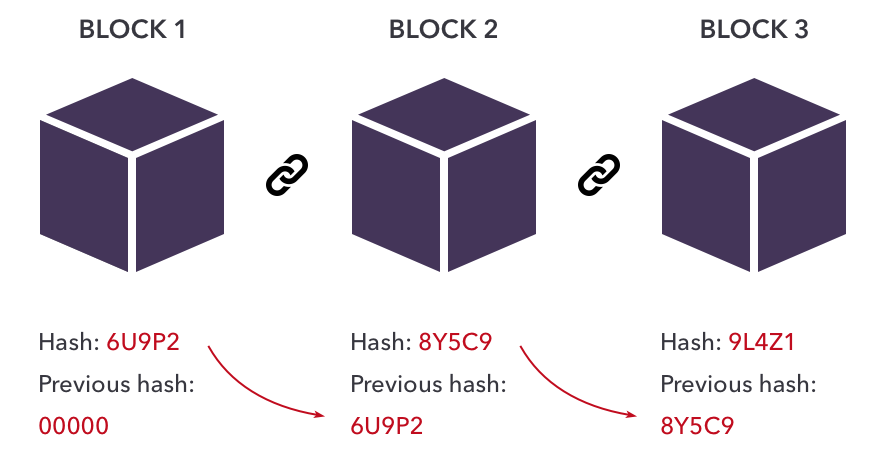
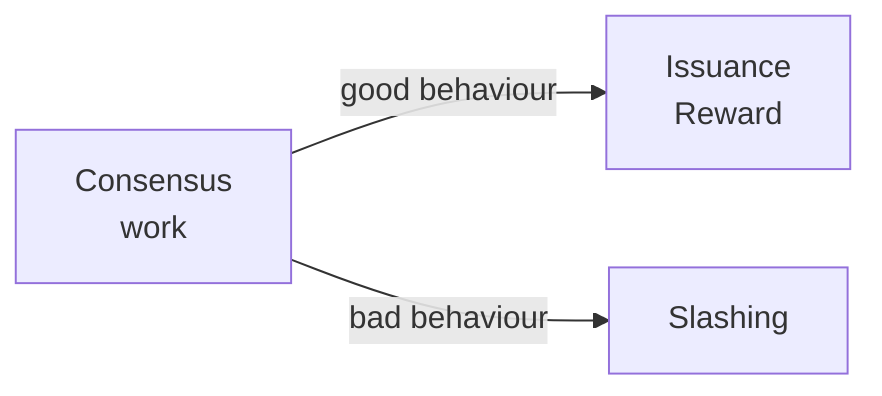
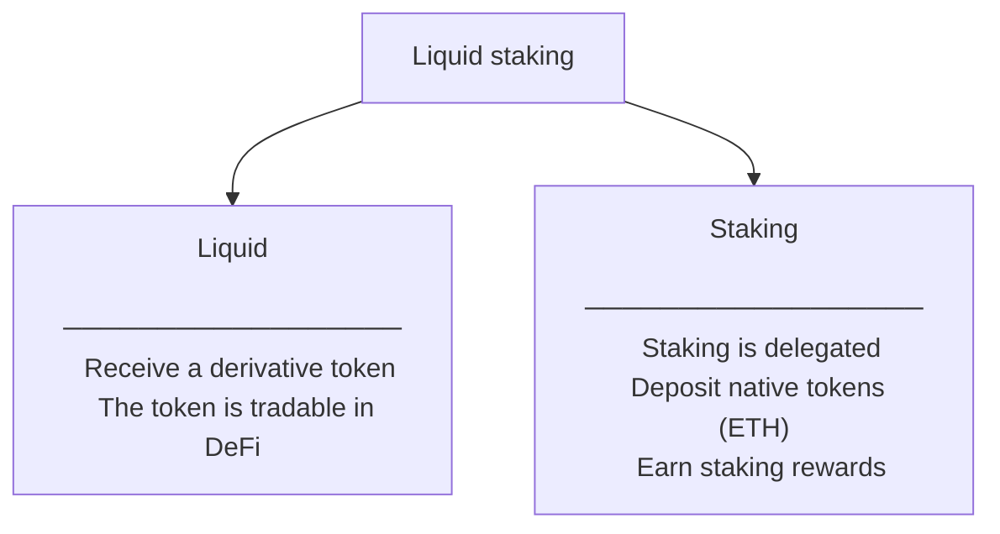

## These slides:  [faycaldrissi.com/staking_talk/](https://www.faycaldrissi.com/staking_talk/)

 

# Macroeconomics of liquid staking

## Fayçal Drissi, Zachary Feinstein, Basil Williams

### *University of Oxford, Stevens Institute of Technology, Imperial Business School*
 

<!--These slides: [https://www.faycaldrissi.com/siam2025](https://www.faycaldrissi.com/siam2025)
[my scholar](https://scholar.google.com/citations?user=njvyriQAAAAJ&hl=fr), 
[my website](https://www.faycaldrissi.com/), [my github](https://github.com/FDR0903)-->

---
section: Motivation
---

# Blockchain economy

### Modern economies rely on trusted intermediaries (banks, clearing houses, platforms)
- intermediaries reduce transaction costs and enforce contracts  
- they also introduce frictions: opacity, market power, monopolies, exclusion, censorship
  
<v-click>

### Can economic activity be coordinated at scale with less intermediaries/monopoles?
- blockchains are a **technological response** to the **frictions** of centralization  
- **regulation** through algorithmic and publicly verifiable rules (consensus) to conduct transactions and enforce contracts
  
<v-click>

### Blockchains replace institutional trust with 
  1. a consensus protocol  
  2. economic incentives: participants are rewarded for following the rules
  
<v-click>

### Examples
- stablecoins: 320 billion $\$$ market cap; decentralised trading: 8.2 billion $\$$ per day; lending/borrowing markets: 3 billion $\$$ per day; crypto currencies: 2.63 trillion $\$$ market cap; decentralised voting, e-government, insurance, derivatives, etc

</v-click>
</v-click>
</v-click>

---
 
# Blockchains

### A shared, tamper-resistant ledger

{style="transform: translate(150%, -20%); width: 250px"}

<v-click>

### Proof of stake (POS) blockchains
- Lock assets on the blockchain to participate in the consensus protocol. The blockchain pays for security through **issuance**.

{style="transform: translate(50%, 0%); width: 500px"}

</v-click>

---

# Economic security

### Economic security
- A high dollar value of total stake, incentivised by issuance, makes a $51%$ attack expensive
- Diversity in the staking pool: decentralised staking reduces the risk of coordination attacks
<v-click>

 

### Slashing
- The blockchain incentivises correct consensus behaviour through **slashing**

```mermaid
flowchart LR
  V["Consensus<br/>work"]
  
  R["Issuance<br/>Reward"]
  S["Slashing"]

  V -->|good behaviour| R
  V -->|bad behaviour| S
```

 

</v-click>

---

# Staking

### Solo staking
- Validation work involves costs: hardware, IT/software knowledge, and a minimum stake of $32$ ETH
  
<v-click>

### Liquid staking (Lido, Rocket Pool, Ankr)
- Solves a tension: no opportunity cost, no hardware need

```mermaid
flowchart TD
  L["Liquid staking"]

  S["Liquid
  ──────────────────
  Receive a derivative token
  The token is tradable in DeFi"]

  Q["Staking
  ──────────────────
  Staking is delegated
  Deposit native tokens (ETH)
  Earn staking rewards"]

  L --> S
  L --> Q
```

 
</v-click>

<!--### Liquid staking
1. **Staking is delegated**
  - *Deposit assets*: users lock tokens (ETH, SOL) in a liquid staking protocol
  - *Earn rewards*: staking reward increases the value of the derivative token
  

2. **Liquid ?** 
  - *Receive a derivative token*: protocol issues a token (stETH) that represents the staked assets
  - The staked token can be traded and used on the blockchain
  

### Examples: Lido, Rocket pool, Ankr, Marinade Finance (Solana)

<!--<v-click>

### Benefits: 
  - No opportunity costs: assets remain accessible for DeFi use
  - Better economic security

</v-click>-->

---

# Liquid staking tokens

### LSTs are productive
- Users can use LSTs in DeFi $\implies$ Market cap of LSTs **January 2026**: total market capitalization of liquid staking tokens is $\approx \$70$ billion (about $20\%$ of the total ETH market cap)

<v-click>

 

### Liquid staking dominates solo staking
- Liquid staking is easier,  reduces reward risk
- Liquid staking represents the majority of staking

<v-click>

{style="transform: translate(20%, 0%); width: 700px"}

</v-click>
</v-click>

---

# Motivation
 

<h3> <u>Question</u>  

What are the effects of liquid staking on the macroeconomics of blockchains?

</h3>

<v-click> 

 
 
 

<h3> <u>Some answers</u>  

Tension between staking and DeFi necessary for issuance and slashing to work

LSTs eliminate this tension: security and centralisation risk
 

Natural forces lead to adoption of LSTs

</h3>

</v-click>

---
section: Blockchain economy model
---

# Blockchain economy without liquid staking tokens

* Small open economy with continuum of homogeneous users (mass one).
* Consumption good normalized to $1$ USD.

<v-click>

* Blockchain issuance is exogenous 
$$dI_t^e/I_t^e$$

<v-click>

* Blockchain users  maximise expected log utility of consumption 
$$E_0\int_0^{\infty} e^{-\beta\,t}\,\log(c_t)\,dt$$

<v-click>

- Infinitesimal users allocate wealth across:
  1. Consumption (USD)
  2. DeFi  (with native tokens ETH)
  3. Staking

</v-click>
</v-click>
</v-click>

---

# Issuance / slashing in USD

* Price of ETH $P=\$1$. 
* Supply of ETH $Q=2\, \footnotesize\text{ETH}$ 
* Stakers hold $1$ ETH, DeFi users hold $1$ ETH

$\implies$ market cap of ETH = $Q\times P = \$\,2.$
<v-click>

* Protocol issues $1$ ETH to stakers $\implies$ new supply $Q = 3 \, \footnotesize\text{ETH}$ 
<v-click>

* Market Cap in USD does not change $\implies$ price adjusts to $P = \$\,2/3$
<v-click>

$\implies$  stakers hold 2 ETH worth $\$\,4/3$,  DeFi users 1 ETH worth $\$\,2/3$

<v-click>

**$\implies$ Issuance redistributes USD wealth from ETH holders to stakers, it does not create/destroys USD**
$$
\boxed{\text{ETH Issuance policy } dI^e_t/I^e_t \equiv \text{USD tax policy } dI^\$_t/I^\$_t \text{ on DeFi users}}
$$

 

<v-click>

### Slashing
* Slashing burns ETH of stakers and transfers value to non‑stakers via price adjustment

</v-click>
</v-click>
</v-click>
</v-click>
</v-click>

---

# Blockchain economy without liquid staking tokens

### Infinitesimal users take aggregates as given

- $S_t\,$:  USD value of aggregate staked ETH
- $D_t$:  USD value of aggregate productive ETH

<v-click>
 

### Dollar return to DeFi: $\small \qquad \qquad \qquad \qquad \qquad \underbrace{\mu^{\$}\,dt+\sigma^{\$}\,dZ_{t}}_{\text{productivity rate}}-\underbrace{\frac{S_{t}}{D_t}\frac{dI_{t}^{\$}}{I_{t}^{\$}}}_{\text{issuance tax}}+\underbrace{\gamma\frac{S_{t}}{D_t+S_t}dN_{t}}_{\text{deflation}}$

<v-click>

### $\footnotesize \qquad\qquad\qquad\qquad\qquad\qquad\qquad\qquad\qquad\qquad\qquad\quad\swarrow\qquad\qquad\qquad \nearrow$

### Dollar return to staking: $\small \qquad \qquad \qquad \qquad \qquad \qquad  \underbrace{\frac{dI_{t}^{\$}}{I_{t}^{\$}}}_{\text{issuance}}-\underbrace{\gamma\frac{D_{t}}{D_t+S_t}dN_{t}}_{\text{slashing}}$

<v-click>

### Clearing & equilibrium
- Only DeFi creates/destroys USD wealth + Staked ETH changes due to issuance
- Aggregate demand for ETH = market cap of ETH

</v-click>
</v-click>
</v-click>

---

# Equilibrium

- Laffer curve

{style="transform: translate(70%, 0%); width: 400px"}

- High issuance raises tax to productive output $\implies$  reduces  productive ETH.  Beyond a point, contraction of tax base dominates.

<v-click>

 

- Token prices
$$ \scriptsize
\begin{cases}
\mu_{P,t}&=
\underbrace{\theta_t^{\star}\,\mu_D
-\beta}_\text{discounted productivity}
-\underbrace{\left(1-\theta_t^{\star}\right)\,\mu_{I,t}^e}_\text{inflation from issuance}
-\underbrace{\theta_t^{\star}\left(1-\theta_t^{\star}\right)\sigma_{I,t}^e\,\sigma_D}_\text{inflation/deflation: productivity shocks}
+\underbrace{\left(1-\theta_t^{\star}\right)^2\sigma_{I,t}^{e\,2}}_\text{issuance risk}\\
\sigma_{P,t}&=
\underbrace{\theta_t^{\star}\,\sigma_D}_{\text{producitivity risk}}
-\underbrace{\left(1-\theta_t^{\star}\right)\,\sigma_{I,t}^e}_{\text{issuance risk}}\,.
\end{cases}
$$

<v-click>

* <u>**Policy tools**</u> (slashing, ETH issuance) affect USD wealth of users $\implies$ influence incentives $\implies$ <u>**Policy objectives**</u> can be attained.

</v-click>

<!--<v-click>
- <u>**Policy objective**</u>: ETH prices
$$\footnotesize
\begin{cases}
\text{Drift} & =\underbrace{\theta_{D}\,\mu^{\$}}_{\text{productivity}}-\underbrace{\left(1-\theta_{D}\right)\mu_{\iota}^{e}}_{\text{inflation}}-\underbrace{\beta}_\text{consumption}+\underbrace{\left(1-\theta_{D}\right)\sigma_{\iota}^{e}\left(\left(1-\theta_{D}\right)\sigma_{\iota}^{e}-\theta_{D}\,\sigma^{\$}\right)}_{\text{covariance issuance/defi}}\\
\\\text{Productivity shocks}  & =\underbrace{\theta_{D}\,\sigma^{\$}}_{\text{DeFi risk}}-\underbrace{\left(1-\theta_{D}\right)\sigma_{\iota}^{e}}_{\text{issuance}}\\
\\\text{slashing shocks} & =\underbrace{\gamma\,\frac{1-\theta_{D}}{1+\left(1-\theta_{D}\right)\left(\gamma_{\iota}^{e}-\gamma\right)}}_{\text{\text{slashing/deflation}}}-\underbrace{\gamma_{\iota}^{e}\,\frac{1-\theta_{D}}{1+\left(1-\theta_{D}\right)\left(\gamma_{\iota}^{e}-\gamma\right)}}_{\text{\text{issuance}}}
\end{cases}
$$
</v-click> -->

</v-click>

---
section: With only LSTs
layout: two-cols-header
---

# Blockchain economy with only liquid staking tokens

::left::

 
 
 
 

### Users allocate wealth across:
  * Consumption (USD)
  * DeFi <u>**with LSTs**</u>
  * Staking with LSTs

 

::right::

<v-click>

## Dollar returns:

### - With <u>only ETH</u> in DeFi

- DeFi: $\qquad \text{productivity rate}-\text{issuance tax}+\text{deflation}$

$$\footnotesize 
\qquad\qquad\qquad\qquad\qquad\swarrow\qquad\qquad\qquad \nearrow 
$$

- Staking: $\qquad\qquad\qquad\quad  \text{issuance}\quad- \quad\text{slashing}$

 
 
 
 

<v-click>

### - With <u>only LSTs</u> in DeFi
- Staking: $\qquad\qquad\quad\qquad\qquad\quad$ <u>**zero**</u>
 
 

- DeFi: $\qquad\qquad\quad\qquad\qquad\underbrace{\mu^{\$}\,dt+\sigma^{\$}\,dZ_{t}}_{\text{productivity rate}}$

</v-click>
</v-click>

---

# Consequences
- **ETH issuance** as reward to staking no longer affects the incentives to staking/DeFi.

 

- **Slashing** no longer affects USD wealth $\implies$ no longer affects staker incentives.

 

<v-click>

- **Centralisation**: total stake at the hand of liquid staking protocols

 

<v-click>

- **Centralisation**:
  * Issuance is a temporary transfer of wealh from stakers in the pool that wins the block, to other stakers
  * Aggregating in one liquid staking pool minimizes wealth variance $\implies$ one surviving pool is the dominant strategy when (symmetric) liquid staking pools compete.

</v-click>
</v-click>

---
section: With ETH and LSTs
---

# PoS blockchains today

* Users can be productive with both LSTs and ETH
 
 

<v-click>

* Users allocate wealth across:
  * Consumption (USD)
  * DeFi (with LSTs)
  * DeFi (with ETH)
  * Staking (with LSTs)

<v-click>
 

* <u>**Productivity rates**</u> of both tokens are positively correlated

</v-click>

</v-click>

---

# Dollar returns

- DeFi with LSTs $\qquad\qquad\qquad\qquad\qquad\qquad\qquad\qquad \underbrace{\mu^{\$}\,dt+{\color{red}\sigma^{\$}\,dZ_{t}}}_{\text{LST productivity rate}}+\text{issuance}$

$$
\qquad\qquad\qquad\qquad\qquad\qquad\qquad\quad\uparrow
$$
- DeFi with native tokens $\qquad\qquad\qquad\qquad\qquad\qquad \underbrace{\mu^{\$}\,dt+{\color{blue}\sigma^{\$}\,dW_{t}}}_{\text{ETH productivity rate}}-\text{issuance tax}$
$$
\qquad\qquad\qquad\qquad\qquad\swarrow
$$
- Staking with LSTs $\qquad\qquad\qquad\qquad\qquad\qquad\qquad\qquad\qquad\quad \text{issuance}$

- Correlation: accessibility to DeFi with LSTs
$$
\langle {\color{blue}W},{\color{red}Z}\rangle = \rho > 0
$$

---
layout: two-cols-header
---

# Issuance/correlation favour LSTs

::left::

###  $\qquad$ Issuance
{style="transform: translate(0%, 0%); width: 450px"}

::right::

<v-click>

###  $\qquad$ Correlation
{style="transform: translate(0%, 0%); width: 450px"}

</v-click>

---

# Strategic complementarity

- DeFi with LSTs $\qquad\qquad\qquad\qquad\qquad\quad \underbrace{\mu^{\$}\,dt+{\color{red}\sigma^{\$}\,dZ_{t}}}_{\text{LST productivity rate}}-\underbrace{c\left(\text{LST}_t\right) dt}_{\text{endog liq cost stETH}}+\text{issuance}$

$$
\qquad\qquad\qquad\qquad\qquad\qquad\qquad\qquad\qquad\quad\uparrow
$$
- DeFi with native tokens $\qquad\qquad\qquad\qquad \underbrace{\mu^{\$}\,dt+{\color{blue}\sigma^{\$}\,dW_{t}}}_{\text{ETH productivity rate}}-\underbrace{c\left(D_t\right)dt}_{\text{endog liq cost ETH}}-\text{issuance tax}$
$$
\qquad\qquad\qquad\qquad\qquad\qquad\qquad\swarrow
$$
- Staking with LSTs $\qquad\qquad\qquad\qquad\qquad\qquad\qquad\qquad\qquad \text{issuance}$

---
layout: two-cols-header
---

# Liquidity costs  $c\left(x\right) = a - b\,x$

::left::

###  $\qquad$ Without strategic complementarity
{style="transform: translate(0%, 0%); width: 450px"}

::right::

###  $\qquad$ With strategic complementarity
{style="transform: translate(0%, 0%); width: 450px"}

---
layout: two-cols-header
---

# Liquidity costs  $c\left(x\right) = a - b\,x$

::left::

###  $\qquad$ Without strategic complementarity
{style="transform: translate(0%, 0%); width: 450px"}

::right::

###  $\qquad$ With strategic complementarity
{style="transform: translate(0%, 0%); width: 450px"}

---
layout: end
---

Thank you !

These slides:  [faycaldrissi.com/staking_talk/](https://www.faycaldrissi.com/staking_talk/)
