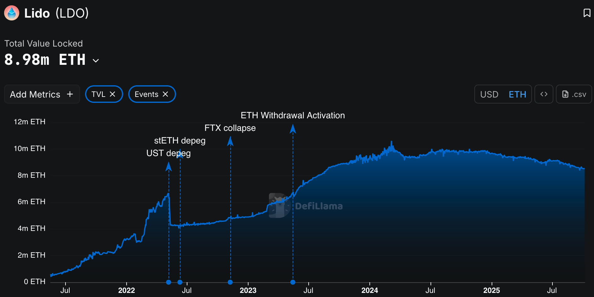
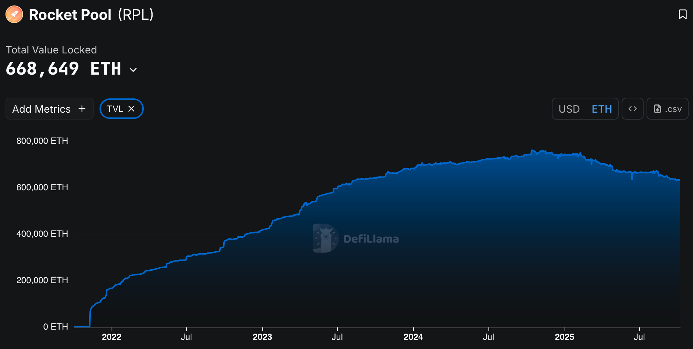

# Macroeconomics of liquid staking in proof-of-stake blockchains

## Fayçal Drissi, Zachary Feinstein, Basil Williams

### *University of Oxford, Stevens Institute of Technology, Imperial Business School*
 

<!--These slides: [https://www.faycaldrissi.com/siam2025](https://www.faycaldrissi.com/siam2025)
[my scholar](https://scholar.google.com/citations?user=njvyriQAAAAJ&hl=fr), 
[my website](https://www.faycaldrissi.com/), [my github](https://github.com/FDR0903)-->

---
section: Issuance, staking, DeFi
---

# Issuance, staking, and DeFi

- **Blockchains** are distributed digital ledgers that **securely** store and execute transactions 
<v-click>

- **Staking**: locking Eth in the blockchain to participate in the protocol: secure block production and validation
<v-click>

- **Issuance**: rewards distributed by the protocol to incentivize staking
<v-click>

- These rewards are minted as new tokens and given to network participants who conduct consensus duties
<v-click>

- **Burn**: gas fees are burned to use the blockchain
  $$\text{total supply of ETH} = \text{issuance} - \text{the burn (EIP-1559)}$$
<v-click>

- Last 30 days  
$$78,277.28 \text{ ETH issued} \qquad  8,041.75 \text{ ETH burned}$$
*Source: ultrasound.money*

</v-click>
</v-click>
</v-click>
</v-click>
</v-click>

---

<!--
# Issuance, staking, and DeFi
### Timeline of issuance

* **Jul 2015** Genesis: block reward set to 5 ETH (PoW miners were rewarded for producing blocks)
* **Oct 2017** Byzantium (EIP-649): block reward reduced to 3 ETH
* **Feb 2019** Constantinople (EIP-1234): block reward reduced to 2 ETH
* **Sep 2022** The Merge: Ethereum issuance is now only from PoS rewards (not withdrawable)
* **Apr 2023** Shanghai/Capella (EIP-4895): Withdrawals to the execution layer

# Issuance, staking, and DeFi
### Today

* Since the beacon chain: issuance is determined by an **issuance curve**
*  parameterized curve that calculates the *yield* as a function of the amount of ETH staked
$$
\text{yield} = \frac{2.6 \cdot 64}{\sqrt{\text{staked ETH}}}
$$

{style="transform: translate(40%, 0%); width: 450px"}

# Issuance, staking, and DeFi
### Rationale
- Aim for 3.3% yield with 30 million ETH staked
- highly incentivizing at least 10 million staked ETH

{style="transform: translate(60%, 0%); width: 400px"}

* **Issuance** in a blockchain is similar to **traditional monetary policy**

# Issuance, staking, and DeFi
### Today: staking high

- June 2025: 35 out 120 million ETH staked (88.6 bn $); stake rate of $28.24\%$
{style="transform: translate(5%, 0%); width: 800px"}

#  Research questions
- What are the equilibrium levels of staking and blockchain adoption ?
- Can equilibrium outcomes be controlled by the blockchain ? 
-  Can the Ethereum Foundation (EF) target objectives such as the volatility of the native token, economic security, and blockchain adoption ?
 

-->

# Fact #1: liquid staking dominates solo staking

- Let pool LS$_1$ have stake $s_1$, LS$_2$ stake $s_2$, total $S=s_1+s_2$.
- A staker with individual stake $s_0$ who joins LS$_1$ receives

<!--
$$R_{LS_1}=\begin{cases}
(1-\alpha)\,\dfrac{s_0}{s_1}\,R - c, & \text{with prob. } \dfrac{s_1}{S}\\[4pt]
-\,c, & \text{with prob. } \dfrac{s_2}{S}
\end{cases}$$

- Let $u$ be strictly concave.  Expected utility of joining LS$_1$:
$$
J_1(s_1;s_2)=\frac{s_1}{S}\,u\!\left(\xi+\frac{a}{s_1}\right)
+\frac{s_2}{S}\,u\!\left(\xi\right),
\qquad
\xi:=s_0-c_L,\quad a:=(1-\alpha)R\,s_0.
$$

- Strategic complementarity (monotonicity in own pool size), by  concavity

$$\partial_{s_1}J_1(s_1;s_2)=\frac{1}{S}\,
u\!\left(\xi+\frac{a}{s_1}\right)-u(\xi)
-\frac{a}{s_1}\,u'\!\left(\xi+\frac{a}{s_1}\right)\;\ge\;0,$$

- solo staking ($s_1=s_0$) is strictly dominated by joining any larger LS pool

-->

---

# Fact #1: liquid staking dominates solo staking

{style="transform: translate(0%, 10%); width: 1500px"}

---

# Fact #2: LSTs enable DeFi access

{style="transform: translate(-5%, -10%); width: 430px"}
{style="transform: translate(110%, -110%); width: 430px"}
{style="transform: translate(60%, -118%); width: 400px"}

---

# Fact #2: LSTs enable DeFi access
- Uniswap pools for steth
- ASTETH: Aave Interest Bearing STETH (ASTETH) 
  - earn staking rewards on their staked ETH while also using it as collateral to borrow other assets. 

---

# Question

   

<h3>
 What are the effects of liquid staking on security, prices, and externality ?</h3>

---
section: Productivity / security
---

# **Blockchain economy**
### **Blockchain economy**
* Small open economy with continuum of homogeneous users (mass one).
* Initial wealth / market cap of ETH $x_0 = Q_0\,P_0$ in USD.
* Consumption good normalized to $1$ USD.
* Time is continuous

<v-click>

* Issuance is public

$$\text{ETH: }dI_t^e/I_t^e \qquad\text{USD}: dI_t^{\$}/I_t^{\$}$$

<v-click>

* Users maximise $\qquad\qquad\qquad\qquad\qquad\qquad\qquad\qquad\mathbb E_0\int_0^{\infty} e^{-\beta\,t}\,\log(c_t)\,dt$

<v-click>

### **Users face a portfolio choice**
- Each (atom) user takes as given 
* $P_t$: price of ETH, $Q_t$: supply of ETH,  $S_t$: aggregate USD value of staked ETH, $D_t$: aggregate  USD value of productive ETH

Users allocate wealth across:

* Consumption (USD)
* DeFi using native ETH
* Staking (via LSTs)

</v-click>
</v-click>
</v-click>

---

# USD returns

### Staking
1. Staking reward (issuance)
2. USD losses due to slashing
3. Price/holdings adjustment
$$
\frac{d\nu_{S,t}}{\nu_{S,t}}=\underbrace{\frac{dI_{t}^{\$}}{I_{t}^{\$}}}_{\text{issuance}}-\underbrace{\gamma\,dN_{t}}_{\text{slashing}}+\underbrace{dA_{S,t}}_{\text{adjustment}}
$$
<v-click>

### DeFi
1. productivity / adoption
2. financial / technological / demand risk
3. liquidity costs
4. Price/holdings adjustment (issuance, slashing)
$$
\frac{d\nu_{D,t}}{\nu_{D,t}}=\underbrace{\mu^{\$}\,dt}_{\text{productivity}}+\underbrace{\sigma^{\$}\,dZ_{t}}_{\text{risk}}-\underbrace{c\left(D_{t}\right)\,dt}_{\text{liquidity cost}}+\underbrace{dA_{D,t}}_{\text{adjustment}}
$$

</v-click>

---

# Issuance/slashing adjustment

* Example: initially $P=1$, stakers hold $1$ ETH, DeFi users hold $1$ ETH (total USD wealth = $2$)
* Protocol issues $1$ ETH to stakers: total ETH = $3$ 
* Price adjusts to $2/3$

  $\implies$ stakers hold 2 ETH worth $4/3$

  $\implies$ DeFi users 1 ETH worth $2/3$

  $\implies$ Total market cap = $2$ (unchanged)

- **Issuance redistributes USD wealth from ETH holders to stakers, it does not create USD wealth**

 
 

<v-click>

### Slashing adjustment

* Slashing burns ETH from stakers and redistributes value to non‑stakers via price adjustment
* Combined effect of issuance and price response is a wealth transfer, not net creation.

</v-click>

---

# Accounting identities

* Blockchain productivity/adoption creates USD wealth:
$$
\underbrace{\frac{dx_t}{x_t}}_\text{changes in ETH market cap} = \underbrace{D_t}_\text{productive ETH}\times\underbrace{\left(\mu^{\$}\,dt + \sigma^{\$}\,dZ_t\right)}_\text{productivity rate}
$$
<v-click>

* ETH supply of stakers changes as
$$
\underbrace{\frac{dI_t^e}{I_t^e}}_\text{new ETH from issuance} - \underbrace{\gamma\,dN_t}_\text{slashing}
$$

<v-click>

* ETH supply of DeFi users does not change

<v-click>

* Total ETH supply grows with ETH issuance $\qquad\qquad\qquad\qquad\ {dQ_t}/{Q_t}=\mu_{\iota}^{e}\,dt+\sigma_{\iota}^{e}\,dZ_{t}+\gamma_{\iota}^{e}\,dN_{t}$

<v-click>

* USD wealth transfer determined by "USD issuance" $\qquad\quad\qquad {dI_{t}^{\$}}/{I_{t}^{\$}}=\mu_{\iota}^{\$}\,dt+\sigma_{\iota}^{\$}\,dZ_{t}+\gamma_{\iota}^{\$}\,dN_{t}$

</v-click>
</v-click>
</v-click>
</v-click>

---

# USD returns to staking / DeFi

DeFi: $\qquad \qquad \qquad \qquad \qquad \qquad \underbrace{\mu^{\$}\,dt}_{\text{productivity}}+\underbrace{\sigma^{\$}\,dZ_{t}}_{\text{risk}}-\underbrace{c(D_t)dt}_{\text{liq cost}} -\underbrace{\frac{S_{t}}{D_{t}}\frac{dI_{t}^{\$}}{I_{t}^{\$}}}_{\text{issuance tax}}+\underbrace{\gamma\frac{S_{t}}{P_{t}\,Q_{t}}dN_{t}}_{\text{deflation}}$

Staking: $\qquad \qquad \qquad \qquad \qquad \qquad \qquad \qquad \qquad  \underbrace{\frac{dI_{t}^{\$}}{I_{t}^{\$}}}_{\text{issuance}}-\underbrace{\gamma\frac{D_{t}}{P_{t}\,Q_{t}}dN_{t}}_{\text{- slashing + deflation}}$

<v-click>

* Optimal consumption: $\qquad \qquad \qquad \qquad \qquad \qquad \qquad \qquad  c_t = \beta\,x_t$

<v-click>

* In equilibrium $\qquad\qquad\qquad\qquad\qquad x_t = P_t\,Q_t \quad\qquad D_t = \theta_D\,x_t \quad\qquad  S_t = (1-\theta_D)\,x_t$

<!-- * Optimal weights
$$\small
\theta=\min\left\{ \max\left\{ 0,\frac{1}{2\,\Delta\gamma\,\Delta\sigma^{2}}\left(\tilde{\delta}+\sqrt{\tilde{\delta}^{2}+4\,\Delta\gamma\,\Delta\sigma^{2}\left(\Delta\mu\left(1+\gamma_{2}\right)+\lambda\,\Delta\gamma+\sigma_{2}\Delta\sigma\left(1+\gamma_{2}\right)\right)}\right)\right\} ,1\right\} 
$$

where 
$$\small
\Delta\gamma=\gamma-\frac{P_{t}Q_{t}}{D_{t}}\gamma_{\iota}^{\$}\qquad\quad \Delta\mu=\mu^{\$}-c_{D}-\frac{P_{t}Q_{t}}{D_{t}}\mu_{\iota}^{\$}\qquad\quad \Delta\sigma=\sigma^{\$}-\frac{P_{t}Q_{t}}{D_{t}}\sigma_{\iota}^{\$}
$$

and
$$\small
\tilde{\delta}=\Delta \gamma\,\Delta\mu-\Delta\sigma^{2}\left(1-\gamma_{2}\right)+\sigma_{2}\,\Delta\gamma\,\Delta\sigma
$$

# Clearing and equilibrium

-->

<v-click>

- The optimal shares solve a fixed point (contraction mapping)
$$\footnotesize
\begin{cases}
\theta & =\min\left\{ \max\left\{ 0,F\left(\theta\right)\right\} ,1\right\} \\
F\left(\theta\right) & =\frac{1}{2\,\Delta\gamma\,\Delta\sigma{}^{2}}\left(\tilde{\delta}+\sqrt{\tilde{\delta}^{2}+4\,\Delta\gamma\,\Delta\sigma{}^{2}\left(\Delta\mu\left(1+\gamma_{2}\right)+\lambda\,\Delta\gamma+\sigma_{2}\Delta\sigma\left(1+\gamma_{2}\right)\right)}\right)\\
\tilde{\delta}\left(\theta\right) & =\Delta\gamma\left(\theta\right)\,\Delta\mu\left(\theta\right)-\Delta\sigma\left(\theta\right)^{2}\left(1-\gamma_{2}\right)+\sigma_{2}\,\Delta\gamma\left(\theta\right)\,\Delta\sigma\left(\theta\right)
\end{cases} \qquad 
\begin{cases}
\Delta\gamma\left(\theta\right) & =\gamma-\frac{\gamma_{\iota}^{\$}}{\theta}\\
\Delta\mu\left(\theta\right) & =\mu^{\$}-c(\theta_t\,P_t\,Q_t)-\frac{\mu_{\iota}^{\$}}{\theta}\\
\Delta\sigma\left(\theta\right) & =\sigma^{\$}-\frac{\sigma_{\iota}^{\$}}{\theta}\\
\end{cases}
$$

</v-click>
</v-click>
</v-click>

---

# Clearing and equilibrium

<!-- Clearing condition
$$
D_{t}+S_{t}=x_{t}=P_{t}\,Q_{t} \qquad\qquad \frac{dQ_{t}}{Q_{t}} = \left(1-\theta_D\right)\left(\frac{dI_{t}^{e}}{I_{t}^{e}}-\gamma\,dN_{t}\right)
$$ -->

- ETH prices
$$
\begin{cases}
\mu_{P} & =\underbrace{\theta_{D}\left(\mu^{\$}-c_{D}\right)}_{\text{productivity}}-\underbrace{\left(1-\theta_{D}\right)\mu_{\iota}^{e}}_{\text{inflation}}+\underbrace{\left(1-\theta_{D}\right)\sigma_{\iota}^{e}\left(\left(1-\theta_{D}\right)\sigma_{\iota}^{e}-\theta_{D}\,\sigma^{\$}\right)}_{\text{covariance issuance/defi}}\\
\\\sigma_{P} & =\underbrace{\theta_{D}\,\sigma^{\$}}_{\text{DeFi risk}}-\underbrace{\left(1-\theta_{D}\right)\sigma_{\iota}^{e}}_{\text{issuance volatility: (inflation/deflation)}}\\
\\\gamma_{P} & =-\underbrace{\frac{\left(1-\theta_{D}\right)\left(\gamma_{\iota}^{e}-\gamma\right)}{1+\left(1-\theta_{D}\right)\left(\gamma_{\iota}^{e}-\gamma\right)}}_{\text{\text{slashing: (inflation/deflation)}}}
\end{cases}
$$

<!--

# Limiting case

When $\sigma_\iota^e = \gamma_\iota^e = 0$
$$
\begin{cases}
\mu_{P} & =\underbrace{\theta_{D}\left(\mu^{\$}-c_{D}\right)}_{\text{productivity}}-\underbrace{\left(1-\theta_{D}\right)\mu_{\iota}^{e}}_{\text{inflation}}\\
\\\sigma_{P} & =\underbrace{\theta_{D}\,\sigma^{\$}}_{\text{DeFi risk}}\\
\\\gamma_{P} & =\underbrace{\frac{\left(1-\theta_{D}\right)\gamma}{1-\left(1-\theta_{D}\right)\gamma}}_{\text{\text{\text{deflation}}}}
\end{cases}
$$

-->

---

# Issuance policy / externality (Urban Jermann does it better)

* <u>**Policy tools**</u>: slashing rate $\gamma$, ETH issuance schedule (USD wealth transfer)

* Mapping from dollar issuance shocks to ETH issuance (identity):
$$
\mu_{\iota}^{e}=  \mu_{\iota}^{\$}-\mu_{P}-\left(\sigma_{\iota}^{\$}-\sigma_{P}\right)\sigma_{P}\qquad\qquad \sigma_{\iota}^{e}=  \sigma_{\iota}^{\$}-\sigma_{P}\qquad\qquad \gamma_{\iota}^{e}=  \frac{\gamma_{\iota}^{\$}-\gamma_{P}}{1+\gamma_{P}}
$$

<v-click>

- <u>**Policy objectives**</u>:
  - Target share of staking
  $\qquad1-\theta(I_t^\$) = \Theta$ 
  - Target rate of productivity (kelly criterion)
  $\qquad\theta(I_t^\$)\,\mu^\$  = M^{\$}$ 
  - Minimize ETH volatility (ETH as a stablecoin)
  $$
  \sigma_{\iota}^{e} = \frac{\theta_D}{1-\theta_D}\sigma^\$, \qquad \qquad \gamma_\iota^e = \gamma
  $$

</v-click>

---
section: Liquidity staking 
---

# Liquid staking

Agents access DeFi  via LSTs $\implies$ Users allocate wealth across:

  * Consumption (USD)
  * DeFi via LSTs
  * Staking via LSTs

Each (atom) user takes as given 

* $P_t$: price of ETH
* $Q_t$: supply of ETH
* $S_t$: aggregate USD value of staked ETH
* $\text{LST}_t$: aggregate USD value of productive ETH

---

# Wealth of users

- DeFi users (via LSTs): $\qquad \qquad \qquad\underbrace{\mu^{\$}\,dt}_{\text{productivity}}+\underbrace{\sigma^{\$}\,dZ_{t}}_{\text{global risk}}-\underbrace{c\left(\text{LST}_t\right)dt}_{\text{liq cost ETH}}+\underbrace{\frac{dI_{t}^{\$}}{I_{t}^{\$}}}_{\text{issuance}}-\underbrace{\gamma\,dN_{t}}_{\text{slashing}}+\underbrace{dA_{LST,t}}_{\text{adjustment}}$

- Stakers (via LSTs) $\qquad \qquad \qquad \qquad \underbrace{\frac{dI_{t}^{\$}}{I_{t}^{\$}}}_{\text{issuance}}-\underbrace{\gamma\,dN_{t}}_{\text{slashing}}+\underbrace{dA_{S,t}}_{\text{adjustment: ETH prices and ETH holdings}}$

<v-click>

   

### Accounting identities and equilbrium

- Dollar returns to LS DeFi: $\underbrace{\mu^{\$}\,dt}_{\text{adoption \& productivity}}+\underbrace{\sigma^{\$}\,dZ_{t}}_{\text{global risk}}-\underbrace{c\left(\text{LST}_t\right)dt}_{\text{liq cost ETH}}$
- Dollar returns to staking: zero

<!-- <v-click>

- Share of wealth invested in the blockchain
$$
\theta_{LST} = \max\{\min\{\frac{\mu^{\$}-c\left(\text{LST}_t\right)}{(\sigma^\$)^2},1\},0\}
$$

</v-click> -->

</v-click>

---

# Accounting identities and equilbrium

- **Externality**: issuance is ineffective to control security, productivity, adoption, etc.

<v-click>

- Issuance can be effective to control ETH prices (volatility)

ETH prices absorb issuance and staking effects
$$
\begin{cases}
\mu_{P} & =\theta_{LST}\left(\mu^{\$}-c_{LST}\right)-\left(1-\theta_{LST}\right)\mu_{\iota}^{e}-\left(1-\theta_{LST}\right)\sigma_{\iota}^{e}\sigma_{P}\\~\\
\sigma_{P} & =\theta_{LST}\,\sigma^{\$}-\left(1-\theta_{LST}\right)\sigma_{\iota}^{e}\\~\\
\gamma_{P} & =\gamma\frac{1-\theta_{LST}}{1-\gamma\,\left(1-\theta_{LST}\right)}
\end{cases}
$$

</v-click>

<!-- Equilibrium aggregate wealth
$$
\frac{dx_{t}}{x_{t}}=\theta_{LST}\left(\mu^{\$}-c_{LST}\right)\,dt+\theta_{LST}\sigma^{\$}\,dZ_{t}
$$ -->

---

<!-- # DeFi with LSTs and ETH
* Agents can access DeFi (be productive) via LSTs and ETH
* Agents allocate wealth across:
  * Consumption (USD)
  * DeFi (via LSTs)
  * DeFi (via ETH)

# Investment options

- DeFi with LSTs
$$
\frac{d\nu_{LST,t}}{\nu_{LST,t}}=\underbrace{\mu^{\$}\,dt}_{\text{adoption \& productivity}}+\underbrace{\sigma^{\$}\,dZ_{t}}_{\text{global risk}}-\underbrace{c_{LST}dt}_{\text{liq cost ETH}}+\underbrace{\frac{dI_{t}^{\$}}{I_{t}^{\$}}}_{\text{issuance}}-\underbrace{\gamma\frac{D_{t}}{P_{t}\,Q_{t}}dN_{t}}_{\text{slashing + deflation}}
$$

- DeFi with native tokens
$$
\frac{d\nu_{D,t}}{\nu_{D,t}}=\underbrace{\mu^{\$}\,dt}_{\text{adoption \& productivity}}+\underbrace{\sigma^{\$}\,dZ_{t}}_{\text{global risk}}-\underbrace{c_{D}dt}_{\text{liq cost ETH}}-\underbrace{\frac{S_{t}}{D_{t}}\frac{dI_{t}^{\$}}{I_{t}^{\$}}}_{\text{issuance tax}}+\underbrace{\gamma\frac{S_{t}}{P_{t}\,Q_{t}}dN_{t}}_{\text{deflation}}
$$

- Equilibrium aggregate wealth 
$$
\frac{dx_{t}}{x_{t}}=\left(\theta_{LST}\left(\mu^{\$}-c_{LST}\right)+\left(1-\theta_{LST}\right)\left(\mu^{\$}-c_{D}\right)\right)\,dt+\sigma^{\$}\,dZ_{t}
$$

      

<h1>
The general problem </h1>

-->

# In practice 

* Agents can be productive with LSTs and ETH
* Agents allocate wealth across:
  * Consumption (USD)
  * DeFi (with LSTs)
  * DeFi (with ETH)
  * Staking (with LSTs)

- For simplicity: no slashing

---

# In practice 

- DeFi with LSTs
$$
\frac{d\nu_{LST,t}}{\nu_{LST,t}}=\underbrace{\mu^{\$}\,dt}_{\text{adoption \& productivity}}+\underbrace{\sigma^{\$}\,dZ_{t}}_{\text{global risk}}-\underbrace{c\left(\text{LST}_t\right) dt}_{\text{liq cost stETH}}+\underbrace{\frac{dI_{t}^{\$}}{I_{t}^{\$}}}_{\text{issuance}}
$$

<!-- - \underbrace{\gamma\frac{D_{t}}{P_{t}\,Q_{t}}dN_{t}}_{\text{slashing + deflation}}
 -->

- DeFi with native tokens
$$
\frac{d\nu_{D,t}}{\nu_{D,t}}=\underbrace{\mu^{\$}\,dt}_{\text{adoption \& productivity}}+\underbrace{\sigma^{\$}\,dZ_{t}}_{\text{global risk}}-\underbrace{c\left(D_t\right)dt}_{\text{liq cost ETH}}-\underbrace{\frac{S_{t}}{D_{t}}\frac{dI_{t}^{\$}}{I_{t}^{\$}}}_{\text{issuance tax}}
$$

<!-- +\underbrace{\gamma\frac{S_{t}}{P_{t}\,Q_{t}}dN_{t}}_{\text{deflation}}
 -->

- Weights (if correlated is high and issuance is high, there is strategic complementarity in joining LST for DeFi and reduce costs)
$$
XXX
$$

- Equilibrium aggregate wealth 
$$
\frac{dx_{t}}{x_{t}}=\left(\theta_{LST}\left(\mu^{\$}-c\left(\text{LST}_t\right)\right)+\left(1-\theta_{LST}\right)\left(\mu^{\$}-c\left({D}_t\right)\right)\right)\,dt+\sigma^{\$}\,dZ_{t}
$$

<!--

# The portfolio problem

- Assumption: **risk-reward tradeoffs are strictly ordered**
- Three investments, two risk factors (productivity and staking)
- Any exposure can be achieved with two assets (Carathéodory)
- Because the assets’ risk–reward tradeoffs are strictly ordered, the minimal-sum representation is achieved by the two best assets and is unique
- **Users select the equilibrium  that maximises log-growth of wealth (Kelly criterion)**

# Three options (equilibrium wealth)

- Staking / DeFi with ETH
$$
\frac{dx_{t}}{x_{t}}=\theta_{D}\left(\mu^{\$}-c_{D}\right)\,dt+\theta_{D}\,\sigma^{\$}\,dZ_{t}
$$

- Staking / DeFi with LSTs
$$
\frac{dx_{t}}{x_{t}}=\theta_{LST}\left(\mu^{\$}-c_{LST}\right)\,dt+\theta_{LST}\,\sigma^{\$}\,dZ_{t}
$$

- DeFi with ETH / DeFi with LSTs
$$
\frac{dx_{t}}{x_{t}}=\left(\theta_{LST}\left(\mu^{\$}-c_{LST}\right)+\left(1-\theta_{LST}\right)\left(\mu^{\$}-c_{D}\right)\right)\,dt+\sigma^{\$}\,dZ_{t}
$$

- If $c_{LST}<c_D$, they choose **Staking / DeFi with LSTs** wins $\implies$ passively holding the LST is worthless

      

<h1>
Conclusion </h1>

-->

---

# Conclusion: takeaways
* Full staking (all ETH staked) increases economic security but may concentrate control if LST providers are centralised.
* Policy should target decentralised LST designs and incentives to avoid a single point of failure.

1. In a closed accounting model, issuance redistributes USD wealth; productivity drives net USD creation.
2. ETH price loadings are endogenous — their interpretation depends on whether you allow exogenous price shocks.
3. Liquid staking expands DeFi access and is often preferred when it lowers effective liquidity/transaction costs.
4. Policy matters: issuance schedule and decentralisation of LSTs both influence equilibrium concentration and security

#### Modeling caveats (accounting choice)

- demand for ETH to pay gas fees

### What we don't have 

- productivity of the blockchain does not grow with how much is staked 
- today this is not the case, because LST tokens don't give you access to all what ETH gives you access to: but once it happens, the model will be true
  
  $\implies$ diversification effects between ETH / stETH

### Consequences
- In POW we had concentration because of sophistication / capital
- Now we have concentration because of liquid staking
- is it bad ? 
  - staking is a way to avoid the security tax
  - not necessarily if liquid staking leads to security (more nodes, solo stakers)
- This can be achieved with protocol / decentralised liquid staking

### TO SAY:

- assuption: defi sharpe is positive otherwise no productivity: staking is worth zero
- slashing share can be used as policy tool
- DVT: distributed validator technology
- Solo staking: an impossibility, any pool is strictly preferable
https://vitalik.eth.limo/general/2023/09/30/enshrinement.html
https://notes.ethereum.org/bW2PeHdwRWmeYjCgCJJdVA

---
section: Conclusion
---

# Decentralized pools are cool

**PP** (protocol pool)
- liquidity cost $c_P$
- per‑staker fixed validator overhead $f$

**LP** (liquid staking): 
- liquidity cost $c_L$
- extra mean‑zero risk with variance $\sigma$
- LIDO proportional fee ($\alpha\in[0,1)$)

---

# Decentralized pools are cool 

**PP** (protocol pool)
- liquidity cost $c_P$
- per‑staker fixed validator overhead $f$

**LP** (liquid staking): 
- liquidity cost $c_L$
- extra mean‑zero risk with variance $\sigma$
- LIDO proportional fee ($\alpha\in[0,1)$)

---
layout: end
---

Thank you !

[faycaldrissi.com](https://www.faycaldrissi.com/)
