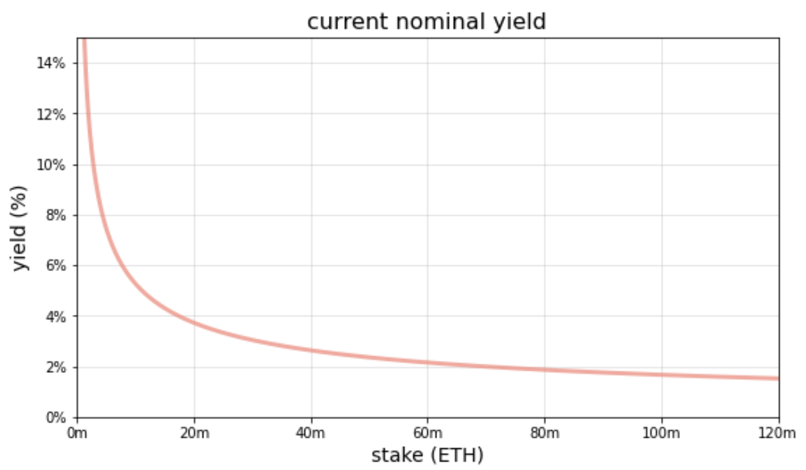
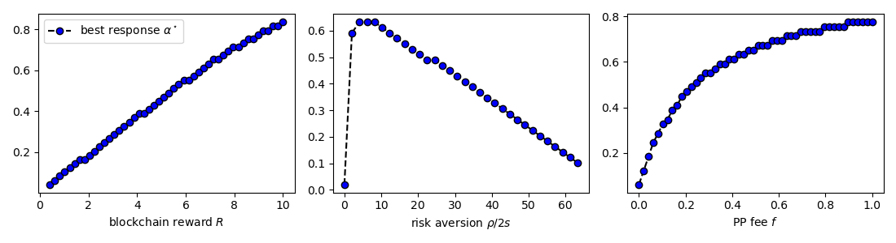

## Blockchain Monetary Policy

Fayçal Drissi, Zachary Feinstein, Basil Williams

*University of Oxford, Stevens Institute of Technology, Imperial Business School*
 

<!--These slides: [https://www.faycaldrissi.com/siam2025](https://www.faycaldrissi.com/siam2025)
[my scholar](https://scholar.google.com/citations?user=njvyriQAAAAJ&hl=fr), 
[my website](https://www.faycaldrissi.com/), [my github](https://github.com/FDR0903)-->

---

# Overview

- Staking market
- Centralized / Decentralized Staking
- Is staking worth anything ?

---

      

<h1>
Issuance, staking, and DeFi </h1>

---

# Issuance, staking, and DeFi
* **Blockchains** are distributed digital ledgers that **securely** store and execute transactions 

---

# Issuance, staking, and DeFi
* **Blockchains** are distributed digital ledgers that **securely** store and execute transactions 
* **Staking**: locking Eth in the blockchain to participate in the protocol: secure block production and validation

---

# Issuance, staking, and DeFi
* **Blockchains** are distributed digital ledgers that **securely** store and execute transactions 
* **Staking**: locking Eth in the blockchain to participate in the protocol: secure block production and validation
* **Issuance**: rewards distributed by the protocol to incentivize staking

---

# Issuance, staking, and DeFi
* **Blockchains** are distributed digital ledgers that **securely** store and execute transactions 
* **Staking**: locking Eth in the blockchain to participate in the protocol: secure block production and validation
* **Issuance**: rewards distributed by the protocol to incentivize staking
* These rewards are minted as new tokens and given to network participants who conduct consensus duties

---

# Issuance, staking, and DeFi
* **Blockchains** are distributed digital ledgers that **securely** store and execute transactions 
* **Staking**: locking Eth in the blockchain to participate in the protocol: secure block production and validation
* **Issuance**: rewards distributed by the protocol to incentivize staking
* These rewards are minted as new tokens and given to network participants who conduct consensus duties
* **Burn**: gas fees are burned to use the blockchain

---

# Issuance, staking, and DeFi
* **Blockchains** are distributed digital ledgers that **securely** store and execute transactions 
* **Staking**: locking Eth in the blockchain to participate in the protocol: secure block production and validation
* **Issuance**: rewards distributed by the protocol to incentivize staking
* These rewards are minted as new tokens and given to network participants who conduct consensus duties
* **Burn**: gas fees are burned to use the blockchain
$$\text{total supply of ETH} = \text{issuance} - \text{the burn (EIP-1559)}$$

---

# Issuance, staking, and DeFi
* **Blockchains** are distributed digital ledgers that **securely** store and execute transactions 
* **Staking**: locking Eth in the blockchain to participate in the protocol: secure block production and validation
* **Issuance**: rewards distributed by the protocol to incentivize staking
* These rewards are minted as new tokens and given to network participants who conduct consensus duties
* **Burn**: gas fees are burned to use the blockchain
$$\text{total supply of ETH} = \text{issuance} - \text{the burn (EIP-1559)}$$
* Last 30 days  
$$78,277.28 \text{ ETH issued} \qquad  8,041.75 \text{ ETH burned}$$

*Source: ultrasound.money*

---

# Issuance, staking, and DeFi
### Timeline of issuance

* **Jul 2015** Genesis: block reward set to 5 ETH (PoW miners were rewarded for producing blocks)
* **Oct 2017** Byzantium (EIP-649): block reward reduced to 3 ETH
* **Feb 2019** Constantinople (EIP-1234): block reward reduced to 2 ETH
* **Sep 2022** The Merge: Ethereum issuance is now only from PoS rewards (not withdrawable)
* **Apr 2023** Shanghai/Capella (EIP-4895): Withdrawals to the execution layer

---

# Issuance, staking, and DeFi
### Today

* Since the beacon chain: issuance is determined by an **issuance curve**
*  parameterized curve that calculates the *yield* as a function of the amount of ETH staked
$$
\text{yield} = \frac{2.6 \cdot 64}{\sqrt{\text{staked ETH}}}
$$

{style="transform: translate(40%, 0%); width: 450px"}

---

# Issuance, staking, and DeFi
### Rationale
- Aim for 3.3% yield with 30 million ETH staked
- highly incentivizing at least 10 million staked ETH

{style="transform: translate(60%, 0%); width: 400px"}

* **Issuance** in a blockchain is similar to **traditional monetary policy**

---

# Issuance, staking, and DeFi
### Today: staking high

- June 2025: 35 out 120 million ETH staked (88.6 bn $); stake rate of $28.24\%$
{style="transform: translate(5%, 0%); width: 800px"}

---

# Issuance, staking, and DeFi
### Today: staking high

- June 2025: 35 out 120 million ETH staked (88.6 bn $); stake rate of $28.24\%$
{style="transform: translate(5%, 0%); width: 800px"}

---

#  Research questions
- What are the equilibrium levels of staking and blockchain adoption ?
- Can equilibrium outcomes be controlled by the blockchain ? 
-  Can the Ethereum Foundation (EF) target objectives such as the volatility of the native token, economic security, and blockchain adoption ?
 

---

      

<h1>
Centralized / Decentralized staking
</h1>

---

# Setup

$N$ identical investors
- Initial ETH wealth $s$

The market
- Staking in the blockchain: $R$
- outside risk-free option: $r_{\$}\, s$

---

# Setup: two pools
**PP** (protocol pool)
- liquidity cost $c_P$
- per‑staker fixed validator overhead $f$

**LP** (liquid staking): 
- liquidity cost $c_L$
- extra mean‑zero risk with variance $\sigma$
- LIDO proportional fee ($\alpha\in[0,1)$)

---

# Timeline 

**Stage 1**: blockchain posts reward $R$ to maximize a security objective.

**Stage 2**: given $R$, LIDO posts fee $\alpha$.

**Stage 3**: given $R$ and $\alpha$, $N$ stakers decide to enter versus outside option ($r_{\$} s$).

**Stage 4**: Given $N$, stakers split across PP and LP.

---

# Stage 4 - LP versus PP

Let $s_P=s\,N_P$, $\quad s_L=s\,N_L$, $\quad S=s_P+s_L=s(N_P+N_L)=sN$.

* Pool selection indicator

$$b\sim \text{Bernoulli}\big(\tfrac{s_P}{S}=\tfrac{N_P}{N}\big)$$

**PP per‑staker payoff**
$$R_{PP}= b\,\frac{s}{s_P} R - c_P - f = b\,\frac{R}{N_P} - c_P - f.$$

**LP per‑staker payoff**
$$R_{LP} = (1-b)(1-\alpha)\,\frac{s}{s_L} R - c_L - \tilde\sigma$$
$$\mathbb E[\tilde\sigma]=0,\ \mathrm{Var}(\tilde\sigma)=\sigma.$$

---

# Stage 4 - expected utility

The utility of a staker

$$
\begin{split}
J_{L}\left(s_{L},s_{P}\right)= & \frac{s_{L}}{S}\mathbb{E}_{\tilde{\sigma}}\left[u\left(s+\left(1-\alpha\right)R\frac{s}{s_{L}}-c_{L}-\sigma\right)\right]+\frac{s_{P}}{S}\mathbb{E}_{\tilde{\sigma}}\left[u\left(s-c_{L}-\sigma\right)\right]\\
J_{P}\left(s_{L},s_{P}\right)= & \frac{s_{P}}{S}u\left(s+R\frac{s}{s_{P}}-c_{P}-f\right)+\frac{s_{L}}{S}u\left(s-c_{P}-f\right)
\end{split}
$$

---

# Stage 4 - expected utility

The utility of a staker

$$
\begin{split}
J_{L}\left(s_{L},s_{P}\right)= & \frac{s_{L}}{S}\mathbb{E}_{\tilde{\sigma}}\left[u\left(s+\left(1-\alpha\right)R\frac{s}{s_{L}}-c_{L}-\sigma\right)\right]+\frac{s_{P}}{S}\mathbb{E}_{\tilde{\sigma}}\left[u\left(s-c_{L}-\sigma\right)\right]\\
J_{P}\left(s_{L},s_{P}\right)= & \frac{s_{P}}{S}u\left(s+R\frac{s}{s_{P}}-c_{P}-f\right)+\frac{s_{L}}{S}u\left(s-c_{P}-f\right)
\end{split}
$$

---

# Stage 4 - Strategic complementarity

For any concave $u$
$$
\begin{split}
J_{P}\left(s_{L},s_{P}\right)=&\frac{s_{P}}{s_{L}+s_{P}}u\left(s-c_{P}-f+\frac{s}{s_{P}}R\right)+\frac{s_{L}}{s_{L}+s_{P}}u(\underbrace{s-c_{P}-f}_{=\xi})\\=&\frac{s_{P}}{S}u\left(\xi+\frac{s}{s_{P}}R\right)+\left(1-\frac{s_{P}}{S}\right)u\left(\xi\right)
\end{split}
$$

Using concavity (tangent line inequality)

$$
\partial_{s_{P}}\mathbb{E}\left[u\left(s+R_{i}^{PP}\right)\right]=\frac{1}{S}\left[u\left(\xi+\frac{s}{s_{P}}R\right)-u\left(\xi\right)-\frac{s}{s_{P}}R\,u'\left(\xi+\frac{s}{s_{P}}R\right)\right] \ge 0
$$

> Payoff rises as the pool grows ⇒ **all‑PP or all‑LP**.

---

# Stage 4 - expected utility

Assume $\rho$ is the relative risk aversion of stakers.

Pratt's approximation:

$$
\begin{split}
J_{L}\left(s_{L},s_{P}\right)=&s+\left(1-\alpha\right)\frac{R}{N}-C_L-\gamma\,\left(1-\alpha\right)^{2}\frac{R^{2}}{N^{2}}\frac{s_{P}}{s_{L}}\\J_{P}\left(s_{L},s_{P}\right)=&s+\frac{R}{N}-C_P-\gamma\,\frac{R^{2}}{N^{2}}\frac{s_{L}}{s_{P}}
\end{split}
$$
where 
$$C_P = c_P + f, \qquad C_L := c_L + \gamma\,\sigma, \qquad \gamma=\rho/2s$$

<!--

# Stage 4 — Dominant‑Corner Comparison

If all‑LP: $s_L=S, s_P=0$
$$\mathbb E[u(s+R_{LP})]= \mathbb E_{\tilde\sigma}\,\left[u\,\left(s+(1-\alpha)\tfrac{R}{N}-c_L-\tilde\sigma\right)\right].$$

If all‑PP: $s_P=S, s_L=0$
$$\mathbb E[u(s+R_{PP})]= u\,\left(s+\tfrac{R}{N}-c_P-f\right).$$

With Pratt CE: **LP dominates PP** iff
$$\boxed{\ \alpha R;\le; N\big[c_P+f-(c_L+\gamma\sigma)\big]\ }.$$
-->

---

# Stage 4 - dominant equilibrium

If all‑LP: $s_L=S, s_P=0$
$$J_{L}\left(S,0\right)= s+\left(1-\alpha\right)\frac{R}{N}-C_{L}.$$

If all‑PP: $s_P=S, s_L=0$
$$J_{P}\left(0,S\right)= s+\frac{R}{N}-C_{P}.$$

**LP dominates PP** iff
$$\boxed{C_{P}-\alpha\frac{R}{N}\ge C_{L} }$$

---

# Stage 4 - pure‑Nash (one‑deviator) conditions

**All‑LP is Nash** iff
$$
J_{P}\left(S-s,s\right)-J_{L}\left(S,0\right) \le 0
$$
or equivalently
$$\boxed{\ \alpha\tfrac{R}{N}+C_L-C_P-\gamma\tfrac{N-1}{N^2}R^2\ \le 0\ }.$$

**All‑PP is Nash** iff
$$J_{L}\left(s,S-s\right)-J_{P}\left(0,S\right)$$
or equivalently
$$\boxed{\ -\alpha\tfrac{R}{N}-C_L+C_P-\gamma(1-\alpha)^2\tfrac{N-1}{N^2}R^2\ \le 0\ }.$$

As $N\to\infty$: conditions collapse to 
$$C_L-C_P\le \ge 0$$ 

---

# Stage 4 - comparative statics

* Higher **$\alpha$** → tilts toward **PP**.
* Higher **$\sigma$** (LP idiosyncratic risk) → toward **PP**.
* Higher **$N$** → smaller proposer‑luck variance → both corners easier to sustain.
* Higher **$R$** → larger mean gaps ($\propto \alpha R/N$) **and** larger risk penalties $(\propto R^2$).

---

# Stage 3 - entry to staking

- If the **all‑LP equilibrium** condition holds, entry is pinned by

$$(1-\alpha)\tfrac{R}{N}-C_L = r_{\$} s 
\quad\Rightarrow\quad
\boxed{N_L=\dfrac{(1-\alpha)R}{r_{\$} s + C_L } }.$$

- Then the **all‑LP equilibrium** condition becomes

$$\boxed{\ \frac{\alpha-\gamma R}{1-\alpha}r_{\$} s+\frac{1-\gamma R}{1-\alpha}C_L-c_P-f+\gamma\frac{(r_{\$} s+C_L)^2}{(1-\alpha)^2}\ \le 0\ }$$

---

# Stage 3 - entry to staking

- If the **all‑PP equilibrium** condition holds, entry is pinned by

$$C_P+ \tfrac{R}{N}= r_{\$} s
  \quad\Rightarrow\quad
  \boxed{\ N_P=\dfrac{R}{r_{\$} s + C_P} }.$$
  
- Then the **all‑PP equilibrium** condition becomes
  
$$\boxed{-\left(\gamma\,\left(1-\alpha\right)^{2}R+\alpha\right)\,r_{\$}\,s+\left(1-\alpha-\gamma\,\left(1-\alpha\right)^{2}R\right)\left(c_{P}+f\right)-C_{L}+\gamma\,\left(1-\alpha\right)^{2}\left(r_{\$}\,s+C_{P}\right)^{2}\le0 }$$
  

---

# Stage 2 — LIDO best response $\alpha^{\star}(R)$

- Let $A:=1/(1-\alpha)$
- The **all‑LP equilibrium** condition is equivalent to the quadratic in $A$:
$$\gamma\,A^{2}\,\left(r_{\$}\,s+C_{L}\right)^{2}+A\left(1-\gamma R\right)\left(r_{\$}\,s+C_{L}\right)-r_{\$}\,s-C_{P}\le0$$

- Feasible $A$ lie between the two roots. 
- Since $A$ increases in $\alpha$, LIDO sets **largest feasible** $A$ (hence largest $\alpha$):

$$\boxed{\alpha^{\star}=\min\left\{ \max\left\{ 0,1-\frac{r_{\$}\,s+C_{L}}{2\left(r_{\$}\,s+C_{P}\right)}\left(\left(1-\gamma R\right)+\sqrt{\left(1-\gamma R\right)^{2}+4\gamma\,\left(r_{\$}\,s+C_{P}\right)}\right)\right\} ,1-\epsilon\right\} \in[0,1)}.$$

---

# Stage 2 — LIDO best response $\alpha^{\star}(R)$

**Comparative statistics:** $\alpha^{\star}$ rises in $R$ and $C_P$; falls in $C_L$; non‑monotone in $\gamma$

{style="transform: translate(0%, 0%); width: 850px"}

---

# Stage 1 — blockchain chooses $R$ to favor **PP**
- Best response $\alpha$ is increasing in $R$ $\implies$  **rule out LP** even if $\alpha=0$: require the **all-LP equilibrium** condition to fail at $\alpha=0$
$$
\boxed{R\le r_{\$}\,s+C_{L}-\frac{C_{P}-C_{L}}{\gamma\left(r_{\$}\,s+C_{L}\right)} = R_{\text{kill LP}}}
$$

- Blockchain **ensures PP** is a Nash: harder at small $R$ and low $\alpha$ $\implies$ must enforce the **all-PP equilibrium** condition at **$\alpha=0$**:
$$
\boxed{R\ge\frac{C_{P}-C_{L}}{\gamma\,\left(r_{\$}\,s+C_{P}\right)}+\left(r_{\$}\,s+C_{P}\right)= R_{\text{save PP}}}
$$

---

# Stage 1 — blockchain chooses $R$ to favor **PP**
- Feasible interval exists iff 
$$R_{\text{save PP}} \le R_{\text{kill LP}}$$

- Possible only if 
$$
C_{L}>C_{P}
$$

- In this case, blockchain sets $R$ at the **upper end** (maximize PP entrants):
$$
R^\star = R=r_{\$}\,s+C_{L}+\frac{C_{L}-C_{P}}{\gamma\left(r_{\$}\,s+C_{L}\right)}
$$
$$
N_{P}^\star=\frac{r_{\$}\,s+C_{L}}{r_{\$}\,s+C_{P}}+\frac{C_{L}-C_{P}}{\gamma\left(r_{\$}\,s+C_{L}\right)\left(r_{\$}\,s+C_{P}\right)}
$$

---

# Takeaways

* Strategic complementarity → corner outcomes (all‑LP or all‑PP).
* LIDO’s best response $\alpha^{\star}(R)$ increases with $R$; larger $R$ lets LIDO charge more.
* To secure **PP only**, the chain must pick $R$ in a band which exists iff LP is sufficiently costly/risky relative to PP.

---

      

<h1>
Is staking worth anything ? a macro model </h1>

---

# short answer
NO

---

# TO say 
what would stop it:
- diversification of pools: more liquidity costs -> prefer using ETH
- small rewards -> such that it's smaller than 

---

# TO SAY:

### DVT: distributed validator technology
### Solo staking: an impossibility, any pool is strictly preferable
https://vitalik.eth.limo/general/2023/09/30/enshrinement.html
https://notes.ethereum.org/bW2PeHdwRWmeYjCgCJJdVA

---

---
layout: end
---

Thank you !

[faycaldrissi.com](https://www.faycaldrissi.com/)
