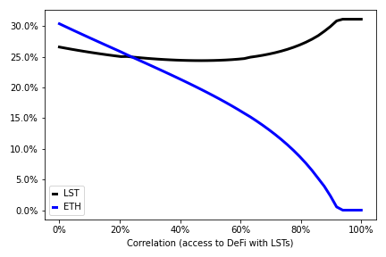

# Macroeconomics of liquid staking

## Fayçal Drissi, Zachary Feinstein, Basil Williams

### *University of Oxford, Stevens Institute of Technology, Imperial Business School*
 

<!--These slides: [https://www.faycaldrissi.com/siam2025](https://www.faycaldrissi.com/siam2025)
[my scholar](https://scholar.google.com/citations?user=njvyriQAAAAJ&hl=fr), 
[my website](https://www.faycaldrissi.com/), [my github](https://github.com/FDR0903)-->

---
section: Motivation
---

# Introduction

### How liquid staking works

- <u>**Deposit assets**</u>: users lock tokens in a liquid staking protocol (ETH, SOL)
- <u>**Receive the derivative token**</u>: protocol issues a token (stETH) that represents the staked assets
- <u>**Earn rewards**</u>: staking reward increases the value of the derivative token
- <u>**Examples**</u>: Lido, Rocket pool, Ankr, Marinade Finance (Solana)

 

<v-click>

### Benefits: 
  - No opportunity costs: assets remain accessible for DeFi use
  - Better economic security

</v-click>

---

# Fact #1: LSTs enable DeFi access
Users utilise LSTs in DeFi applications: AMM pools (stETH), Aave Interest Bearing STETH  (stETH as collateral to borrow  assets)
 
 

{style="transform: translate(15%, -10%); width: 350px"}
{style="transform: translate(125%, -110%); width: 350px"}
{style="transform: translate(75%, -105%); width: 350px"}

---

# Fact #2: liquid staking dominates solo staking

- **Solo staking** and **liquid staking** provide the **same expected reward** per unit of stake
- Liquid staking pools reduce reward risk
 
$\implies$ strategic complementarity
 
$\implies$ liquid staking dominates solo staking
<v-click>

{style="transform: translate(0%, 0%); width: 900px"}

</v-click>

---

# Motivation
 

<h3> <u>Question</u>  

What are the effects of liquid staking on the macroeconomics of blockchains ?
</h3>

<v-click>

 
 
 

<h3> <u>Some answers</u>  

LSTs eliminate the tension between staking and DeFi
 

Natural forces will migrate DeFi from native ETH to LSTs
 

Issuing (or slashing) Eth would no longer affect user incentives

</h3>

</v-click>

---
section: Productivity / security
---

# **Blockchain economy**

* Small open economy with continuum of homogeneous users (mass one).
* Consumption good normalized to $1$ USD.

<v-click>

* Blockchain issuance is exogenous 
$$dI_t^e/I_t^e$$

<v-click>

* Blockchain users  maximise expected log utility of consumption 
$$E_0\int_0^{\infty} e^{-\beta\,t}\,\log(c_t)\,dt$$

<v-click>

- Users allocate wealth across:
  1. Consumption (USD)
  2. DeFi  (with native ETH)
  3. Staking

</v-click>
</v-click>
</v-click>

---

# Issuance / slashing

### Example
* $P=1\,\$/\footnotesize\text{ETH}$. Supply $2\, \footnotesize\text{ETH}$ $\implies$ market cap of ETH = $\$\,2.$
* Stakers hold $1$ ETH, DeFi users hold $1$ ETH
* Protocol issues $1$ ETH to stakers $\implies$ Supply = $3 \, \footnotesize\text{ETH}$ 
$\implies$ Price adjusts to $2\,\$/\footnotesize\text{ETH}$
<v-click>

  $\implies$ stakers hold 2 ETH worth $\$\,4/3$

  $\implies$ DeFi users 1 ETH worth $\$\,2/3$

  $\implies$ Total market cap unchanged = $\$\,2$

<v-click>

- **Issuance redistributes USD wealth from ETH holders to stakers, it does not create/destroys USD**
$$
\boxed{\text{ETH Issuance policy } dI^e_t/I^e_t \equiv \text{USD tax policy } dI^\$_t/I^\$_t}
$$

 

<v-click>

### Slashing
* Slashing burns ETH from stakers and transfers value to non‑stakers via price adjustment

</v-click>
</v-click>
</v-click>

---

# Dollar returns

### Governing dynamics
- Only DeFi creates/destroys USD wealth
- Staked ETH changes due to issuance/slashing, productive ETH does not
- Issuance regulates the supply

<v-click>

- $S_t\,$:  USD value of aggregate staked ETH
- $D_t$:  USD value of aggregate productive ETH

### Dollar return to DeFi: $\small \qquad \qquad \qquad \qquad \qquad \underbrace{\mu^{\$}\,dt+\sigma^{\$}\,dZ_{t}}_{\text{productivity rate}}-\underbrace{\frac{S_{t}}{D_t}\frac{dI_{t}^{\$}}{I_{t}^{\$}}}_{\text{issuance tax}}+\underbrace{\gamma\frac{S_{t}}{D_t+S_t}dN_{t}}_{\text{deflation}}$

<v-click>

### $\footnotesize \qquad\qquad\qquad\qquad\qquad\qquad\qquad\qquad\qquad\qquad\qquad\quad\swarrow\qquad\qquad\qquad \nearrow$

### Dollar return to staking: $\small \qquad \qquad \qquad \qquad \qquad \qquad  \underbrace{\frac{dI_{t}^{\$}}{I_{t}^{\$}}}_{\text{issuance}}-\underbrace{\gamma\frac{D_{t}}{D_t+S_t}dN_{t}}_{\text{slashing}}$

</v-click>

 

</v-click>

---

# Social planning through issuance 

* <u>**Policy tools**</u>: slashing rate $\gamma$, ETH issuance
$$
{dI_{t}^{\$}}/{I_{t}^{\$}}=\mu_{\iota}^{\$}\,dt+\sigma_{\iota}^{\$}\,dZ_{t}+\gamma_{\iota}^{\$}\,dN_{t}
$$

<v-click>

- <u>**Policy objective**</u>: incentives / allocations
$$
\theta_D = \theta_D(\gamma, \mu_{\iota}^{\$}, \sigma_{\iota}^{\$}, \gamma_{\iota}^{\$})
$$

<v-click>

- <u>**Policy objective**</u>: ETH prices
$$\footnotesize
\begin{cases}
\text{Drift} & =\underbrace{\theta_{D}\,\mu^{\$}}_{\text{productivity}}-\underbrace{\left(1-\theta_{D}\right)\mu_{\iota}^{e}}_{\text{inflation}}-\underbrace{\beta}_\text{consumption}+\underbrace{\left(1-\theta_{D}\right)\sigma_{\iota}^{e}\left(\left(1-\theta_{D}\right)\sigma_{\iota}^{e}-\theta_{D}\,\sigma^{\$}\right)}_{\text{covariance issuance/defi}}\\
\\\text{Productivity shocks}  & =\underbrace{\theta_{D}\,\sigma^{\$}}_{\text{DeFi risk}}-\underbrace{\left(1-\theta_{D}\right)\sigma_{\iota}^{e}}_{\text{issuance}}\\
\\\text{slashing shocks} & =\underbrace{\gamma\,\frac{1-\theta_{D}}{1+\left(1-\theta_{D}\right)\left(\gamma_{\iota}^{e}-\gamma\right)}}_{\text{\text{slashing/deflation}}}-\underbrace{\gamma_{\iota}^{e}\,\frac{1-\theta_{D}}{1+\left(1-\theta_{D}\right)\left(\gamma_{\iota}^{e}-\gamma\right)}}_{\text{\text{issuance}}}
\end{cases}
$$

</v-click>
</v-click>

---
section: Liquidity staking / security
layout: two-cols-header
---

# DeFi with liquid staking tokens

::left::

### Users allocate wealth across:
  * Consumption (USD)
  * DeFi with LSTs
  * Staking with LSTs

 

::right::

<v-click>

### Dollar returns when LSTs are used in DeFi
- Dollar returns to LS DeFi: $\qquad\quad\underbrace{\mu^{\$}\,dt+\sigma^{\$}\,dZ_{t}}_{\text{productivity rate}}$
- Dollar returns to staking: $\qquad\qquad\quad$ <u>**zero**</u>

 
 
 

### Dollar returns when ETH is used in DeFi

- DeFi: $\qquad \underbrace{\mu^{\$}\,dt+\sigma^{\$}\,dZ_{t}}_{\text{productivity rate}}-\underbrace{\frac{S_{t}}{D_t+S_t}\frac{dI_{t}^{\$}}{I_{t}^{\$}}}_{\text{issuance tax}}+\underbrace{\gamma\frac{S_{t}}{D_t+S_t}dN_{t}}_{\text{deflation}}$

$$\footnotesize 
\qquad\qquad\qquad\swarrow\qquad\qquad\qquad \nearrow 
$$

- Staking: $\qquad\qquad\qquad  \underbrace{\frac{dI_{t}^{\$}}{I_{t}^{\$}}}_{\text{issuance}}-\underbrace{\gamma\frac{D_{t}}{D_t+S_t}dN_{t}}_{\text{- slashing + deflation}}$

 

</v-click>

---

# Consequences
- Issuing ETH as reward to staking no longer affects the incentives to staking/DeFi.

- **Centralisation**: stake at the hand of liquid staking protocols.

---
section: LSTs / ETH
---

# Ethereum today

* Users can be productive with both LSTs and ETH
 
 

<v-click>

* Users allocate wealth across:
  * Consumption (USD)
  * DeFi (with LSTs)
  * DeFi (with ETH)
  * Staking (with LSTs)

<v-click>
 

* <u>**Productivity rates**</u> of both tokens are positively correlated

<v-click>

 

- For simplicity: <u>**no slashing**</u>

</v-click>

</v-click>

</v-click>

---

# Dollar returns

- DeFi with LSTs $\qquad\qquad\qquad\qquad\qquad\qquad\qquad\qquad \underbrace{\mu^{\$}\,dt+{\color{red}\sigma^{\$}\,dZ_{t}}}_{\text{LST productivity rate}}+\text{issuance}$

$$
\qquad\qquad\qquad\qquad\qquad\qquad\qquad\quad\uparrow
$$
- DeFi with native tokens $\qquad\qquad\qquad\qquad\qquad\qquad \underbrace{\mu^{\$}\,dt+{\color{blue}\sigma^{\$}\,dW_{t}}}_{\text{ETH productivity rate}}-\text{issuance tax}$
$$
\qquad\qquad\qquad\qquad\qquad\swarrow
$$
- Staking with LSTs $\qquad\qquad\qquad\qquad\qquad\qquad\qquad\qquad\qquad\quad \text{issuance}$

- Correlation: accessibility to DeFi with LSTs
$$
\langle {\color{blue}W},{\color{red}Z}\rangle = \rho > 0
$$

---
layout: two-cols-header
---

# Issuance/correlation favour LSTs

::left::

###  $\qquad$ Issuance
{style="transform: translate(0%, 0%); width: 450px"}

::right::

<v-click>

###  $\qquad$ Correlation
{style="transform: translate(0%, 0%); width: 450px"}

</v-click>

---

# Strategic complementarity

- DeFi with LSTs $\qquad\qquad\qquad\qquad\qquad\quad \underbrace{\mu^{\$}\,dt+{\color{red}\sigma^{\$}\,dZ_{t}}}_{\text{LST productivity rate}}-\underbrace{c\left(\text{LST}_t\right) dt}_{\text{endog liq cost stETH}}+\text{issuance}$

$$
\qquad\qquad\qquad\qquad\qquad\qquad\qquad\qquad\qquad\quad\uparrow
$$
- DeFi with native tokens $\qquad\qquad\qquad\qquad \underbrace{\mu^{\$}\,dt+{\color{blue}\sigma^{\$}\,dW_{t}}}_{\text{LST productivity rate}}-\underbrace{c\left(D_t\right)dt}_{\text{endog liq cost ETH}}-\text{issuance tax}$
$$
\qquad\qquad\qquad\qquad\qquad\qquad\qquad\swarrow
$$
- Staking with LSTs $\qquad\qquad\qquad\qquad\qquad\qquad\qquad\qquad\qquad \text{issuance}$

---
layout: two-cols-header
---

# Liquidity costs  $c\left(x\right) = a - b\,x$

::left::

###  $\qquad$ Without strategic complementarity
{style="transform: translate(0%, 0%); width: 450px"}

::right::

###  $\qquad$ With strategic complementarity
{style="transform: translate(0%, 0%); width: 450px"}

---
layout: two-cols-header
---

# Liquidity costs  $c\left(x\right) = a - b\,x$

::left::

###  $\qquad$ Without strategic complementarity
{style="transform: translate(0%, 0%); width: 450px"}

::right::

###  $\qquad$ With strategic complementarity
{style="transform: translate(0%, 0%); width: 450px"}

---
section: Conclusion
---

# Conclusion

- Natural forces will lead to $100\%$ liquid staking $\implies$ issuance is not effective

<v-clicks>

- Is it good or bad ? 
  - <u>**bad**</u>: slashing has no effect, no social planning, centralisation
  - <u>**good**</u>: economic security, productivity

- Demand for native ETH can be controlled with gas fees   $\implies$ decreases productivity / adoption

- <u>**Future work**</u>: decentralised staking / distributed validator technology (DVT)   $\implies$ competition between blockchain and liquid staking protocols
</v-clicks>

---
layout: end
---

Thank you !

These slides:  [faycaldrissi.com/staking_talk/](https://www.faycaldrissi.com/staking_talk/)
