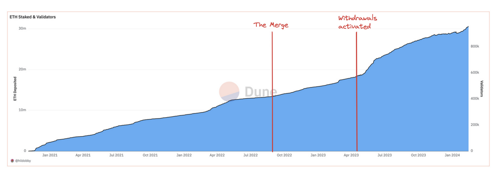

## Decentralized Monetary Policy

Fayçal Drissi, Zachary Feinstein, Basil Williams

*University of Oxford, Stevens Institute of Technology, Imperial Business School*
 

<!--These slides: [https://www.faycaldrissi.com/siam2025](https://www.faycaldrissi.com/siam2025)
[my scholar](https://scholar.google.com/citations?user=njvyriQAAAAJ&hl=fr), 
[my website](https://www.faycaldrissi.com/), [my github](https://github.com/FDR0903)-->

---

# Overview

- Issuance, adoption, and staking 
- Layer 1 / Layer 2

---

      

<h1>
Issuance, adoption, and staking </h1>

---

# Issuance, adoption, and staking

* **Blockchains** are distributed digital ledgers that **securely** store and execute transactions 

---

# Issuance, adoption, and staking

* **Blockchains** are distributed digital ledgers that **securely** store and execute transactions 
* **Issuance** defines how Ethereum pays for this **security**

---

# Issuance, adoption, and staking

* **Staking**: locking Eth in the blockchain to participate in the protocol: secure block production and validation

---

# Issuance, adoption, and staking

* **Staking**: locking Eth in the blockchain to participate in the protocol: secure block production and validation
* **Issuance**: rewards distributed by the protocol to incentivize staking

---

# Issuance, adoption, and staking

* **Staking**: locking Eth in the blockchain to participate in the protocol: secure block production and validation
* **Issuance**: rewards distributed by the protocol to incentivize staking
* **Burn**: gas fees are burned to use the blockchain: tax on productivity
* These rewards are minted as new tokens and given to network participants who conduct consensus duties
$$\text{total supply of ETH} = \text{issuance} - \text{the burn (EIP-1559)}$$

---

# Issuance, adoption, and staking

* **Staking**: locking Eth in the blockchain to participate in the protocol: secure block production and validation
* **Issuance**: rewards distributed by the protocol to incentivize staking
* **Burn**: gas fees are burned to use the blockchain: tax on productivity
* These rewards are minted as new tokens and given to network participants who conduct consensus duties
$$\text{total supply of ETH} = \text{issuance} - \text{the burn (EIP-1559)}$$
* Last 30 days  
$$78,277.28 \text{ ETH issued} \qquad  8,041.75 \text{ ETH burned}$$

*Source: ultrasound.money*

---

# Issuance, adoption, and staking
### Timeline of issuance

* **Jul 2015** Genesis: block reward set to 5 ETH (PoW miners were rewarded for producing blocks)
* **Oct 2017** Byzantium (EIP-649): block reward reduced to 3 ETH
* **Feb 2019** Constantinople (EIP-1234): block reward reduced to 2 ETH
* **Dec 2020** Beacon chain genesis: *Proof-of-Stake* issuance started
    - PoS rewards remain locked in the beacon chain  (not withdrawable)
* **Sep 2022** The Merge: Ethereum issuance is now only from PoS rewards (not withdrawable)
* **Apr 2023** Shanghai/Capella (EIP-4895): Withdrawals to the execution layer

---

# Issuance, adoption, and staking
### Today

* Since the beacon chain: issuance cy is determined by an **issuance curve**
*  parameterized curve that calculates the *yield* as a function of the amount of ETH staked
$$
\text{yield} = \frac{2.6 \cdot 64}{\sqrt{\text{staked ETH}}}
$$

{style="transform: translate(40%, 0%); width: 450px"}

---

# Issuance, adoption, and staking
### Rationale

$$
\text{yield} = \frac{2.6 \cdot 64}{\sqrt{\text{staked ETH}}}
$$

- Aim for 3.3% yield with 30 million ETH staked
- highly incentivizing at least 10 million staked ETH

{style="transform: translate(60%, 0%); width: 400px"}

---

# Issuance, adoption, and staking
### Today

- June 2025: 35 out 120 million ETH staked (88.6 bn $); stake rate of $28.24\%$

{style="transform: translate(5%, 0%); width: 800px"}

---

# Issuance, adoption, and staking
### Today

- June 2025:  0.162 out of the 35 million ETH staked are by solo stakers

{style="transform: translate(40%, 0%); width: 500px"}

--- 

# Issuance, adoption, and staking
### Tomorrow: staking demand likely to increase
- ETH price appreciation
- US interest rates decline (Fed Fund $5.5\%$ to $4.5\%$ since Sep 2024, projected $3\%$)
- LST/LRT LST/LRT demand (Liquid staking tokens and liquid restaking tokens)
    * lower the barrier of entry to staking and help decentralize the validator set
    * EigenLayer quickly attracted over $11 billion TVL

--- 

# Issuance, adoption, and staking
### What's wrong with too much staking?
* Solana is at 85% stake rate, Cosmos is at 66%, Celestia at 55%
* More stake implies more economic security for Ethereum
  

---

#  Research questions

- Is it possible to implement issuance policy in blockchain ecosystems?
-  Can the Ethereum Foundation (EF) target objectives such as the volatility of the native token, economic security, and blockchain adoption ?
 

---

      

<h1>
A continuous-time macro-finance model of adoption and issuance </h1>

---

# Macro-finance model
### Blockchain economy

* Blockchain can be seen as **small open economy** within the US economy
* EF controls rewards (inflationary effect) and gas fees (deflationary effect)
* **Issuance policy** of a blockchain is similar to **traditional monetary policy**

---

# Macro-finance model
### Blockchain economy
* Time is continuous
* continuum of homogeneous users with mass one
* each user is endowed with initial wealth of $x_0$ USD
* consumption good with constant price normalized to one USD
* Each user chooses a lifetime stream of consumption $\{c_t\}_{t=0}^\infty$ to maximize
$$
\mathbb E_0\int_0^\infty e^{-\beta\,t}\,\log(c)    
$$

---

# Macro-finance model
### Blockchain economy
* At each time $t \in [0,\infty)$, each user may allocate their wealth across 
    * dollar-denominated consumption
    * dollar-denominated risk-free asset
    * DeFi protocols (requires locking ETH)
    * staking (requires locking ETH)

* They take as given
    * the aggregate staked ETH $S_t$ in dollar terms
    * the aggregate ETH $D_t$ locked in DeFi in dollar terms
    * the price of ETH $P_t$

---

# Macro-finance model
### Staking

* The returns to staking consist of
    1. reward for staking issued by the blockchain
    2. MEV fees paid by DeFi investors
    3. losses due to slashing
    4. change in the dollar value of ETH: due to issuance, gas fee burning, slashing, and adoption

---

# Macro-finance model
### Staking

* The returns to staking consist of
    1. reward for staking issued by the blockchain
    2. MEV fees paid by DeFi investors
    3. losses due to slashing
    4. change in the dollar value of ETH: due to issuance, gas fee burning, slashing, and adoption

---

# Macro-finance model
### Staking rewards

* For each unit of ETH staked, the blockchain rewards stakers with newly issued ETH at rate $dI_{t}/I_t$.  
* the blockchain issuance reward rule is public knowledge.

---

# Macro-finance model
### Staking MEV revenue

* Stakers earn the MEV paid by DeFi users
* We assume that the rate of DeFi transactions is a constant fraction $\delta$ of the aggregate dollar value $D_t$ invested in DeFi
* we assume a fraction $m \in (0,1)$ of the value of DeFi transactions is taken as MEV
* As a result, the MEV revenue per dollar staked is $\delta\,m\,D_{t} \big / S_{t}$.

---

# Macro-finance model
### Staking and slashing

* If a validator is found to misbehave due to operational errors or intentional misconduct, it may be slashed
* we model this risk with a random jump process $n_t$ with intensity $\lambda$. 
* When slashing occurs, a proportion $\gamma$ per unit of ETH staked is destroyed.

---

# Macro-finance model
### Staking returns
* Taken together, we can write the returns to staking as follows:
$$
\frac{d\nu_{S,t}}{\nu_{S,t}}=\underbrace{\frac{dI_{t}}{I_{t}}}_{\text{issuance reward}}+\underbrace{\delta\,m\frac{D_{t}}{S_{t}}\,dt}_{\text{mev revenue}}-\underbrace{\gamma\,dn_{t}}_{\text{slashing}}+\underbrace{\frac{dP_{t}}{P_t}}_{\text{ETH price adjustment}}    
$$

* The price $P_t$ of ETH  is simply the ratio of total dollars $S_t + D_t$ on the blockchain to the total quantity $Q_t$ of ETH
* $P_t$ changes through four channels: 
    1. the change in total dollars due to fluctuating demand for DeFi services and adoption
    2. the change in quantity $Q_t$ of ETH due to staking rewards
    3. the change in the quantity $Q_t$ of ETH due to burned gas fees
    4. the change in the quantity $Q_t$ of ETH due to slashing

---

# Macro-finance model
### DeFi

The wealth of DeFi users evolves according to 
1. the revenue generated from external users using DeFi smart contracts
2. gas  and MEV costs due to transactions
3. shocks from financial and technological risk
4. changes in the price of ETH (blockchain adoption, issuance, burned gas fees, and slashing)

---

# Macro-finance model
### DeFi external adoption

DeFi generates USD wealth at a rate  $\mu_{t}^{\$}$ due to
1. external inflows from the dollar economy who engage with blockchain financial services and generate income
2. stablecoin holders who engage with blockchain financial services and generate income
3. appreciation of blockchain smart contract technology

We assume that the productivity of DeFi protocols is a function that increases in the fraction $D_{t}\big/P_tQ_t$ of ETH supply locked in DeFi, 
$$
\mu_{t}^{\$}=\mu\left(D_{t}\big/P_tQ_t\right).    
$$

---

# Macro-finance model
### DeFi gas and mev costs

* Productivity of DeFi protocols comes at a cost: DeFi requires transactions of a constant rate $\delta\,dt$
* DeFi users pay MEV and gas fees at a rate  \( \delta\,(m+f_t) \)

---

# Macro-finance model
### DeFi risk

* DeFi is subject to exogenous shocks modeled by a standard Brownian motion $z_t$ and volatility $\sigma_{t}^{\$}$
* the  magnitude of $\sigma_{t}^{\$}$ reflects the financial and technological risk associated with DeFi investment
* we assume it is a function that increases in the fraction $D_t/P_tQ_t$ of ETH supply locked in DeFi
    1. larger negative shocks because of the increased attractiveness of the chain as a target for malicious attacks due to increased wealth locked in DeFi protocols
    2. larger positive shocks due to increased demand (lower costs and increased liquidity).

---

# Macro-finance model
### returns to DeFi

Taking all these effects together, the returns to DeFi technology are
$$
\frac{d\nu_{t}}{\nu_{t}}=\underbrace{\mu_{t}^{\$}\,dt}_{\text{adoption \& productivity}}-\underbrace{\delta\,(f_{t}+m)\,dt}_{\text{gas fees and MEV}}+\underbrace{\sigma_{t}^{\$}\,dz_{t}}_{\text{global risk}}+\underbrace{\frac{dP_{t}}{P_{t}}}_{\text{ETH price adjustment}}.
$$

---

# Macro-finance model
### supply of ETH

* The total supply $Q_t$ of ETH changes due to 
1. issuance
2. slashing
3. gas fee burning. 

* The number of ETH tokens in staking is $S_t/P_t$ and that locked in DeFi is $D_t/P_t.$ 

* Thus, the dynamics of the aggregate ETH supply are
$$
dQ_{t}=\underbrace{\frac{S_t}{P_t}\, \frac{dI_t}{I_t} }_{\text{ETH issuance}}-\underbrace{\frac{S_t}{P_t}\, \gamma\,dn_t }_{\text{slashing}}-\underbrace{\frac{D_{t}}{P_{t}}\,\delta \,f_{t}\,dt}_{\text{gas fees}}.
$$

---

# Macro-finance model
### Portfolio problem

* Let $x_t^i$ denote the USD-denominated net worth of user $i\in[0,1]$ 
* let $\theta_{t}^{i}$ denote the fraction of wealth allocated by each user to DeFi 
* let $\theta_{S,t}^{i}$ denote the fraction of wealth allocated by each user to staking
* $1-\theta_{t}^{i}-\theta_{S,t}^{i}$ denotes the fraction allocated outside the blockchain. 
* The dynamics of the net worth of user $i$ are 
$$
\frac{dx_{t}^{i}}{x_{t}^{i}}=\theta_{t}^{i}\,\frac{d\nu_{t}}{\nu_{t}}+\theta_{S,t}^{i}\,\frac{d\nu_{S,t}}{\nu_{S,t}}+\left(1-\theta_{t}^{i}-\theta_{S,t}^{i}\right)r\,dt-\frac{c_{t}^{i}}{x_{t}^{i}}dt
$$
* To solve the portfolio problem, agents must know the returns associated with each investment option $\implies$ we need to re-express the returns to both staking and DeFi in terms of the relevant state variables

---

# Macro-finance model
### Portfolio problem

* Suppose the price of ETH is initially $\$1$. 
* Stakers hold 1 ETH and DeFi users hold 1 ETH
* If the protocol issues $1$ ETH as staking rewards, the total ETH supply becomes $3$, and the new ETH price becomes $\$2/3$. 
* Stakers now hold 2 ETH worth $\$ {4}/{3}$
* DeFi users hold 1 ETH worth $\$ {2}/{3}$
* stakers gain $\${1}/{3}$,  DeFi users lose the same amount, and the total wealth remains $\$2$. 
* Thus, any USD revenue   to stakers from issuance and productivity constitutes a loss of equal amount to DeFi users
* Issuance does not create value: redistribution of wealth from non-stakers to stakers  $\implies$ for stakers

---

# Macro-finance model
### Portfolio problem

* we combine the effect of the issuance reward with effects of ETH price adjustment due to adoption and issuance. we call the resulting combination **issuance revenue**
* this component represents the exact USD-denominated wealth transfer from DeFi users to stakers
* What remains in the ETH price adjustment term is the effects of the change in the price of ETH due to burned gas fees and slashing, which is
$$
dG_{t} = \frac{D_{t}}{P_{t}Q_{t}}\,\delta\,f_{t}\,dt + \gamma\,\frac{S_{t}}{P_{t}Q_{t}}\,dn_{t}.
$$
* With these modifications, we can write the dollar returns per dollar staked as follows:
$$
\frac{d\nu_{S,t}}{\nu_{S,t}}=\underbrace{ \frac{dI_{t}^{\$}}{I_{t}^{\$}} }_{\text{issuance revenue}}+\underbrace{\delta\,m\frac{D_{t}}{S_{t}}\,dt}_{\text{MEV revenue}}-\underbrace{\gamma\,dn_{t}}_{\text{slashing}}+\underbrace{dG_{t}}_{\text{deflation from gas fees/slashing}}.
$$

---

# Macro-finance model
### Portfolio problem

* Similarly, we can re-write the returns to DeFi  as follows:
$$
\frac{d\nu_{t}}{\nu_{t}}=\underbrace{\mu_{t}^{\$}\,dt}_{\text{adoption \& productivity}}-\underbrace{\delta\,(f_{t}+m)\,dt}_{\text{gas fees and MEV}}-\underbrace{\frac{S_{t}}{D_{t}}\,\frac{dI_{t}^{\$}}{I_{t}^{\$}}}_{\text{issuance}}+\underbrace{\sigma_{t}^{\$}\,dz_{t}}_{\text{global risk}}+\underbrace{dG_{t}}_{\text{deflation from gas fees/slashing}}.
$$

---

# Macro-finance model
### Equilibrium

* In equilibrium, the aggregate staked ETH is 
$$
S_{t}/P_t = \int_i \theta_{S,t}^{i}\,x_t^i/P_t\, di,
$$

* In equilibrium, the aggregate amount of ETH locked in DeFi applications on the L1 is 
$$
D_{t}/P_t = \int_i \theta_{t}^{i}\,x_t^i/P_t\,di;    
$$

---

# Macro-finance model
### Portfolio problem

* Consumption is a fraction of wealth
$$
c_t = \int_i c_t^i di = \beta\,P_t\,Q_t.
$$

* The optimal weights solve the fixed point
$$
\theta_{t}=  \frac{\mu_{t}-r}{\left(\sigma_{t}^{\$}\right)^{2}}+\theta_{S,t}\,\frac{\mu_{S,t}-r}{\theta_{t}}
$$

$$
\theta_{S,t}=  \theta_{S,t}^{2}\,\frac{\mu_{S,t}-r}{\theta_{t}^{2}}-\frac{\lambda}{\mu_{S,t}-r}+\frac{\theta_{S,t}+\theta_{t}}{\theta_{t}}\left(1+\gamma\,\left(\frac{\mu_{t}-r}{\left(\sigma_{t}^{\$}\right)^{2}}\right)\right),
$$
where 
$$
\mu_{t}=-\frac{S_{t}}{D_{t}}\,\iota^{\$}-\delta\,m-\frac{S_{t}}{P_{t}Q_{t}}\,\delta\,f_{t}+\mu_{t}^{\$}, \qquad\quad\qquad
\mu_{S,t}=\iota^{\$}+\delta\,m\frac{D_{t}}{S_{t}}+\frac{D_{t}}{P_{t}Q_{t}}\,\delta\,f_{t}. 
$$

---

# Macro-finance model
### Market clearing

* Assume 
$$
\frac{dI_{t}^{\$}}{I_{t}^{\$}}=\iota^{\$}\,dt \qquad \text{or} \qquad \frac{dI_{t}}{I_{t}}=\iota_{t}\,dt+\sigma_{\iota,t}dz_{t}+\gamma_{\iota,t}\,dn_{t}.
$$

* Postulate 
$$
\frac{dP_t}{P_t} = dp_t+\sigma_{P,t}\,dz_{t}+\gamma_{P,t}dn_{t},
$$

* Clearing conditions W
    1. the total supply of ETH equals the sum of ETH staked and ETH locked in DeFi protocols.
    $$
    P_t\,Q_t = S_{t} + D_{t}.
    $$
    2. $P_t$ ensures that aggregate supply $Q_t$ matches total user holdings in USD:
    $$
    P_t\,Q_t = \int_i (\theta_t + \theta_{S,t})x_t^i di = (\theta_t + \theta_{S,t})\,x_t\,,
    $$
    3. user USD wealth changes stem from only (i) fluctuations in ETH market capitalization and (ii) returns from external investments $\implies$ aggregate on-chain earnings derive solely from DeFi productivity ($\mu_t^\$$) and shocks ($\sigma_t^\$ dz_t$), while slashing, issuance, and gas fee burning merely redistribute existing wealth.

---

# Macro-finance model
### Solution

$$
\begin{cases}
\gamma_{P,t} & =\frac{\theta_{S,t}\left(\gamma-\gamma_{\iota,t}\right)}{\theta_{t}+\theta_{S,t}-\theta_{S,t}\left(\gamma_{\iota,t}-\gamma\right)}\\
\sigma_{P,t} & =\sigma_{t}^{\$}\,\theta_{t}-\frac{\theta_{S,t}}{\theta_{t}+\theta_{S,t}}\sigma_{\iota,t}.
\end{cases}    
$$
* ETH prices inherit risk from both slashing events and DeFi activity
* issuance policies that create ETH in response to DeFi shocks mitigate ETH price risk from DeFi volatility
* policies responsive to slashing events reduce ETH price risk from slashing

---

# Macro-finance model
### Solution

$$
\begin{split}
dp_{t}&=\Big(\underbrace{\theta_{t}\,\mu_{t}^{\$}}_{\text{productivity}}\ \ \underbrace{-\beta}_{\text{consumption}}-\underbrace{\frac{\theta_{S,t}}{\theta_{t}+\theta_{S,t}}\,\iota_{t}}_{\text{inflation from issuance}}-\underbrace{\frac{\theta_{t}}{\theta_{t}+\theta_{S,t}}\,\delta\,f_{t}}_{\text{inflation from gas fees}}\Big)dt\\&+\underbrace{\left(1-\theta_{t}-\theta_{S,t}\right)rdt+\frac{d\left(\theta_{t}+\theta_{S,t}\right)}{\theta_{t}+\theta_{S,t}}}_{\text{wealth redistribution accross blockchain and outside investments }}+\underbrace{\frac{\theta_{S,t}}{\theta_{t}+\theta_{S,t}}\,\sigma_{P,t}\,\sigma_{\iota,t}\,dt}_{\text{risk term}}.
\end{split}
$$

---

# Blockchain adoption
Blockchain adoption occurs through two distinct channels
* external: use of blockchain financial services by external users
* internal: users reallocating wealth from investments outside the blockchain into the blockchain ecosystem

{style="transform: translate(30%, 0%); width: 550px"}

---

# Numerical results

* Assume
$$
\mu_t^\$ = a\,\theta_t,\qquad \sigma_t^\$ = b\,\theta_t
$$

* Default parameter values
$$
\begin{cases}
a &= 0.5\\
b &= 1\\
\iota^\$ &= 0.1\\
\delta &= 0.1\\
m &= 0.1\\
f_t &= 0.1\\
r &= 0.03\\
\gamma &= 0.1\\
\lambda &= 0.1\\
\end{cases}
$$

---

# Blockchain adoption: external

{style="transform: translate(65%, 0%); width: 390px"}

---

# Blockchain adoption: external

{style="transform: translate(65%, 0%); width: 390px"}

---

# Blockchain adoption: internal

{style="transform: translate(65%, 0%); width: 390px"}

---

# Blockchain issuance

{style="transform: translate(65%, 0%); width: 390px"}

---

# Blockchain MEV

{style="transform: translate(65%, 0%); width: 390px"}

---

      

<h1>
Blockchain monetary policy </h1>

---

# Blockchain monetary policy
### Eth price volatility

* Central banks often target exchange rate volatility to maintain currency stability
* ETH price volatility could theoretically be eliminated by 
    1. prohibiting ETH locking in DeFi protocols, as these represent the primary risk source $\implies$ DeFi adoption is a key objective
    2. Compensate each shock to DeFi by a shock in issuance $\implies$  volatile issuance discourages staking

---

# Blockchain monetary policy
### Eth price volatility

* Targeting volatility $\xi$ requires maintaining a DeFi adoption level of:
$$
\theta_t = \frac{\xi}{\sigma_t^\$}.
$$

* For the case of linear DeFi productivity described previously, this policy objective can be achieved through the following issuance revenue rule:
$$
\frac{dI_{t}^{\$}}{I_{t}^{\$}} = \frac{\xi}{1+\gamma\,\frac{b}{a}\,\theta_{t}}\left(a\,\xi - \sigma_{t}^{\$}(r+b)\,\frac{\xi^{2}}{\sigma_{t}^{\$}}\right)dt - \frac{a\,\xi\sigma_{t}^{\$} - r(\sigma_{t}^{\$})^{2} - b\,\xi^{2}}{(\sigma_{t}^{\$})^{2}}dt.
$$

* The policy targets a weight $\sqrt{\xi/b}$ of aggregate ETH locked in DeFi

---

# Blockchain monetary policy
### Eth price volatility

* This issuance policy induces 
    1. specific ETH dynamics
    2. specific staking behaviour
    3. low adoption

* Need for issuance policies that simultaneously:
    1. target low ETH price volatility
    2. guarantee a desired level of ETH price appreciation
    3. maintain adequate economic security

---

# Blockchain monetary policy
### Economic security

* Assume the USD value of aggregate ETH in the blockchain exceeds a threshold $T$ USD
* To achieve an economic security target $\tilde T < T$, the blockchain implements the following issuance policy:  
$$
\frac{dI_{t}^{\$}}{I_{t}^{\$}} = \frac{(a\theta_t - r - b\theta_t)\tilde T}{P_t Q_t}dt + \frac{\tilde T}{P_t Q_t}dt.  
$$
* When combined with the volatility-targeting policy, the issuance rule becomes:  
$$
\frac{dI_{t}^{\$}}{I_{t}^{\$}} = \left(\frac{(a - b)\xi - r\sigma_t^\$}{\sigma_t^\$}+ 1\right)\frac{\tilde T}{P_t Q_t}dt,  
$$
* The policy response is monotonically increasing in the security target $\tilde T$

---

# Blockchain monetary policy
### Long-term economic security and adoption

* Economic security $\implies$ target a specific level
* Adoption $\implies$ increasing ETH’s market capitalization
* This can be formalized as the stochastic control problem
$$
\sup_{\iota^\$} \mathbb{E}\left[ \int_0^\infty e^{-\beta t} \left( P_t Q_t - \phi \left(\theta_{S,t}P_t Q_t  - \tilde T \right)^2 \right) dt \right],  
$$
where $\phi$ penalizes deviations from the target staking level $\tilde T$.

---

# Blockchain monetary policy
### Long-term economic security and adoption

* Solution
    * When $P_tQ_t < \tilde T$: encourage DeFi to increase adoption and ETH market cap.
    * When $P_tQ_t > \tilde T$: weighte average of (depending on $\phi$)
        1. economic security policy
        2. DeFi growth target 

---

      

<h1>
Layer 2 blockchains and blocklchain monetary policy </h1>

---

# Layer 1 / Layer 2
### Introduction

- L1 blockchain faces scalability challenges 
- rollup-centric ethereum roadmap (2020): big push for development of Layer-2 (L2) solutions
- Rollups are L2s that periodically post state commitments to Ethereum
- Commitments are validated by either
    * validity proofs
    * optimistic accept (can be challenged via Fraud Proof mechanism)

---

# Layer 1 / Layer 2
{style="transform: translate(40%, 0%); width: 500px"}
*Source: Mike Neuder's Blob gossip and validation before and after PeerDAS*
* user submits L2 transaction to the centralized sequencer
* sequencer immediately confirms the transaction
* sequencer batches many L2 transactions into an L1 blob
* they submit to the public mempool
* Ethereum builder/proposer include in a block + publishes the block to the consensus layer
* user receives second confirmation

---

# Layer 1 / Layer 2
- Almost $60$ Layer 2 projects
{style="transform: translate(30%, 0%); width: 500px"}
- Mainly horizental product differentitation

---

# Layer 1 / Layer 2
- Majority of Ethereum’s transaction activity has moved to L2 networks 
    - see Saleh et al. 2025
{style="transform: translate(20%, 0%); width: 600px"}
{style="transform: translate(20%, 0%); width: 600px"}

---

# Layer 1 / Layer 2
### Research question:  What are the effects of L2s on blockchain monetary policy ?

---

# Layer 1 / Layer 2

* L2s are fast and cheap $\implies$ good for adoption / scale DeFi
* L2s pay blob fees to use the L1
* L2s generate new wealth in the ecosystem
$$
\text{returns to DeFi} = \underbrace{\text{adoption/growth}}_{++} - \underbrace{\text{gasfees}}_{--} - \underbrace{\text{MEV}}_{--} - \text{issuance} + \underbrace{\text{risk}}_{==}
$$
$$
\text{staking returns} = \text{issuance} +  \underbrace{\text{MEV}}_{--} + \text{blob fees} - \text{slashing}
$$
* **Consequences**: more demand for ETH, higher ETH prices, more effective issuance policies, more economic security...

---

# Layer 1 / Layer 2
### Some answers

* However, L2s increasingly use natively minted tokens and less birdged tokens

{style="transform: translate(5%, 0%); width: 800px"}

---

# Layer 1 / Layer 2
### Some answers

* Costs of L2s to use L1 are low

{style="transform: translate(15%, 0%); width: 700px"}

---

# Layer 1 / Layer 2

* **Consequence 1**: demand for ETH decreases instead of increasing
    * ETH prices decrease
    * economic security hard to achieve
* **Consequence 2**: issuance policy less (not) effective if policy objective involves L1/L2 interaction
    * Too much power for L2s over the ecosystem

---

# Layer 1 / Layer 2
* To incorporate L2 blockchains into our framework, introduce an additional investment vehicle: DeFi on L2s
* The key distinctions are
    1. L2 blockchains can be used without (or with less) ETH
    2. L2s blockchains feature specific security and technological risks (L2s are run by private companies). 
* We model this by 
    1. a parameter $\alpha \in [0,1]$, which represents the fraction of L2 wealth that must be held in ETH rather than L2-native tokens
    2. Brownian motion $z_{L2,t}$ that models shocks to the L2 ecosystem. 
* the returns to L2 DeFi
$$
\frac{d\nu_{t}}{\nu_{t}}=\underbrace{\mu_{L2,t}^{\$}\,dt}_{\text{adoption \& productivity}}-\underbrace{\delta\,b_{t}\,dt}_{\text{blob fees}}+\underbrace{\sigma_{L2,t}^{\$}\,dz_{L2,t}}_{\text{L2-specific risk}}+\underbrace{\alpha\,\frac{dP_{t}}{P_{t}}}_{\text{ETH price adjustment}},
$$
*  the market-clearing condition becomes
$$
P_t\,Q_t = D_t + S_t + \alpha\,D_{L2,t}\,,    
$$
* Policy tools
    - blob fees
    - issuance

---

# Layer 1 / Layer 2
### Future work

* The presence of L2s complicates the implementation of policy objectives tied to ETH price dynamics
* Future work
    1. analyze the efficacy of issuance policies in an environment with active L2 ecosystems
    2. characterize the long-run equilibrium effects of such policies on the industrial organization of L2 blockchains (market concentration and product differentiation)
    3. quantify the risk that L2s expand to the point of independence from the L1
    4. the optimal way for an L1 to compete with other L1s

---
layout: end
---

Thank you !

[faycaldrissi.com](https://www.faycaldrissi.com/)
